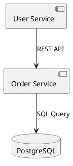
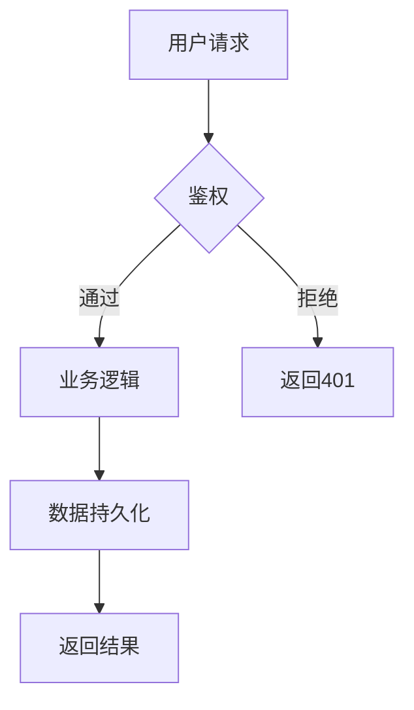
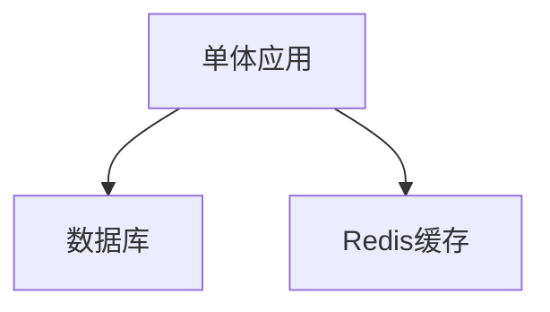
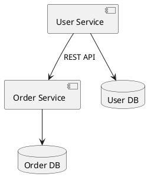
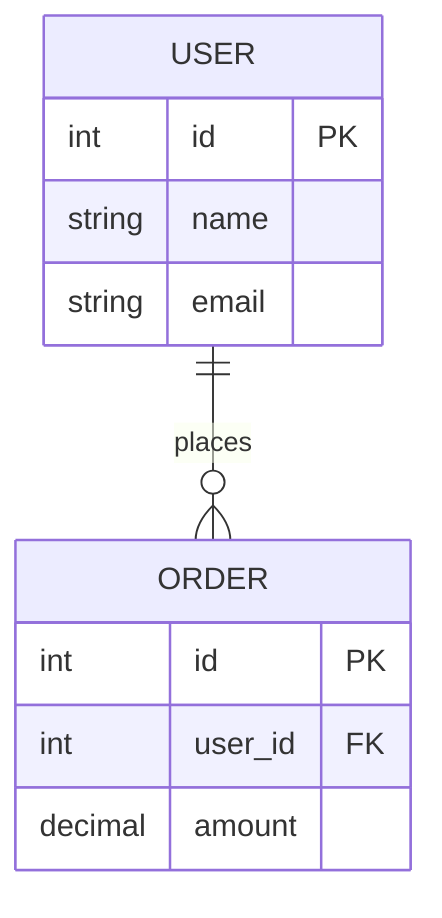
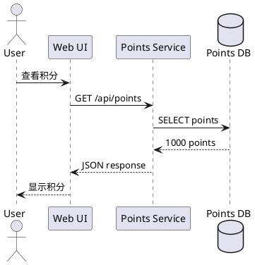

# Template Extension Skill

## 目的

为 Specify CLI 扩展和优化自定义场景模板（refactor/data/feature），基于真实案例抽象通用模式，并通过 UML 模型（PlantUML/Mermaid）确保 spec→plan→tasks 传递链的可追溯性和一致性。

## 何时使用

- 从真实项目案例中抽象新的场景模板（refactor/data/feature）
- 优化现有模板的传递性和可追溯性
- 使用 UML 模型（架构图、流程图、序列图）定义规格
- 建立 spec→plan→tasks 传递链的硬约束
- 确保每个模板遵循 UML-Spec Driven Development 思想

## 核心原则

### 1. UML-Spec Driven Development 思想

**UML 模型优先**: 规格必须使用 UML 图形化描述系统结构和行为
- **架构图**: 使用 PlantUML/Mermaid 描述目标架构（组件图、部署图）
- **流程图**: 描述业务流程和数据流转（活动图、状态机图）
- **交互图**: 描述系统交互和序列（序列图、通信图）

**UML 语法支持**:


或使用 Mermaid:


### 2. Spec→Plan→Tasks 传递性（Traceability Chain）

**单一真实来源原则**: 避免信息冗余和不一致

- **Spec 定义 WHAT**: 目标、约束、验收标准（使用 UML 模型描述）
- **Plan 定义 HOW**: 架构设计、实施策略（细化 UML 模型，添加实现细节）
- **Tasks 定义 DO**: 可执行任务、验收 DoD（引用 Plan 中的 UML 组件/接口）

**传递规则**:
1. Spec 中的 UML 模型（目标架构）→ Plan 中的 UML 模型（详细设计）
2. Plan 中的组件/接口清单 → Tasks 中的交付单元（1:1 映射）
3. Spec 中的验收标准 → Tasks 中的 DoD 检查项（不重复定义）

### 3. 硬约束标识符（Hard Constraint Identifiers）

**可追溯标识符**: 使用稳定 ID 在三个文档间建立机械可验证的映射

**示例**（根据场景类型不同，标识符规则不同）:

**Refactor 场景**: Interface:Ixx（端到端接口）
```markdown
# Plan: Interface Inventory
| I01 | REST | GET /api/users | {...} |

# Tasks: 交付任务
### Interface:I01 - 用户查询接口实现
- T001: 实现 handler
- T002: 集成测试
```

**Data 场景**: Entity:Exx（数据实体）
```markdown
# Plan: Entity Inventory
| E01 | User | {id, name, email} | {...} |

# Tasks: 数据迁移任务
### Entity:E01 - User 表迁移
- T001: 创建新表结构
- T002: 数据回填验证
```

**Feature 场景**: Feature:Fxx（功能特性）
```markdown
# Plan: Feature Breakdown
| F01 | 用户注册 | {email验证, 密码强度} | {...} |

# Tasks: 功能开发任务
### Feature:F01 - 用户注册功能
- T001: 前端表单实现
- T002: 后端API实现
```

### 4. 模板场景化抽象（Scenario-Specific Abstraction）

**不同场景有不同侧重点**:

| 场景 | 侧重点 | UML 重点 | 验收标准 |
|------|--------|----------|---------|
| **Refactor** | 一致性、无损迁移 | 组件图、部署图 | 行为等价、性能无退化、可回滚 |
| **Data** | 数据完整性、一致性 | 类图、ER 图 | 零丢失、校验和匹配、可回滚 |
| **Feature** | 功能完整性、用户体验 | 序列图、活动图 | 功能验收、用户反馈、性能指标 |

**模板抽象流程**:
1. 收集真实项目案例（≥3 个同类场景）
2. 提取共性模式（使用 UML 描述）
3. 定义场景特定的硬约束标识符
4. 设计 Spec→Plan→Tasks 传递链
5. 验证可追溯性（机械检查）

## 实施步骤

### 第一步: 案例收集与模式识别

1. **收集真实案例**（≥3 个同类场景项目）
   - Refactor: 微服务拆分、架构重构、技术栈迁移
   - Data: 数据库迁移、数据模型重构、ETL 流程
   - Feature: 新功能开发、用户故事、产品迭代

2. **提取 UML 模型共性**
   - 绘制案例的架构图（PlantUML/Mermaid）
   - 识别共同组件、接口、数据流
   - 抽象通用模式（设计模式、架构模式）

3. **定义场景特定标识符**
   - Refactor: Interface:Ixx（端到端接口）
   - Data: Entity:Exx（数据实体）
   - Feature: Feature:Fxx（功能特性）

### 第二步: 设计 Spec 模板

**文件**: `templates/spec-template.<scenario>.md`

**通用结构**（所有场景共有）:

```markdown
# <Scenario> Spec: <项目名称>

## Business Objectives
- [业务目标、Why 做这件事]

## Current State Analysis
- **UML Model**: 当前架构图（PlantUML/Mermaid）
- **Key Metrics**: 基线数据（根据场景不同）
- **Pain Points**: 痛点分析

## Target State
- **UML Model**: 目标架构图（PlantUML/Mermaid）
- **Key Components**: 关键组件清单
- **Constraints**: 不可改变的约束（Invariants）

## Acceptance Criteria（场景特定）
[根据场景定义验收标准，不同场景侧重点不同]

## Acceptance Gate
- [ ] 验收标准 1 通过
- [ ] 验收标准 2 通过
```

**场景特定内容**:

- **Refactor**: 性能基线、一致性验收（行为/性能/SLA）、MTTR 风险
- **Data**: 数据完整性校验、迁移回滚策略、数据一致性验证
- **Feature**: 用户验收测试、功能完整性、用户体验指标

### 第三步: 设计 Plan 模板

**文件**: `templates/plan-template.<scenario>.md`

**通用结构**:

```markdown
# <Scenario> Plan: <项目名称>

## Non-Negotiables
（从 Spec 继承 Invariants，不重复定义）

## Architecture Design
- **UML Model**: 详细设计图（PlantUML/Mermaid）
- **Component Breakdown**: 组件分解
- **Interface/Entity/Feature Inventory**: 清单（单一真实来源）

## <Scenario> Inventory (Source of Truth)

| ID | Name | Description | Owner | Verification |
|----|------|-------------|-------|--------------|
| Xxx | ... | ... | ... | ... |

**Hard Consistency Rules**:
1. 每个 ID 在此表中出现且仅出现一次
2. 每个 ID 必须在 Tasks 中以 `<Type>:Xxx` 形式出现且仅出现一次
3. 验证命令: `grep "<Type>:" tasks.md | sort | uniq -c`

## Implementation Strategy
[实施策略，根据场景不同]

## Rollback & Risk Mitigation
[回滚策略，根据场景不同]
```

### 第四步: 设计 Tasks 模板

**文件**: `templates/tasks-template.<scenario>.md`

**通用结构**:

```markdown
# <Scenario> Tasks: <项目名称>

## HARD CONSISTENCY CONTRACT

**<Type>:Xxx Mapping Rules**:
1. Plan Inventory 中的每个 Xxx → Tasks 中恰好一个 `<Type>:Xxx` 章节
2. Tasks 中的每个 `<Type>:Xxx` → Plan Inventory 中必须存在
3. 机械验证: `diff <(plan_ids) <(task_ids)` 应无差异

## Phase 1: 准备阶段（所有场景通用）

- **T001**: 建立基线
  - 记录当前状态（UML 模型、关键指标）
  - 输出: baseline.md
  
- **T002**: 影响分析
  - 依赖分析、风险评估
  - 输出: impact-map.md

- **T003**: 回滚方案
  - 回滚步骤、验证检查
  - 输出: rollback.md

## Phase 2: 实施阶段（场景特定）

### <Type>:X01 - <组件/实体/功能名称>

- **T004**: [具体任务 1]
  - DoD: [完成定义]
  
- **T005**: [具体任务 2]
  - DoD: [完成定义]

（每个 Inventory 项一个章节，1:1 映射）

## Phase 3: 验收阶段（场景特定）

- **T0XX**: 验收标准 1 验证
  - 执行验收测试
  - DoD: 通过标准
  
- **T0YY**: 验收标准 2 验证
  - 执行验收测试
  - DoD: 通过标准

## Phase 4: 收尾阶段

- **T0ZZ**: 清理与文档
  - 移除临时代码、更新文档
  - DoD: 文档审查通过
```

### 第五步: 更新命令模板

**文件**: `templates/commands/{spec,plan,tasks}.<scenario>.md`

确保命令模板引导 AI 生成符合上述结构的文档：

```markdown
# Spec Command Template

Generate a <scenario> spec with:
1. Current/Target State UML models (PlantUML or Mermaid)
2. Scenario-specific acceptance criteria
3. Constraints (Invariants)
4. Acceptance gate checklist

# Plan Command Template

Generate a <scenario> plan with:
1. Detailed architecture design (UML models)
2. <Type> Inventory table (ID, Name, Description, Owner, Verification)
3. Hard Consistency Rules reminder
4. Implementation strategy with phases

# Tasks Command Template

Generate <scenario> tasks with:
1. HARD CONSISTENCY CONTRACT declaration
2. Phase 2: One `<Type>:Xxx` section per Inventory item
3. Phase 3: Acceptance verification tasks
4. Mechanical validation commands
```

### 第六步: 验证传递性

1. **UML 模型传递验证**
   - Spec 中的目标架构图 → Plan 中的详细设计图（组件一致）
   - Plan 中的组件清单 → Tasks 中的交付单元（1:1 映射）

2. **标识符一致性验证**
   ```bash
   # 提取 Plan Inventory IDs
   grep "^| X" plan.md | awk '{print $2}' | sort > plan_ids.txt
   
   # 提取 Tasks 标识符
   grep "### <Type>:X" tasks.md | sed 's/.*<Type>:\(X[0-9]*\).*/\1/' | sort > task_ids.txt
   
   # 验证 1:1 映射
   diff plan_ids.txt task_ids.txt
   # 预期: 无差异
   ```

3. **验收标准传递验证**
   - Spec 中定义的验收标准 → Tasks 中的验收任务（不重复定义内容，仅引用编号）

## 模板更新 Checklist

### 核心原则检查
- [ ] 所有 Spec 包含 UML 模型（PlantUML/Mermaid）
- [ ] Spec→Plan→Tasks 传递链清晰无冗余
- [ ] 使用场景特定的硬约束标识符（Ixx/Exx/Fxx）
- [ ] 每个模板遵循 UML-Spec Driven Development 思想

### 模板文件
- [ ] `spec-template.<scenario>.md` - 包含 UML 模型、验收标准
- [ ] `plan-template.<scenario>.md` - Inventory 清单、硬约束规则
- [ ] `tasks-template.<scenario>.md` - 一致性契约、1:1 映射
- [ ] `commands/{spec,plan,tasks}.<scenario>.md` - 命令模板

### 文档和脚本
- [ ] `docs/TEMPLATE_USAGE_GUIDE.md` - 使用指南（可选）
- [ ] `docs/<scenario>-template-validation-report.md` - 验证报告（可选）
- [ ] `scripts/bash/sync-local-templates.sh` - 同步脚本（可选）

### Git 和发布
- [ ] 提交所有模板更改（详细 commit message）
- [ ] 推送到 GitHub
- [ ] 创建 Release tag（可选）

## 输出示例

### 示例 1: Refactor 场景（微服务拆分）

#### Spec 输出

```markdown
# Refactor Spec: 用户服务拆分

## Current State Analysis

**UML Model**:


**Key Metrics**:
- Response Time P99: 800ms
- Throughput: 1000 req/s
- Error Rate: 0.1%

## Target State

**UML Model**:


## Acceptance Criteria（Refactor 场景特定）

### AC-1: 行为一致性
- [ ] 所有 API 返回格式完全一致
- [ ] 错误码和消息完全匹配

### AC-2: 性能无退化
- [ ] P99 ≥ 800ms baseline
- [ ] Throughput ≥ 1000 req/s baseline
```

#### Plan 输出

```markdown
# Refactor Plan: 用户服务拆分

## Interface Inventory (Source of Truth)

| Ixx | Type | Method/Path | Contract | Owner | Verification |
|-----|------|-------------|----------|-------|--------------|
| I01 | REST | GET /api/users | Pagination | Team-A | E2E test |
| I02 | REST | POST /api/users | JSON body | Team-A | E2E test |

**Hard Consistency Rules**:
- 每个 Ixx 在 Tasks 中以 `Interface:Ixx` 形式出现且仅出现一次
```

#### Tasks 输出

```markdown
# Refactor Tasks: 用户服务拆分

## HARD CONSISTENCY CONTRACT

Interface:I01, I02 必须在下方各出现一次。

## Phase 3: Interface Delivery

### Interface:I01 - 用户查询接口

- **T007**: 实现查询 handler
  - DoD: 单元测试通过
- **T008**: E2E 测试（AC-1）
  - DoD: 返回格式与旧系统一致

### Interface:I02 - 用户创建接口

- **T009**: 实现创建 handler
  - DoD: 单元测试通过
- **T010**: 性能测试（AC-2）
  - DoD: P99 ≥ 800ms
```

### 示例 2: Data 场景（数据库迁移）

#### Spec 输出

```markdown
# Data Spec: MySQL 迁移到 PostgreSQL

## Current State Analysis

**UML Model**:


**Key Metrics**:
- Total Records: 10M users, 50M orders
- Data Size: 500GB

## Target State

**UML Model**: (相同 ER 图，数据库类型改变)

## Acceptance Criteria（Data 场景特定）

### AC-1: 数据完整性
- [ ] 零数据丢失（100% 记录迁移）
- [ ] 校验和匹配（MD5 哈希）

### AC-2: 数据一致性
- [ ] 外键关系完整
- [ ] 业务规则验证通过
```

#### Plan 输出

```markdown
# Data Plan: MySQL 迁移到 PostgreSQL

## Entity Inventory (Source of Truth)

| Exx | Table | Columns | Constraints | Verification |
|-----|-------|---------|-------------|--------------|
| E01 | user | id, name, email | PK, unique email | Row count match |
| E02 | order | id, user_id, amount | PK, FK to user | Row count + FK check |

**Hard Consistency Rules**:
- 每个 Exx 在 Tasks 中以 `Entity:Exx` 形式出现且仅出现一次
```

#### Tasks 输出

```markdown
# Data Tasks: MySQL 迁移到 PostgreSQL

## HARD CONSISTENCY CONTRACT

Entity:E01, E02 必须在下方各出现一次。

## Phase 2: Entity Migration

### Entity:E01 - User 表迁移

- **T004**: 创建目标表结构
  - DoD: DDL 执行成功
- **T005**: 数据复制（10M 行）
  - DoD: Row count 匹配 100%
- **T006**: 校验和验证（AC-1）
  - DoD: MD5 哈希匹配

### Entity:E02 - Order 表迁移

- **T007**: 创建目标表结构（含 FK）
  - DoD: DDL 执行成功
- **T008**: 数据复制（50M 行）
  - DoD: Row count 匹配 100%
- **T009**: 外键一致性验证（AC-2）
  - DoD: 无孤儿记录
```

### 示例 3: Feature 场景（新功能开发）

#### Spec 输出

```markdown
# Feature Spec: 用户积分系统

## Target State

**UML Model**:


## Acceptance Criteria（Feature 场景特定）

### AC-1: 功能完整性
- [ ] 用户可查看积分余额
- [ ] 用户可查看积分历史
- [ ] 积分增减正确记录

### AC-2: 用户体验
- [ ] 页面加载时间 < 2 秒
- [ ] 移动端自适应
```

#### Plan 输出

```markdown
# Feature Plan: 用户积分系统

## Feature Breakdown (Source of Truth)

| Fxx | Feature | Sub-features | Owner | Verification |
|-----|---------|--------------|-------|--------------|
| F01 | 积分查询 | 余额、历史 | Team-B | UAT |
| F02 | 积分增减 | 赚取、消费 | Team-B | UAT |

**Hard Consistency Rules**:
- 每个 Fxx 在 Tasks 中以 `Feature:Fxx` 形式出现且仅出现一次
```

#### Tasks 输出

```markdown
# Feature Tasks: 用户积分系统

## HARD CONSISTENCY CONTRACT

Feature:F01, F02 必须在下方各出现一次。

## Phase 2: Feature Development

### Feature:F01 - 积分查询功能

- **T004**: 前端积分页面
  - DoD: UI 审查通过
- **T005**: 后端积分 API
  - DoD: 接口测试通过
- **T006**: UAT 验收（AC-1）
  - DoD: 产品经理签字

### Feature:F02 - 积分增减功能

- **T007**: 前端增减交互
  - DoD: UI 审查通过
- **T008**: 后端积分逻辑
  - DoD: 单元测试通过
- **T009**: 性能测试（AC-2）
  - DoD: 响应时间 < 2s
```

## 参考资源

### UML 建模
- [PlantUML 官方文档](https://plantuml.com/)
- [Mermaid 官方文档](https://mermaid.js.org/)
- [UML-Spec Driven Development 思想](../../spec-driven.md)

### 文档
- [VS Code Agent Skills 规范](https://code.visualstudio.com/docs/copilot/customization/agent-skills)
- [Agent Skills 开放标准](https://agentskills.io/)
- 项目文档: `docs/TEMPLATE_USAGE_GUIDE.md`（如果存在）

### 脚本
- Bash 同步: `scripts/bash/sync-local-templates.sh`（如果存在）
- PowerShell 同步: `scripts/powershell/sync-local-templates.ps1`（如果存在）

### 最佳实践
- 始终在 Spec 中使用 UML 模型描述目标架构
- Inventory 在 Plan 中定义一次，Spec 和 Tasks 仅引用
- 使用场景特定的硬约束标识符（Ixx/Exx/Fxx）
- 每个 Inventory 项独立交付，独立验收（1:1 原则）
- 保持 Spec→Plan→Tasks 传递链无冗余

## 故障排查

### 问题: Inventory 缺失或不一致

**症状**: Tasks 中无法找到对应的 `<Type>:Xxx` 定义

**解决**:
1. 检查 Plan 的 Inventory 表是否完整
2. 确认每个 Xxx 在 Plan 中出现且仅出现一次
3. 运行验证命令: `grep "<Type>:" tasks.md | sort | uniq -c`
4. 重新生成 Tasks（`specify tasks <scenario> --force`）

### 问题: UML 模型缺失

**症状**: Spec 中没有 PlantUML 或 Mermaid 图

**解决**:
1. 在 Spec 的 Current/Target State 章节添加 UML 代码块
2. 使用 PlantUML 语法（组件图、部署图）或 Mermaid 语法（流程图）
3. 确保 UML 图描述清晰的架构或数据模型
4. 在 Plan 中细化 UML 图，添加实现细节

### 问题: 验收标准不明确

**症状**: Tasks 中验收任务无法映射到 Spec 的验收标准

**解决**:
1. 以 Spec 为准（单一真实来源）
2. 在 Spec 中明确列出验收标准编号（AC-1, AC-2, ...）
3. Tasks 中的验收任务引用这些编号，不重复定义内容
4. 确保验收标准具体可测（包含数值、指标、测试方法）

### 问题: 传递性断裂

**症状**: Spec/Plan/Tasks 之间信息不一致或重复

**解决**:
1. 确认信息流向: Spec (定义 WHAT) → Plan (定义 HOW) → Tasks (执行 DO)
2. 避免在 Plan 中重复 Spec 的验收标准内容
3. Tasks 中引用 Plan 的 Inventory，不重新定义
4. 使用机械验证命令检查一致性

---

**技能版本**: 2.0.0  
**最后更新**: 2026-02-05  
**兼容**: Specify CLI v2.0.0+  
**核心思想**: UML-Spec Driven Development
