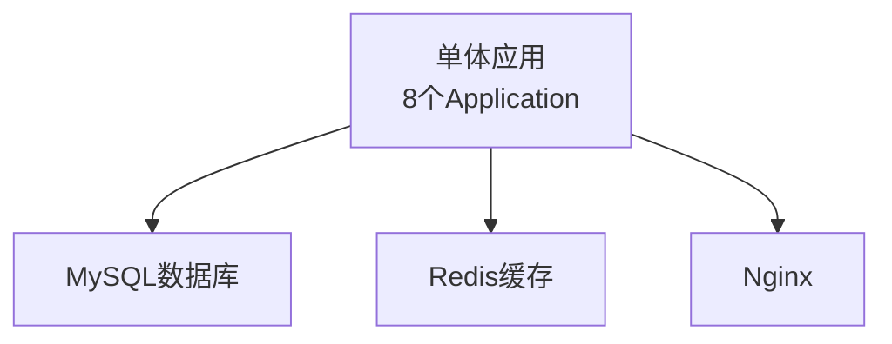
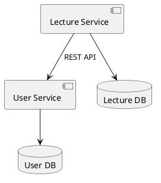
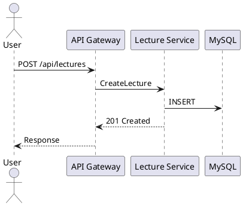
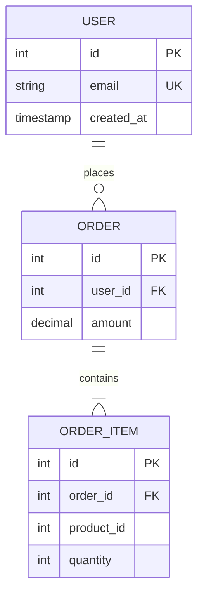
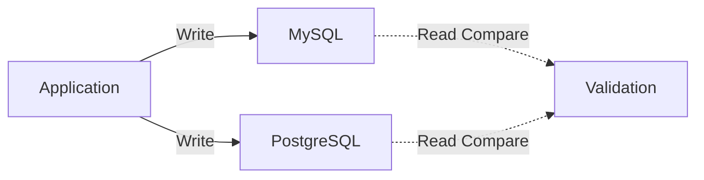
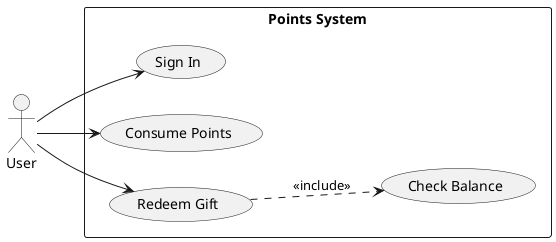
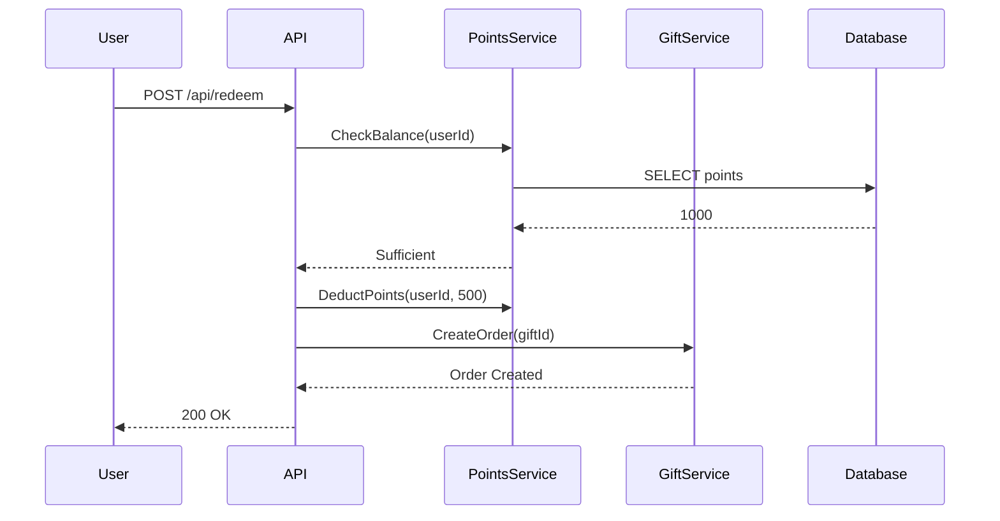
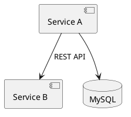
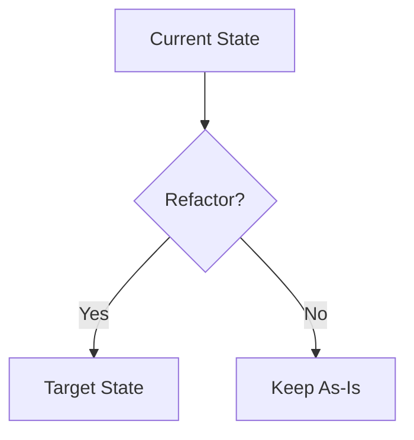

# 模板扩展参考案例（多场景）

本文件展示如何使用 template-extension skill 从真实案例中抽象通用模板，遵循 **UML-Spec Driven Development** 思想。

## 核心方法论

1. **从案例到模式**: 收集 ≥3 个真实项目 → 提取共性 → 抽象模板
2. **UML 模型优先**: 使用 PlantUML/Mermaid 描述架构和流程
3. **Spec→Plan→Tasks 传递性**: 单一真实来源，无冗余
4. **硬约束标识符**: 场景特定 ID（Ixx/Exx/Fxx）确保可追溯性

---

## 案例 1: Refactor 场景 - 讲课服务拆分

### 项目背景

- **原服务**: 单体应用（8 个 Application）
- **目标**: 拆分为微服务（2 个端到端接口 I01, I02）
- **场景类型**: Refactor（架构重构）
- **验收方式**: 行为一致性、性能无退化

### UML 模型（关键）

**Current State**:


**Target State**:


### Spec 示例片段（Refactor 场景）

```markdown
## Interface Inventory（Refactor 场景特定）

| ID   | Name              | Protocol | Current State      | Target State         |
| ---- | ----------------- | -------- | ------------------ | -------------------- |
| I01  | CreateLecture     | REST     | Monolith:8080/api  | LectureService:8001  |
| I02  | QueryLectureList  | REST     | Monolith:8080/api  | LectureService:8001  |

**重点**: Interface Inventory 是 Refactor 场景的特有元素，用于描述接口迁移。

## 验收标准（Refactor 场景：一致性验收）

- AC-1 用户行为: 与 Baseline 100% 一致（HTTP 状态码、响应结构）
- AC-2 性能: 延迟 ≤ Baseline + 10ms（P99）
- AC-3 可靠性: 可用性 ≥ 99.5%（对齐 SLA）
- AC-4 发布风险: MTTR ≤ 15min（灰度回滚时间）
```

### Plan 示例片段（Refactor 场景）

```markdown
## Phase 1: Interface:I01 - CreateLecture

### Design Details

**UML 序列图**:


**Implementation Steps**:
1. LectureService.createLecture() - 业务逻辑
2. LectureRepository.save() - 数据持久化
3. Dual-Write Validation - 双写验证
```

### Tasks 示例片段（Refactor 场景）

```markdown
## Phase 1: Interface:I01 - CreateLecture

**Task 1.1**: 实现 LectureService.createLecture()
```java
public class LectureService {
    public CreateLectureResponse createLecture(CreateLectureRequest request) {
        // 验证输入
        // 保存到 MySQL
        // 返回 201 响应
    }
}
```

**Task 1.2**: AC-1 E2E 测试
- 测试用例 1: 正常创建 → 返回 201
- 测试用例 2: 重复标题 → 返回 400
- 验证: 与旧服务响应 100% 一致

**Task 1.3**: AC-2 负载测试
- 工具: wrk -c 100 -d 60s
- 基线: P99 = 800ms
- 目标: P99 ≤ 810ms
```

### 从案例抽象模板的步骤（Refactor 场景）

1. **提取 UML 模型共性**:
   - Current State（现状图） → Target State（目标架构图）
   - Component Diagram（组件关系）
   - Sequence Diagram（接口交互）

2. **识别场景特定元素**:
   - Refactor: Interface Inventory（接口清单）
   - Refactor: AC-1~AC-4 验收框架（一致性验收）
   - Refactor: Phase 按 Interface:Ixx 拆分

3. **提取通用传递性模式**:
   - Spec 定义 Interface:I01, I02 → Plan 必须覆盖所有 ID
   - Plan Phase 1, 2 → Tasks 必须 1:1 对应
   - UML 模型在 Spec 定义，Plan/Tasks 引用，不重复绘制

4. **机械验证命令**:
   ```bash
   # 检查 Spec→Plan 传递性
   grep -E 'Interface:I[0-9]{2}' spec.md | sort > spec_ids.txt
   grep -E 'Interface:I[0-9]{2}' plan.md | sort > plan_ids.txt
   diff spec_ids.txt plan_ids.txt  # 应该一致
   ```

---

## 案例 2: Data 场景 - MySQL 迁移到 PostgreSQL

### 项目背景

- **原数据库**: MySQL 5.7（3 张核心表）
- **目标**: 迁移到 PostgreSQL 14（零数据丢失）
- **场景类型**: Data（数据迁移）
- **验证方式**: 数据完整性、查询结果一致性

### UML 模型（关键）

**Data Model**:


### Spec 示例片段（Data 场景）

```markdown
## Entity Inventory（Data 场景特定）

| ID   | Name       | Source Schema | Target Schema | Row Count | Constraints              |
| ---- | ---------- | ------------- | ------------- | --------- | ------------------------ |
| E01  | USER       | MySQL         | PostgreSQL    | 1.2M      | PK, UK(email)            |
| E02  | ORDER      | MySQL         | PostgreSQL    | 5.6M      | PK, FK(user_id)          |
| E03  | ORDER_ITEM | MySQL         | PostgreSQL    | 18M       | PK, FK(order_id)         |

**重点**: Entity Inventory 是 Data 场景的特有元素，用于描述数据迁移。

## 验收标准（Data 场景：完整性验收）

- AC-1 数据完整性: Row Count 100% 一致（源 vs 目标）
- AC-2 约束一致性: PK/FK/UK 全部迁移成功
- AC-3 查询一致性: 核心查询结果 100% 一致（10 个 SQL 场景）
- AC-4 发布风险: 回滚时间 ≤ 30min（备份恢复时间）
```

### Plan 示例片段（Data 场景）

```markdown
## Phase 1: Entity:E01 - USER 表迁移

### Migration Strategy

**Dual-Write 流程图**:


**Implementation Details**:
- Step 1: Schema 迁移（CREATE TABLE）
- Step 2: 全量数据同步（mysqldump → pg_restore）
- Step 3: 增量同步（Binlog → Debezium）
- Step 4: 双写验证（1 周观察期）
```

### Tasks 示例片段（Data 场景）

```markdown
## Phase 1: Entity:E01 - USER 表迁移

**Task 1.1**: PostgreSQL Schema 创建
```sql
CREATE TABLE users (
    id SERIAL PRIMARY KEY,
    email VARCHAR(255) UNIQUE NOT NULL,
    created_at TIMESTAMP NOT NULL
);
```

**Task 1.2**: 全量数据同步
```bash
# 导出 MySQL 数据
mysqldump --single-transaction users > users.sql

# 转换为 PostgreSQL 格式
./convert-to-postgres.sh users.sql

# 导入 PostgreSQL
psql -d mydb -f users_pg.sql
```

**Task 1.3**: AC-1 数据完整性验证
```bash
# 检查行数
mysql -e "SELECT COUNT(*) FROM users;" # 应该 = 1,200,000
psql -c "SELECT COUNT(*) FROM users;"   # 应该 = 1,200,000

# 检查数据一致性（抽样 1000 行）
./compare-data.sh users 1000
```
```

### 从案例抽象模板的步骤（Data 场景）

1. **提取 UML 模型共性**:
   - ER Diagram（实体关系图）
   - Migration Flowchart（迁移流程图）

2. **识别场景特定元素**:
   - Data: Entity Inventory（实体清单）
   - Data: AC-1~AC-4 验收框架（完整性验收）
   - Data: Phase 按 Entity:Exx 拆分

3. **提取通用传递性模式**:
   - Spec 定义 Entity:E01, E02, E03 → Plan 必须覆盖所有 ID
   - Plan Phase 1, 2, 3 → Tasks 必须 1:1 对应

4. **机械验证命令**:
   ```bash
   # 检查 Spec→Plan 传递性
   grep -E 'Entity:E[0-9]{2}' spec.md | sort > spec_ids.txt
   grep -E 'Entity:E[0-9]{2}' plan.md | sort > plan_ids.txt
   diff spec_ids.txt plan_ids.txt  # 应该一致
   ```

---

## 案例 3: Feature 场景 - 用户积分系统

### 项目背景

- **新功能**: 用户积分系统（签到、消费积分、兑换礼品）
- **场景类型**: Feature（新功能开发）
- **验证方式**: 功能完整性、性能达标

### UML 模型（关键）

**Use Case Diagram**:


**Sequence Diagram (Redeem Gift)**:


### Spec 示例片段（Feature 场景）

```markdown
## Feature Inventory（Feature 场景特定）

| ID   | Name          | User Story                          | Priority | Dependency |
| ---- | ------------- | ----------------------------------- | -------- | ---------- |
| F01  | SignIn        | 用户签到获取积分                    | P0       | None       |
| F02  | RedeemGift    | 用户使用积分兑换礼品                | P0       | F01        |
| F03  | QueryHistory  | 用户查询积分历史记录                | P1       | F01        |

**重点**: Feature Inventory 是 Feature 场景的特有元素，用于描述功能列表。

## 验收标准（Feature 场景：功能验收）

- AC-1 功能完整性: F01, F02, F03 全部实现，测试覆盖率 ≥ 80%
- AC-2 性能: F02 兑换接口延迟 ≤ 200ms（P95）
- AC-3 可靠性: 积分扣减必须原子性（无超扣）
- AC-4 发布风险: Feature Flag 控制，灰度比例 10%→50%→100%
```

### Plan 示例片段（Feature 场景）

```markdown
## Phase 1: Feature:F01 - SignIn 签到功能

### Technical Design

**API Specification**:
```
POST /api/points/sign-in
Request: { "userId": "string" }
Response: { "points": 10, "totalPoints": 1000 }
```

**Database Schema**:
```sql
CREATE TABLE sign_in_log (
    id BIGINT PRIMARY KEY,
    user_id VARCHAR(64) NOT NULL,
    points INT NOT NULL,
    created_at TIMESTAMP NOT NULL,
    UNIQUE INDEX uk_user_date (user_id, DATE(created_at))
);
```

**Implementation Steps**:
1. SignInService.signIn() - 业务逻辑
2. PointsRepository.addPoints() - 积分增加
3. SignInLogRepository.log() - 记录日志
```

### Tasks 示例片段（Feature 场景）

```markdown
## Phase 1: Feature:F01 - SignIn 签到功能

**Task 1.1**: 创建数据库表
```sql
-- 执行 SQL（如 Plan 定义）
CREATE TABLE sign_in_log (...);
```

**Task 1.2**: 实现 SignInService
```java
public class SignInService {
    public SignInResult signIn(String userId) {
        // 检查今日是否已签到
        if (signInLogRepository.existsTodaySignIn(userId)) {
            throw new AlreadySignedException();
        }
        
        // 增加积分
        pointsRepository.addPoints(userId, 10);
        
        // 记录日志
        signInLogRepository.log(userId, 10);
        
        return new SignInResult(10, getTotalPoints(userId));
    }
}
```

**Task 1.3**: AC-1 单元测试
- 测试用例 1: 首次签到成功（预期：积分 +10）
- 测试用例 2: 重复签到失败（预期：抛出异常）
- 测试用例 3: 积分累加正确（预期：总积分 = 上次 + 10）

**Task 1.4**: AC-2 性能测试
```bash
# 使用 JMeter 测试
jmeter -n -t sign_in_load_test.jmx -l results.jtl
# 验证：P95 ≤ 200ms
```
```

### 从案例抽象模板的步骤（Feature 场景）

1. **提取 UML 模型共性**:
   - Use Case Diagram（用例图）
   - Sequence Diagram（交互序列图）
   - ER Diagram（数据模型）

2. **识别场景特定元素**:
   - Feature: Feature Inventory（功能清单）
   - Feature: AC-1~AC-4 验收框架（功能验收）
   - Feature: Phase 按 Feature:Fxx 拆分

3. **提取通用传递性模式**:
   - Spec 定义 Feature:F01, F02, F03 → Plan 必须覆盖所有 ID
   - Plan Phase 1, 2, 3 → Tasks 必须 1:1 对应

4. **机械验证命令**:
   ```bash
   # 检查 Spec→Plan 传递性
   grep -E 'Feature:F[0-9]{2}' spec.md | sort > spec_ids.txt
   grep -E 'Feature:F[0-9]{2}' plan.md | sort > plan_ids.txt
   diff spec_ids.txt plan_ids.txt  # 应该一致
   ```

---

## 通用模板抽象原则

### 1. UML 模型优先

- **Spec 阶段**: 必须包含架构级 UML 模型（Component/ER/Use Case Diagram）
- **Plan 阶段**: 必须包含实现级 UML 模型（Sequence/Flowchart/Deployment Diagram）
- **Tasks 阶段**: 引用 UML 模型，不重复绘制

### 2. 硬约束标识符

| 场景类型 | 标识符格式    | 示例        | 用途           |
| -------- | ------------- | ----------- | -------------- |
| Refactor | Interface:Ixx | I01, I02    | 接口迁移追踪   |
| Data     | Entity:Exx    | E01, E02    | 实体迁移追踪   |
| Feature  | Feature:Fxx   | F01, F02    | 功能开发追踪   |

### 3. 验收标准框架

所有场景都遵循 AC-1~AC-4 框架，但侧重点不同：

**Refactor 场景**:
- AC-1: 行为一致性（与 Baseline 100% 一致）
- AC-2: 性能无退化（延迟 ≤ Baseline + 阈值）
- AC-3: SLA 对齐（可用性、监控对齐）
- AC-4: MTTR 风险（灰度回滚时间）

**Data 场景**:
- AC-1: 数据完整性（Row Count 100% 一致）
- AC-2: 约束一致性（PK/FK/UK 全部迁移）
- AC-3: 查询一致性（核心查询结果一致）
- AC-4: 回滚时间（备份恢复时间）

**Feature 场景**:
- AC-1: 功能完整性（功能全部实现，测试覆盖率）
- AC-2: 性能达标（接口延迟、吞吐量）
- AC-3: 可靠性（事务一致性、错误处理）
- AC-4: 灰度发布（Feature Flag、灰度比例）

### 4. Spec→Plan→Tasks 传递性

```bash
# 通用验证流程（适用所有场景）
# 1. 提取 Spec 中的硬约束 ID
grep -oE '(Interface|Entity|Feature):[A-Z][0-9]{2}' spec.md | sort -u > spec_ids.txt

# 2. 提取 Plan 中的硬约束 ID
grep -oE '(Interface|Entity|Feature):[A-Z][0-9]{2}' plan.md | sort -u > plan_ids.txt

# 3. 提取 Tasks 中的硬约束 ID
grep -oE '(Interface|Entity|Feature):[A-Z][0-9]{2}' tasks.md | sort -u > tasks_ids.txt

# 4. 验证一致性
diff spec_ids.txt plan_ids.txt && echo "Spec→Plan 一致 ✓"
diff plan_ids.txt tasks_ids.txt && echo "Plan→Tasks 一致 ✓"
```

### 5. UML 语法规范

**PlantUML（推荐用于组件图、部署图、序列图）**:


**Mermaid（推荐用于流程图、ER 图、状态图）**:


---

## 模板定制化检查清单

- [ ] 收集 ≥3 个真实案例（Refactor/Data/Feature）
- [ ] 每个案例都包含 Spec/Plan/Tasks 完整文件
- [ ] 提取所有 UML 模型的共性模式
- [ ] 识别场景特定元素（Interface/Entity/Feature Inventory）
- [ ] 设计通用的硬约束标识符规则
- [ ] 更新 spec-template.\<scenario\>.md
- [ ] 更新 plan-template.\<scenario\>.md
- [ ] 更新 tasks-template.\<scenario\>.md
- [ ] 更新 commands/\<scenario\>.md（如需要）
- [ ] 运行传递性验证命令（grep/diff）
- [ ] 在本地项目测试模板生成效果

---

**版本**: 2.0.0  
**核心思想**: UML-Spec Driven Development - 用可视化架构模型驱动开发，用硬约束标识符保证传递性
