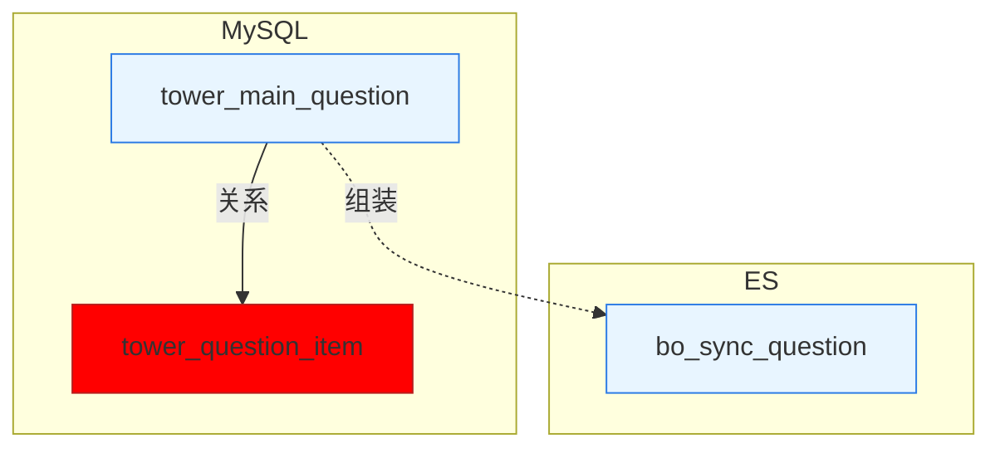
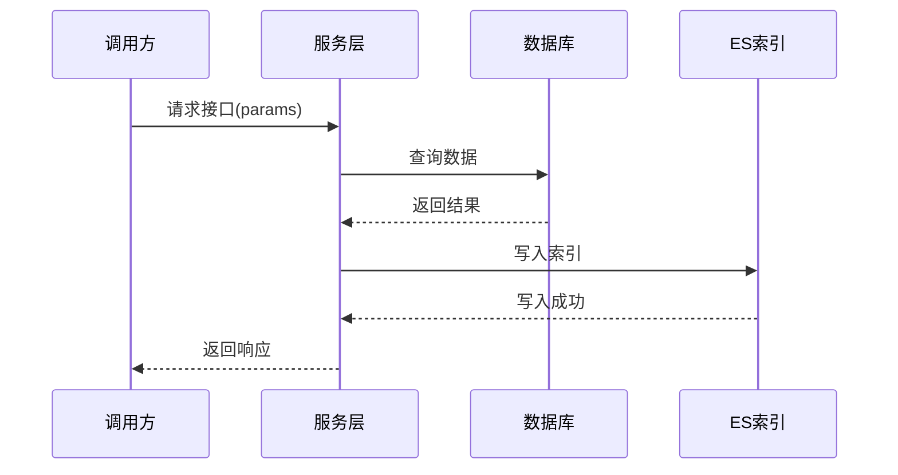

# 教研知识发布模板使用指南

## 概述

教研知识发布模板（`spec-template.knowledge-publish.md`）是专门为教育研究和知识发布领域设计的规范模板。它特别适用于需要详细数据模型设计、接口定义和系统集成的场景，如题库发布、教学内容管理等。

## 适用场景

当您的功能开发涉及以下内容时，建议使用此模板：

- ✅ 教研系统的数据发布功能
- ✅ 题库、题目、教学内容的管理与发布
- ✅ 需要详细数据模型设计（MySQL + ES）
- ✅ 需要完整的接口时序图和性能分析
- ✅ 涉及多系统交互（hub、publish等）
- ✅ 需要严格的发布规则和校验逻辑
- ✅ 需要标注责任人和改动清单

## 使用方法

### 方法1：通过命令调用（推荐）

如果您的 AI 助手支持自定义命令：

```bash
/speckit.specify-knowledge-publish "添加竖式排版内容格式支持"
```

### 方法2：通过脚本调用

#### Bash

```bash
./scripts/bash/create-new-feature.sh \
  --json \
  --template knowledge-publish \
  --short-name "vertical-layout" \
  "对计算专项场景提供竖式排版内容格式支持"
```

#### PowerShell

```powershell
./scripts/powershell/create-new-feature.ps1 `
  -Json `
  -Template knowledge-publish `
  -ShortName "vertical-layout" `
  "对计算专项场景提供竖式排版内容格式支持"
```

### 方法3：手动复制模板

```bash
# 创建功能分支目录
mkdir -p specs/001-vertical-layout

# 复制模板
cp templates/spec-template.knowledge-publish.md specs/001-vertical-layout/spec.md
```

## 模板结构

### 必填部分（mandatory）

1. **User Scenarios & Testing**
   - 用户故事（按优先级排序）
   - 独立测试场景
   - 验收标准

2. **需求输入（来自业务方）**
   - 日期、范围、来源
   - 核心需求要点
   - 业务规则

3. **技术方案**
   - 变更总览
   - 架构设计（Mermaid 图）
   - 数据模型设计（表结构、字段说明）

4. **接口设计**
   - 接口总览表
   - 每个接口包含：
     - 接口签名和 Schema
     - 时序图
     - 改动分析
     - 性能设计
     - 改动清单
     - 验证路径

5. **风险评估**
   - 技术风险
   - 兼容性风险

6. **上线计划**
   - 上线检查清单
   - 上线步骤

7. **依赖方沟通**
   - 上游依赖
   - 下游影响

8. **监控与告警**
   - 关键指标
   - 告警配置

### 可选部分（optional）

- **发布规则**：发布校验规则和链路
- **数据流转**：数据链路图和关键数据结构
- **附录**：相关文档和术语表

## 关键特性

### 1. 责任人标注

使用彩色标注格式：

```markdown
**责任人**：$\color{#0089FF}{@张三}$
```

### 2. 架构图示例



- **蓝色**：现有模型/字段
- **红色**：新增/变更模型/字段

### 3. 接口时序图示例



### 4. 数据模型表格

| **字段** | **类型** | **含义** | **备注** |
| --- | --- | --- | --- |
| id | bigint | 主键 | 自增 |
| content_template | text | 题干占位模板 | **本次新增** |
| is_delete | tinyint | 软删 | 0/1 |
| create_time | bigint | 创建时间 | 毫秒时间戳 |

### 5. 改动分析表格

| **仓库** | **业务/场景** | **影响评估** |
| --- | --- | --- |
| jzx-server | 全科精准学 | 需要适配新字段 |
| poseidon | 数学一对一 | 无影响 |

## 最佳实践

### 1. 架构设计

- ✅ 使用 Mermaid 图清晰展示系统架构
- ✅ 区分新旧模型（蓝色 vs 红色）
- ✅ 标注数据流向和关系

### 2. 数据模型

- ✅ 完整的字段定义（类型、含义、备注）
- ✅ 标注新增字段（**本次新增**）
- ✅ 包含审计字段（create_time, update_time等）
- ✅ 明确责任人

### 3. 接口设计

- ✅ 提供完整的时序图
- ✅ 分析对现有系统的影响
- ✅ 设定明确的性能目标（RT < 50ms）
- ✅ 列出具体的改动文件和位置
- ✅ 提供可操作的验证步骤

### 4. 风险管理

- ✅ 识别技术风险和兼容性风险
- ✅ 提供应对措施
- ✅ 明确回滚方案

### 5. 上线规划

- ✅ 使用检查清单确保完整性
- ✅ 明确上线步骤和时间
- ✅ 配置监控和告警

## 实际案例

查看实际使用案例：

- [对计算专项场景提供竖式排版内容格式支持](../md/对计算专项场景提供竖式排版内容格式支持.md)

该案例完整展示了：
- 需求输入和业务规则
- 完整的 ER 图设计
- 多个接口的详细设计
- 发布规则和校验逻辑
- 性能设计和改动清单
- 依赖方沟通和上线计划

## 与其他模板的区别

| 特性 | knowledge-publish | 标准模板 | data 模板 |
| --- | --- | --- | --- |
| 架构图 | ✅ 强调（彩色区分） | ⚠️ 可选 | ✅ 包含 |
| 数据模型 | ✅ 详细表结构 | ⚠️ 简单 | ✅ 详细 |
| 接口时序图 | ✅ 必需 | ⚠️ 可选 | ✅ 推荐 |
| 责任人标注 | ✅ 彩色格式 | ❌ 无 | ❌ 无 |
| 发布规则 | ✅ 详细 | ❌ 无 | ⚠️ 简单 |
| 性能指标 | ✅ 明确 RT 目标 | ⚠️ 简单 | ✅ 包含 |
| 改动清单 | ✅ 具体到文件 | ❌ 无 | ⚠️ 简单 |
| 验证路径 | ✅ 可操作步骤 | ⚠️ 简单 | ⚠️ 简单 |
| 中文支持 | ✅ 原生支持 | ⚠️ 英文为主 | ⚠️ 英文为主 |

## 常见问题

### Q: 什么时候应该使用这个模板？

A: 当您的功能涉及教研系统、题库发布、数据模型变更、多系统集成时，应该使用此模板。

### Q: 如何添加新的接口？

A: 复制 "2.1 接口名称" 部分，按照相同的结构填写：
1. 接口签名和 Schema
2. 时序图
3. 改动分析（包含调用方清单）
4. 性能设计
5. 改动清单
6. 验证路径

### Q: 架构图的颜色如何设置？

A: 在 Mermaid 图的末尾添加：

```mermaid
classDef old fill:#e8f5ff,stroke:#2c7be5,stroke-width:1px;
classDef new fill:#ff0000,stroke:#b91c1c,stroke-width:1px;
class table1,index1 old;
class table2,index2 new;
```

### Q: 责任人标注不显示颜色怎么办？

A: 确保使用正确的 LaTeX 格式：`$\color{#0089FF}{@姓名}$`

某些 Markdown 渲染器可能不支持彩色文本，可以考虑使用加粗或斜体替代。

### Q: 如何处理多个数据库表？

A: 为每个表创建一个独立的表格，使用三级标题分隔：

```markdown
#### 表1：tower_main_question

| **字段** | **类型** | **含义** | **备注** |
...

#### 表2：tower_question_item

| **字段** | **类型** | **含义** | **备注** |
...
```

## 相关资源

- [Spec Kit 官方文档](../README.md)
- [Mermaid 图表语法](https://mermaid.js.org/)
- [Markdown 表格指南](https://www.markdownguide.org/extended-syntax/#tables)

---

**维护者**：Spec Kit Team  
**最后更新**：2026-02-05
