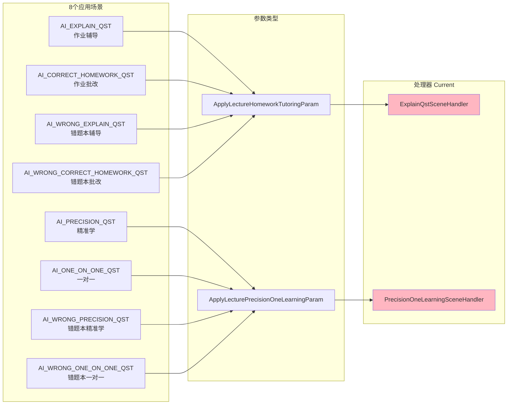
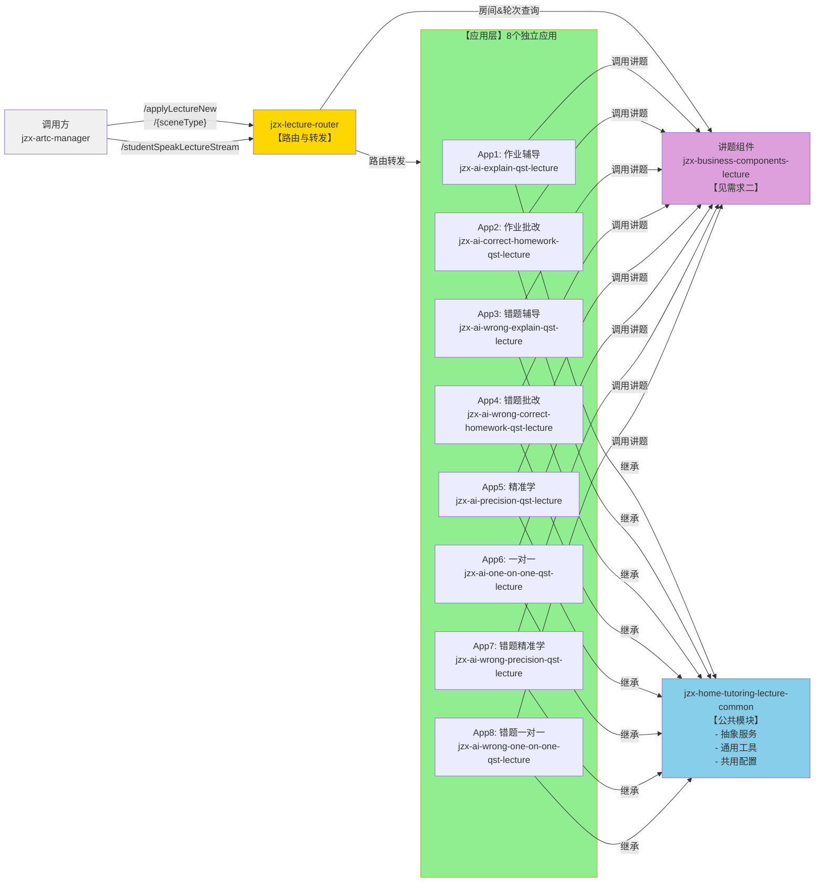
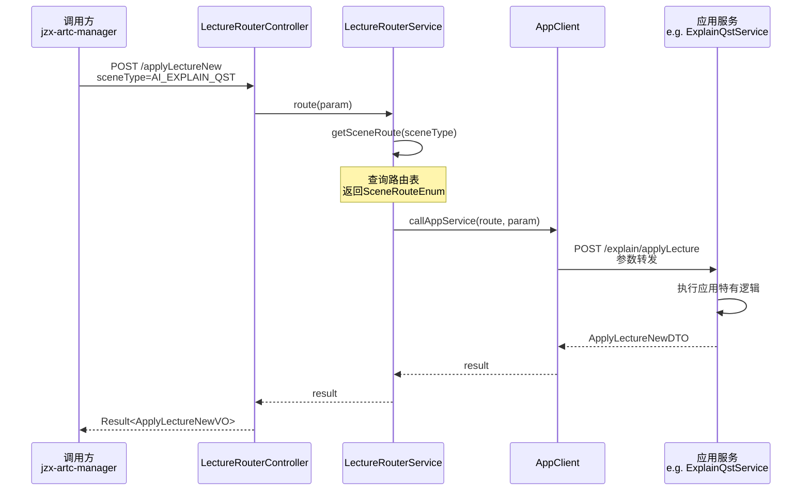

# AIDM讲题服务重构 - 需求一：应用拆分方案

## 文档说明

本文档描述**需求一：场景剥离与应用独立**的完整设计方案，包括需求背景、现状分析、目标架构设计和实现规划。

:::
**核心目标**：从AIDM仓库中剥离"家庭辅导"场景，创建8个可独立部署、互不耦合的应用模块。
:::

---

## 一、背景与问题

### 1.1 当前问题分析

| 问题 | 描述 | 影响 |
| --- | --- | --- |
| **高度耦合** | 8个应用在同一个Handler中处理 | 修改一个应用可能影响其他应用 |
| **代码臃肿** | AILectureServiceImpl 3000+行代码 | 可读性差，维护困难 |
| **扩展性差** | 新增应用需要修改核心类 | 违反开闭原则 |
| **测试困难** | 无法针对单一应用进行单元测试 | 测试覆盖率低 |
| **部署耦合** | 所有应用必须一起部署 | 无法按需扩缩容 |
| **流程不可视** | 业务逻辑在代码中，难以理解 | 业务方无法参与评审 |

### 1.2 涉及的接口

| 接口路径 | 接口名称 | 说明 |
| --- | --- | --- |
| `/aidm/lecture/applyLectureNew` | 讲题接口 | 获取讲题房间、初始化讲题流程 |
| `/aidm/lecture/studentSpeakLectureStream` | 学生发言接口 | 处理学生回答、触发AI讲题 |

### 1.3 业务枚举映射



---

## 二、需求与目标

### 2.1 需求描述

从AIDM仓库中剥离"家庭辅导"场景，明确**场景 → 应用**的颗粒度，创建8个可独立部署的应用模块。

### 2.2 重构目标

| 目标维度 | 具体目标 |
| --- | --- |
| **可维护性** | 代码结构清晰，职责单一，易于理解和修改 |
| **可测性** | 各应用可独立单元测试，便于自动化测试 |
| **扩展性** | 新增应用无需修改现有应用，遵循开闭原则 |
| **部署灵活** | 各应用可独立部署和扩缩容，降低变更风险 |
| **性能优化** | 提升接口响应速度，降低资源消耗 |

### 2.3 应用清单

| 应用代码 | 应用名称 | 所属模块 | 参数类型 | 特有逻辑 |
| --- | --- | --- | --- | --- |
| AI_EXPLAIN_QST | 作业辅导应用 | jzx-ai-explain-qst-lecture | ApplyLectureHomeworkParam | 路由查询（Quark/OCR） |
| AI_CORRECT_HOMEWORK_QST | 作业批改应用 | jzx-ai-correct-homework-qst-lecture | ApplyLectureHomeworkParam | 批改模式设置 + 答案校验 |
| AI_WRONG_EXPLAIN_QST | 错题本辅导应用 | jzx-ai-wrong-explain-qst-lecture | ApplyLectureWrongQstParam | 错题本数据初始化 |
| AI_WRONG_CORRECT_HOMEWORK_QST | 错题本批改应用 | jzx-ai-wrong-correct-homework-qst-lecture | ApplyLectureWrongQstParam | 错题本 + 批改模式 |
| AI_PRECISION_QST | 精准学应用 | jzx-ai-precision-qst-lecture | ApplyLecturePrecisionParam | 推荐题、3-9年级数学跳过清洗 |
| AI_ONE_ON_ONE_QST | 一对一讲题应用 | jzx-ai-one-on-one-qst-lecture | ApplyLecturePrecisionParam | 分配题目获取 |
| AI_WRONG_PRECISION_QST | 错题本精准学应用 | jzx-ai-wrong-precision-qst-lecture | ApplyLectureWrongPrecisionParam | 错题本 + 推荐 + 跳过清洗 |
| AI_WRONG_ONE_ON_ONE_QST | 错题本一对一应用 | jzx-ai-wrong-one-on-one-qst-lecture | ApplyLectureWrongQstParam | 错题本 + 分配题 |

---

## 三、重构策略

### 3.1 重构原则

> **重要原则：不改变时序、不改变表结构、最小化改动**

| 原则 | 说明 | 验证方法 |
| --- | --- | --- |
| **时序不变** | 保持原有的调用时序，确保业务逻辑等价 | 新老接口结果对比 |
| **表结构不变** | 不修改现有数据库表结构，保证数据兼容 | 数据库Schema一致性检查 |
| **接口兼容** | 入参/出参保持一致，调用方无感知 | 接口协议一致性测试 |
| **最小改动** | 优先复制代码，保持原有逻辑不变 | 代码行数增量统计 |

### 3.2 分阶段实施

**阶段1：应用拆分** - 完成应用级别服务拆分与E2E通过
**阶段2：组件抽取** - 完成讲题接口的唯一调用（参见需求二文档）
**阶段3：BPMN重构** - 完成业务代码BPMN、冗余代码优化（参见需求三文档）

---

## 四、目标架构设计

### 4.1 整体架构



### 4.2 工程结构

```
jzx-composition/
│
├── jzx-lecture-router/                           # 路由模块 【新增】
│   ├── src/main/java/com/jzx/lecture/router/
│   │   ├── controller/
│   │   │   └── LectureRouterController.java       # 统一入口
│   │   ├── service/
│   │   │   └── LectureRouterService.java          # 路由转发逻辑
│   │   ├── client/
│   │   │   ├── LectureAppClient.java              # 应用调用客户端
│   │   │   └── impl/
│   │   └── config/
│   │       └── SceneRouteConfig.java              # 路由配置
│   ├── src/main/resources/
│   │   └── application.yml                        # 应用配置
│   └── pom.xml
│
├── jzx-home-tutoring/
│   │
│   ├── jzx-home-tutoring-lecture-common/         # 公共模块 【新增】
│   │   ├── src/main/java/com/jzx/home/tutoring/lecture/common/
│   │   │   ├── controller/
│   │   │   │   └── AbstractLectureController.java
│   │   │   ├── service/
│   │   │   │   ├── AbstractLectureService.java    # 讲题抽象服务
│   │   │   │   └── AbstractDialogueService.java   # 对话抽象服务
│   │   │   ├── model/
│   │   │   │   ├── param/                         # 通用入参
│   │   │   │   │   ├── ApplyLectureNewBaseParam.java
│   │   │   │   │   └── StudentSpeakLectureParam.java
│   │   │   │   ├── dto/                           # 通用DTO
│   │   │   │   ├── vo/                            # 通用VO
│   │   │   │   └── context/
│   │   │   │       └── LectureContext.java        # 讲题执行上下文
│   │   │   ├── util/                              # 工具类
│   │   │   └── config/
│   │   │       └── LectureCommonConfig.java
│   │   ├── src/main/resources/
│   │   │   └── bpmn/
│   │   │       └── templates/                     # BPMN模板
│   │   └── pom.xml
│   │
│   ├── jzx-ai-explain-qst-lecture/               # APP1: 作业辅导
│   │   ├── src/main/java/com/jzx/ai/explain/qst/lecture/
│   │   │   ├── controller/
│   │   │   │   └── ExplainQstController.java
│   │   │   ├── service/
│   │   │   │   └── ExplainQstLectureService.java
│   │   │   └── model/
│   │   │       └── param/
│   │   │           └── ApplyLectureHomeworkParam.java
│   │   ├── src/main/resources/
│   │   │   ├── application.yml
│   │   │   └── bpmn/
│   │   └── pom.xml
│   │
│   ├── jzx-ai-correct-homework-qst-lecture/     # APP2: 作业批改
│   │   ├── src/main/java/com/jzx/ai/correct/homework/qst/lecture/
│   │   ├── src/main/resources/
│   │   └── pom.xml
│   │
│   ├── jzx-ai-wrong-explain-qst-lecture/        # APP3: 错题本辅导
│   │   └── ...
│   │
│   ├── jzx-ai-wrong-correct-homework-qst-lecture/ # APP4: 错题本批改
│   │   └── ...
│   │
│   ├── jzx-ai-precision-qst-lecture/            # APP5: 精准学
│   │   └── ...
│   │
│   ├── jzx-ai-one-on-one-qst-lecture/           # APP6: 一对一
│   │   └── ...
│   │
│   ├── jzx-ai-wrong-precision-qst-lecture/      # APP7: 错题本精准学
│   │   └── ...
│   │
│   └── jzx-ai-wrong-one-on-one-qst-lecture/     # APP8: 错题本一对一
│       └── ...
│
└── jzx-business-components/
    └── jzx-business-components-lecture/          # 讲题组件 【见需求二】
        └── ...
```

---

## 五、路由设计

### 5.1 路由表

| sceneType | 应用模块 | applyLecture接口 | studentSpeak接口 |
| --- | --- | --- | --- |
| `AI_EXPLAIN_QST` | jzx-ai-explain-qst-lecture | `/explain/applyLecture` | `/explain/studentSpeak` |
| `AI_CORRECT_HOMEWORK_QST` | jzx-ai-correct-homework-qst-lecture | `/correct/applyLecture` | `/correct/studentSpeak` |
| `AI_WRONG_EXPLAIN_QST` | jzx-ai-wrong-explain-qst-lecture | `/wrong-explain/applyLecture` | `/wrong-explain/studentSpeak` |
| `AI_WRONG_CORRECT_HOMEWORK_QST` | jzx-ai-wrong-correct-homework-qst-lecture | `/wrong-correct/applyLecture` | `/wrong-correct/studentSpeak` |
| `AI_PRECISION_QST` | jzx-ai-precision-qst-lecture | `/precision/applyLecture` | `/precision/studentSpeak` |
| `AI_ONE_ON_ONE_QST` | jzx-ai-one-on-one-qst-lecture | `/one-on-one/applyLecture` | `/one-on-one/studentSpeak` |
| `AI_WRONG_PRECISION_QST` | jzx-ai-wrong-precision-qst-lecture | `/wrong-precision/applyLecture` | `/wrong-precision/studentSpeak` |
| `AI_WRONG_ONE_ON_ONE_QST` | jzx-ai-wrong-one-on-one-qst-lecture | `/wrong-one-on-one/applyLecture` | `/wrong-one-on-one/studentSpeak` |

### 5.2 路由实现

```java
/**
 * 应用路由枚举
 */
public enum SceneRouteEnum {

    AI_EXPLAIN_QST(
        "AI_EXPLAIN_QST",
        "作业辅导",
        "jzx-ai-explain-qst-lecture",
        "/explain/applyLecture",
        "/explain/studentSpeak"
    ),
    AI_CORRECT_HOMEWORK_QST(
        "AI_CORRECT_HOMEWORK_QST",
        "作业批改",
        "jzx-ai-correct-homework-qst-lecture",
        "/correct/applyLecture",
        "/correct/studentSpeak"
    ),
    AI_WRONG_EXPLAIN_QST(
        "AI_WRONG_EXPLAIN_QST",
        "错题本辅导",
        "jzx-ai-wrong-explain-qst-lecture",
        "/wrong-explain/applyLecture",
        "/wrong-explain/studentSpeak"
    ),
    AI_WRONG_CORRECT_HOMEWORK_QST(
        "AI_WRONG_CORRECT_HOMEWORK_QST",
        "错题本批改",
        "jzx-ai-wrong-correct-homework-qst-lecture",
        "/wrong-correct/applyLecture",
        "/wrong-correct/studentSpeak"
    ),
    AI_PRECISION_QST(
        "AI_PRECISION_QST",
        "精准学",
        "jzx-ai-precision-qst-lecture",
        "/precision/applyLecture",
        "/precision/studentSpeak"
    ),
    AI_ONE_ON_ONE_QST(
        "AI_ONE_ON_ONE_QST",
        "一对一",
        "jzx-ai-one-on-one-qst-lecture",
        "/one-on-one/applyLecture",
        "/one-on-one/studentSpeak"
    ),
    AI_WRONG_PRECISION_QST(
        "AI_WRONG_PRECISION_QST",
        "错题本精准学",
        "jzx-ai-wrong-precision-qst-lecture",
        "/wrong-precision/applyLecture",
        "/wrong-precision/studentSpeak"
    ),
    AI_WRONG_ONE_ON_ONE_QST(
        "AI_WRONG_ONE_ON_ONE_QST",
        "错题本一对一",
        "jzx-ai-wrong-one-on-one-qst-lecture",
        "/wrong-one-on-one/applyLecture",
        "/wrong-one-on-one/studentSpeak"
    );

    private final String sceneType;
    private final String sceneName;
    private final String serviceName;
    private final String applyLectureUrl;
    private final String studentSpeakUrl;

    // constructor, getter...

    public static SceneRouteEnum getBySceneType(String sceneType) {
        for (SceneRouteEnum e : values()) {
            if (e.getSceneType().equals(sceneType)) {
                return e;
            }
        }
        return null;
    }
}
```

### 5.3 路由时序图



---

## 六、应用规范

### 6.1 通用规范

#### 6.1.1 入参规范

所有应用的`applyLecture`接口入参都继承自`ApplyLectureNewBaseParam`：

```java
/**
 * 讲题基础参数
 */
@Data
public abstract class ApplyLectureNewBaseParam {
    /** 场景类型 */
    @NotBlank
    private String sceneType;
    
    /** 学科 */
    private String subject;
    
    /** 路由类型：quark/ocr */
    private String route;
    
    /** TTS语速 */
    private Double ttsSpeed;
    
    /** GK类型：GK2/GK4 */
    private String gkType;
    
    /** 反馈ID */
    private Long feedbackId;
    
    /** 渠道 */
    private String jzxChannel;
}
```

#### 6.1.2 出参规范

所有应用的`applyLecture`接口出参统一为`ApplyLectureNewVO`：

```java
/**
 * 讲题返回值
 */
@Data
public class ApplyLectureNewVO {
    /** 房间ID */
    private Long roomId;
    
    /** 轮次ID */
    private Long roundId;
    
    /** 讲题问题ID */
    private String lectureQuestionId;
    
    /** 题干图片URL */
    private String stemImage;
    
    /** 关键字提取图片URL */
    private String keywordStemImage;
    
    /** 当前小题ID */
    private String currentSubQid;
    
    /** GK ID */
    private String gkId;
    
    /** GK类型 */
    private String gkType;
}
```

#### 6.1.3 Controller规范

```java
/**
 * 抽象讲题Controller
 */
public abstract class AbstractLectureController {
    
    @PostMapping("/applyLecture")
    public Result<ApplyLectureNewVO> applyLecture(
            @RequestBody ApplyLectureNewBaseParam param,
            @RequestHeader(value = "X-User-Id", required = false) String userId,
            @RequestHeader(value = "X-App-Id", required = false) Long appId) {
        
        // 设置ThreadLocal上下文
        setUserContext(userId, appId);
        
        try {
            // 调用具体实现
            ApplyLectureNewDTO dto = doApplyLecture(param);
            return Result.success(convertToVO(dto));
        } catch (Exception e) {
            return Result.fail(e);
        } finally {
            clearUserContext();
        }
    }
    
    @PostMapping("/studentSpeak")
    public Result<Boolean> studentSpeak(
            @RequestBody StudentSpeakLectureParam param,
            @RequestHeader(value = "X-User-Id", required = false) Long userId) {
        
        setUserContext(userId, null);
        
        try {
            boolean result = doStudentSpeak(param);
            return Result.success(result);
        } catch (Exception e) {
            return Result.fail(e);
        } finally {
            clearUserContext();
        }
    }
    
    /**
     * 具体应用实现
     */
    protected abstract ApplyLectureNewDTO doApplyLecture(ApplyLectureNewBaseParam param);
    
    protected abstract boolean doStudentSpeak(StudentSpeakLectureParam param);
    
    protected abstract ApplyLectureNewVO convertToVO(ApplyLectureNewDTO dto);
}
```

#### 6.1.4 Service规范

```java
/**
 * 抽象讲题Service
 */
public abstract class AbstractLectureService {
    
    @Autowired
    protected RoomServiceV2 roomService;
    
    @Autowired
    protected AILectureQuestionService aiLectureQuestionService;
    
    @Autowired
    protected LectureComponentFacade lectureComponentFacade;
    
    /**
     * 申请讲题 - 核心流程
     */
    public ApplyLectureNewDTO applyLecture(ApplyLectureNewBaseParam param) {
        // Step 1: 通用参数校验
        validateCommonParam(param);
        
        // Step 2: 应用特有校验
        doCustomValidate(param);
        
        // Step 3: 获取讲题房间信息
        OpenRoomResponseDTO roomResponse = doLectureArrange(param);
        
        // Step 4: 开启讲题房间
        roomResponse = openLectureRoom(param, roomResponse);
        
        // Step 5: 异步触发首轮讲题
        triggerFirstLecture(roomResponse);
        
        // Step 6: 构建返回结果
        return buildApplyLectureDTO(roomResponse);
    }
    
    /**
     * 学生发言 - 核心流程
     */
    public boolean studentSpeak(StudentSpeakLectureParam param) {
        // Step 1: 参数校验
        validateSpeakParam(param);
        
        // Step 2: 获取房间和轮次信息
        RoomRoundDTO roomRound = getRoomRound(param);
        
        // Step 3: 保存学生发言
        recordStudentSpeak(param);
        
        // Step 4: 异步执行AI讲题
        asyncExecuteLecture(param, roomRound);
        
        // Step 5: 立即返回true
        return true;
    }
    
    // ============ 钩子方法 - 由子类实现 ============
    
    /**
     * 获取场景类型
     */
    protected abstract String getSceneType();
    
    /**
     * 应用特有的参数校验
     */
    protected abstract void doCustomValidate(ApplyLectureNewBaseParam param);
    
    /**
     * 讲题编排 - 获取题目、清洗等
     */
    protected abstract OpenRoomResponseDTO doLectureArrange(ApplyLectureNewBaseParam param);
    
    // ============ 通用方法 ============
    
    protected void validateCommonParam(ApplyLectureNewBaseParam param) {
        // 通用校验逻辑
    }
    
    protected OpenRoomResponseDTO openLectureRoom(
            ApplyLectureNewBaseParam param,
            OpenRoomResponseDTO roomResponse) {
        // 创建房间、轮次
        return roomService.createRoom(roomResponse);
    }
    
    protected void triggerFirstLecture(OpenRoomResponseDTO response) {
        // 异步触发讲题
    }
    
    protected ApplyLectureNewDTO buildApplyLectureDTO(OpenRoomResponseDTO response) {
        // 构建返回DTO
        return null;
    }
}
```

### 6.2 各应用特性

#### APP1：作业辅导应用 (AI_EXPLAIN_QST)

**特有参数**：

```java
public class ApplyLectureHomeworkParam extends ApplyLectureNewBaseParam {
    /** 题目图片URL */
    private String imgUrl;
    
    /** 拍题任务ID */
    private Long pid;
    
    /** 题目序号 */
    private Integer qid;
    
    /** 小题序号 */
    private Integer subQid;
    
    /** 切图URL列表 */
    private List<String> cutImgUrls;
}
```

**特有逻辑**：
- 支持Quark/OCR两种路由方式获取题目
- 同题判断和重复处理
- 关键字提取
- 标准清洗流程

**实现要点**：
```java
@Service
public class ExplainQstLectureService extends AbstractLectureService {
    
    @Autowired
    private QuarkFacade quarkFacade;
    
    @Autowired
    private SearchQstFacade searchQstFacade;
    
    @Override
    protected String getSceneType() {
        return "AI_EXPLAIN_QST";
    }
    
    @Override
    protected void doCustomValidate(ApplyLectureHomeworkParam param) {
        Assert.notBlank(param.getImgUrl(), "imgUrl不能为空");
    }
    
    @Override
    protected OpenRoomResponseDTO doLectureArrange(ApplyLectureNewBaseParam param) {
        ApplyLectureHomeworkParam homeworkParam = (ApplyLectureHomeworkParam) param;
        
        // 1. 根据route选择查询方式
        AILectureQuestionDTO question;
        if ("quark".equals(homeworkParam.getRoute())) {
            question = quarkFacade.getQuestion(homeworkParam.getPid(), homeworkParam.getQid());
        } else {
            question = searchQstFacade.getQuestionByImageUrl(homeworkParam.getImgUrl());
        }
        
        // 2. 清洗题目
        question = cleanQuestion(question);
        
        // 3. 保存讲题记录
        Long questionId = aiLectureQuestionService.save(question);
        
        return new OpenRoomResponseDTO().setQuestionId(questionId);
    }
}
```

#### APP2：作业批改应用 (AI_CORRECT_HOMEWORK_QST)

**特有参数**：继承`ApplyLectureHomeworkParam`，额外字段：
- `studentAnswer`: 学生答案

**特有逻辑**：
- 答案校验
- 批改模式设置（影响AI讲题prompt）

#### APP3：错题本辅导应用 (AI_WRONG_EXPLAIN_QST)

**特有参数**：

```java
public class ApplyLectureWrongQstParam extends ApplyLectureNewBaseParam {
    /** 错题本来源ID */
    private String wrongQstSourceId;
    
    /** 错题本来源类型 */
    private String wrongQstSourceType;
}
```

**特有逻辑**：
- 从错题本服务获取题目
- 标记讲题来源为"错题本"

#### APP4：错题本批改应用 (AI_WRONG_CORRECT_HOMEWORK_QST)

**特有参数**：继承`ApplyLectureWrongQstParam`，额外字段：
- `studentAnswer`: 学生答案

**特有逻辑**：
- 错题本初始化 + 答案校验 + 批改模式

#### APP5：精准学应用 (AI_PRECISION_QST)

**特有参数**：

```java
public class ApplyLecturePrecisionParam extends ApplyLectureNewBaseParam {
    /** GK题目ID */
    private String gkQid;
    
    /** 试卷ID */
    private String paperId;
    
    /** 试卷类型 */
    private String paperType;
}
```

**特有逻辑**：
- 从GK服务获取推荐题目
- 3-9年级数学跳过清洗
- 应用题特殊路由

#### APP6：一对一讲题应用 (AI_ONE_ON_ONE_QST)

**特有参数**：继承`ApplyLecturePrecisionParam`

**特有逻辑**：
- 从GK服务获取分配题目（非推荐题）
- 发送激励消息

#### APP7：错题本精准学应用 (AI_WRONG_PRECISION_QST)

**特有参数**：

```java
public class ApplyLectureWrongPrecisionParam extends ApplyLectureNewBaseParam {
    /** 错题本来源ID */
    private String wrongQstSourceId;
    
    /** 错题本来源类型 */
    private String wrongQstSourceType;
}
```

**特有逻辑**：
- 错题本初始化 + 3-9年级数学跳过清洗 + 应用题路由

#### APP8：错题本一对一应用 (AI_WRONG_ONE_ON_ONE_QST)

**特有参数**：继承`ApplyLectureWrongQstParam`

**特有逻辑**：
- 错题本初始化 + 分配题目

---

## 七、实现规划

### 7.1 实现步骤

#### 阶段1：基础设施搭建（1-2周）

1. **创建路由模块** `jzx-lecture-router`
   - 实现LectureRouterController
   - 实现路由转发逻辑
   - 配置Dubbo/HTTP客户端

2. **创建公共模块** `jzx-home-tutoring-lecture-common`
   - 提取通用参数、DTO、VO
   - 实现AbstractLectureController
   - 实现AbstractLectureService
   - 提供通用工具类

3. **建立通用测试框架**
   - 参数校验测试
   - 通用流程测试

#### 阶段2：应用逐个迁移（2-4周）

针对每个应用：

1. **创建应用模块** `jzx-ai-xxx-lecture`
2. **复制原有代码**（最小化改动）
   - 复制Handler→Controller
   - 复制Service实现
   - 复制参数类和DTO
3. **重构为扩展类**
   - 将Service改为继承AbstractLectureService
   - 实现特有逻辑（钩子方法）
   - 删除重复代码
4. **单应用测试**
   - 单元测试：参数校验、特有逻辑
   - 集成测试：与依赖服务的交互
   - 端到端测试：与原AIDM对比

5. **灰度上线**
   - 应用与原AIDM并存
   - 路由配置切换
   - 监控对比

#### 阶段3：应用适配（1-2周）

1. 路由模块对接各应用
2. 整合测试（8个应用 + 路由 + 组件）
3. 性能对标

#### 阶段4：验收与下线（1周）

1. 全链路E2E测试
2. 压力测试
3. 监控验证
4. 下线原有AIDM旧逻辑

### 7.2 迁移清单

| 应用 | 原Handler | 新Service | 参数类 | 依赖组件 | 预估工期 |
| --- | --- | --- | --- | --- | --- |
| APP1 作业辅导 | ExplainQstSceneHandler | ExplainQstLectureService | ApplyLectureHomeworkParam | Quark/SearchQst | 3天 |
| APP2 作业批改 | ExplainQstSceneHandler | CorrectHomeworkService | ApplyLectureHomeworkParam | Quark/SearchQst | 2天 |
| APP3 错题本辅导 | ExplainQstSceneHandler | WrongExplainService | ApplyLectureWrongQstParam | WrongQstFacade | 2天 |
| APP4 错题本批改 | ExplainQstSceneHandler | WrongCorrectService | ApplyLectureWrongQstParam | WrongQstFacade | 2天 |
| APP5 精准学 | PrecisionSceneHandler | PrecisionLectureService | ApplyLecturePrecisionParam | GkFacade | 3天 |
| APP6 一对一 | PrecisionSceneHandler | OneOnOneService | ApplyLecturePrecisionParam | GkFacade | 2天 |
| APP7 错题精准学 | PrecisionSceneHandler | WrongPrecisionService | ApplyLectureWrongPrecisionParam | WrongQst/GkFacade | 3天 |
| APP8 错题一对一 | PrecisionSceneHandler | WrongOneOnOneService | ApplyLectureWrongQstParam | WrongQstFacade | 2天 |

### 7.3 验收标准

**功能验收**：
- ✅ 8个应用都能独立启动、运行
- ✅ 路由转发正确，转发成功率 > 99%
- ✅ 与原AIDM接口结果一致
- ✅ 入参/出参协议完全兼容

**性能验收**：
- ✅ P95延迟 ≤ 200ms（与原AIDM持平）
- ✅ 成功率 ≥ 99.9%
- ✅ 内存占用 ≤ 原AIDM的1.2倍

**代码质量**：
- ✅ 代码覆盖率 ≥ 80%
- ✅ 单个Service代码行数 ≤ 500行
- ✅ 通过静态代码扫描（无高危问题）

---

## 八、后续工作

完成应用拆分后，继续执行：

1. **需求二** - 讲题组件化（参见[02-jzx-lecture-component.md](02-jzx-lecture-component.md)）
   - 提取讲题逻辑为统一组件
   - 支持离线/实时讲题
   
2. **需求三** - BPMN重构（参见[03-jzx-bpmn-refactor.md](03-jzx-bpmn-refactor.md)）
   - 将讲题流程改造为BPMN
   - 优化冗余代码

---

## 附录：配置示例

### A.1 路由配置示例

```yaml
# jzx-lecture-router/application.yml
lecture:
  router:
    routes:
      - sceneType: AI_EXPLAIN_QST
        serviceName: jzx-ai-explain-qst-lecture
        applyLectureUrl: /explain/applyLecture
        studentSpeakUrl: /explain/studentSpeak
      - sceneType: AI_CORRECT_HOMEWORK_QST
        serviceName: jzx-ai-correct-homework-qst-lecture
        applyLectureUrl: /correct/applyLecture
        studentSpeakUrl: /correct/studentSpeak
      # ... 其他7个应用
```

### A.2 应用配置示例

```yaml
# jzx-ai-explain-qst-lecture/application.yml
spring:
  application:
    name: jzx-ai-explain-qst-lecture
  profiles:
    active: dev

server:
  port: 8081
  servlet:
    context-path: /

management:
  endpoints:
    web:
      exposure:
        include: health,metrics,info
```

---

## 附录：FAQ

**Q: 为什么不一次性将所有8个应用都开发完？**  
A: 8个应用有共同逻辑但特性差异大。采用分批迁移的方式可以：
- 及时发现问题并调整
- 降低整体风险
- 验证设计是否合理

**Q: 路由模块会成为性能瓶颈吗？**  
A: 不会。路由模块只做简单的HTTP/Dubbo转发，完全是IO密集而不是CPU密集。性能开销 < 5ms。

**Q: 可以自己编写应用吗？**  
A: 可以。只需继承AbstractLectureService，实现3个钩子方法即可。建议参考APP1的示例。

---

**文档版本**：v1.0  
**最后更新**：2026-02-05  
**相关文档**：
- [02-jzx-lecture-component.md](02-jzx-lecture-component.md) - 需求二：讲题组件化
- [03-jzx-bpmn-refactor.md](03-jzx-bpmn-refactor.md) - 需求三：BPMN重构
