# 讲题服务重构第一版

:::
本次服务重构主要思路：

定义好颗粒度、明确边界。利用接口定义、uml类图和时序图来描述模块。
:::

# 背景

| 问题 | 描述 | 影响 |
| --- | --- | --- |
| **高度耦合** | 8个应用在同一个Handler中处理 | 修改一个应用可能影响其他应用 |
| **代码臃肿** | AILectureServiceImpl 3000+行代码 | 可读性差，维护困难 |
| **扩展性差** | 新增应用需要修改核心类 | 违反开闭原则 |
| **测试困难** | 无法针对单一应用进行单元测试 | 测试覆盖率低 |
| **部署耦合** | 所有应用必须一起部署 | 无法按需扩缩容 |
| **流程不可视** | 业务逻辑在代码中，难以理解 | 业务方无法参与评审 |

# 一、需求概述

## 1.1 概念

| 概念 | 说明 |
| --- | --- |
| jzx-ai-dual-mentor | 待重构项目 |
| jzx-home-tutoring | 新项目，独立的业务会开发为一个单独的模块，主逻辑通过BPMN进行编排实现 |
| jzx-business-components | 组件仓库，将通用能力下沉，作为组件供 jzx-home-tutoring 调用 |
| jzx-business-components/jzx-business-components-cleanrender | 清洗组件（初版，待完善） |
| jzx-business-components/jzx-business-components-lecture | 讲题组件（初版，待完善） |
| 场景 | 定义用户价值的关键描述，包含角色，交互等。当前业务定义中有以下场景：家庭辅导、假期复习、备考总复习，同步学习； |
| 应用 | 独立入口的APP |

## 1.2 重构目标

将 `jzx-ai-dual-mentor` 项目中 `/applyLectureNew` 和 `/studentSpeakLectureStream` 的接口逻辑重构至新项目 `jzx-home-tutoring` 的新建模块中。

| 目标维度 | 具体目标 |
| --- | --- |
| **可维护性** | 代码结构清晰，职责单一，易于理解和修改 |
| **可测性** | 各组件可独立单元测试，便于自动化测试 |
| **性能优化** | 提升接口响应速度，降低资源消耗 |

## 1.3 重构需求

#### 需求一：场景剥离与应用独立

**需求描述：** 从aidm仓库中剥离"家庭辅导"场景，明确 **场景 → 应用** 颗粒度。

**交付物：**

*   8个可独立部署的应用模块
    
*   确保各应用可独立运行
    
*   确保与其它场景无耦合
    

**应用清单：**

| 应用代码 | 应用名称 | 所属模块 |
| --- | --- | --- |
| AI\_EXPLAIN\_QST | 作业辅导应用 | jzx-ai-explain-qst-lecture |
| AI\_CORRECT\_HOMEWORK\_QST | 作业批改应用 | jzx-ai-correct-homework-qst-lecture |
| AI\_WRONG\_EXPLAIN\_QST | 错题本辅导应用 | jzx-ai-wrong-explain-qst-lecture |
| AI\_WRONG\_CORRECT\_HOMEWORK\_QST | 错题本批改应用 | jzx-ai-wrong-correct-homework-qst-lecture |
| AI\_PRECISION\_QST | 精准学应用 | jzx-ai-precision-qst-lecture |
| AI\_ONE\_ON\_ONE\_QST | 一对一讲题应用 | jzx-ai-one-on-one-qst-lecture |
| AI\_WRONG\_PRECISION\_QST | 错题本精准学应用 | jzx-ai-wrong-precision-qst-lecture |
| AI\_WRONG\_ONE\_ON\_ONE\_QST | 错题本一对一应用 | jzx-ai-wrong-one-on-one-qst-lecture |

#### 需求二：讲题服务组件化

**需求描述：** 从aidm中剥离讲题服务（组件），支持离线、实时题，确保作为 **全场景讲题唯一服务**。

**定位：**

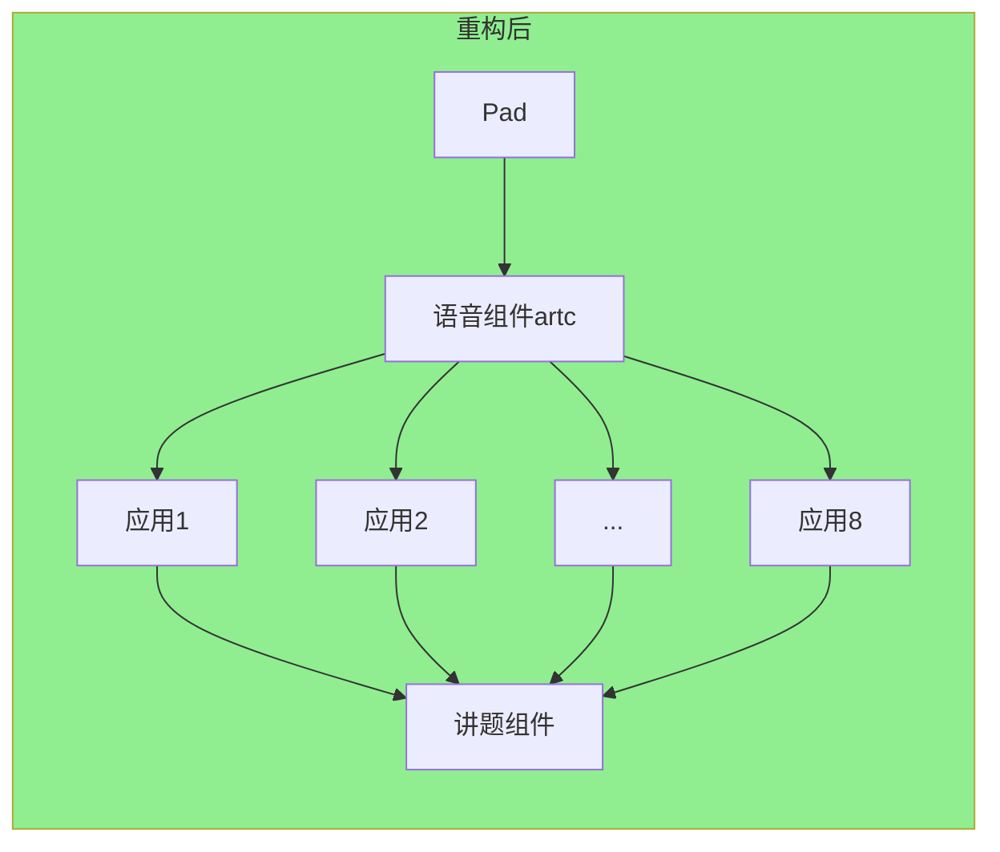
```mermaid
flowchart LR
    

    subgraph AFTER["重构后"]
        direction TB
        A_CLIENT[Pad] --> A_ROUTER[语音组件artc]
        A_ROUTER --> A_APP1[应用1]
        A_ROUTER --> A_APP2[应用2]
        A_ROUTER --> A_APP3[...]
        A_ROUTER --> A_APP8[应用8]
        A_APP1 & A_APP2 & A_APP3 & A_APP8 --> A_COMP[讲题组件]
    end
    style AFTER fill:#90EE90

```

#### 需求三：确保各应用可独立迭代(互不干扰)，使用BPMN进行逻辑编排重构

1.  **代码迁移**：将 `jzx-ai-dual-mentor` 项目中的 applyLectureNew 和 studentSpeakLectureStream 接口相关代码迁移到 `jzx-composition/jzx-home-tutoring-homework-lecture` 模块
    
    *   **最小化改动**：先直接复制代码，保持原有逻辑不变
        
    *   **保持包结构**：尽量保持与原项目相似的包结构
        
2.  **BPMN流程改造**：应用BPMN改造对应应用，确保无损上线
    
    *   **接口协议兼容**：入参/出参保持一致
        
    *   **功能等价验证**：新老接口结果对比
        
    *   **性能基线对比**：延迟、成功率不降低
        

---

# 二、现状分析

## 2.1 本次修改涉及的接口

| 接口路径 | 接口名称 |
| --- | --- |
| /aidm/lecture/applyLectureNew | 讲题接口 |
| /aidm/lecture/studentSpeakLectureStream | 学生发言接口 |

## 2.2 业务枚举映射

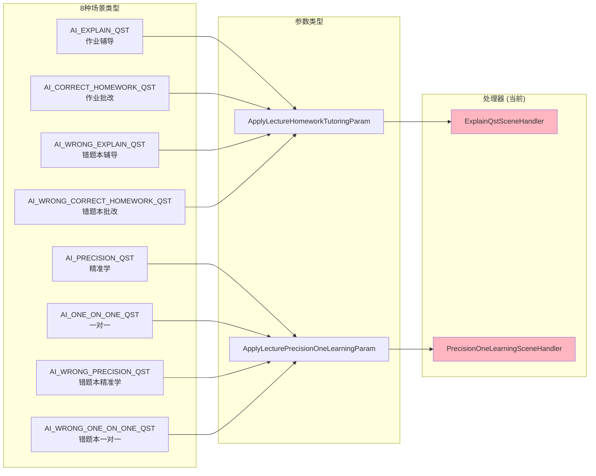
```mermaid
flowchart LR
    subgraph SceneTypes["8种场景类型"]
        S1[AI_EXPLAIN_QST<br/>作业辅导]
        S2[AI_CORRECT_HOMEWORK_QST<br/>作业批改]
        S3[AI_WRONG_EXPLAIN_QST<br/>错题本辅导]
        S4[AI_WRONG_CORRECT_HOMEWORK_QST<br/>错题本批改]
        S5[AI_PRECISION_QST<br/>精准学]
        S6[AI_ONE_ON_ONE_QST<br/>一对一]
        S7[AI_WRONG_PRECISION_QST<br/>错题本精准学]
        S8[AI_WRONG_ONE_ON_ONE_QST<br/>错题本一对一]
    end

    subgraph Params["参数类型"]
        P1[ApplyLectureHomeworkTutoringParam]
        P2[ApplyLecturePrecisionOneLearningParam]
    end

    subgraph Handlers["处理器 (当前)"]
        H1[ExplainQstSceneHandler]
        H2[PrecisionOneLearningSceneHandler]
    end

    S1 & S2 & S3 & S4 --> P1
    S5 & S6 & S7 & S8 --> P2

    P1 --> H1
    P2 --> H2

    style H1 fill:#FFB6C1
    style H2 fill:#FFB6C1

```

## 2.3 applyLectureNew 接口

#### 2.3.1 applyLectureNew 接口时序图

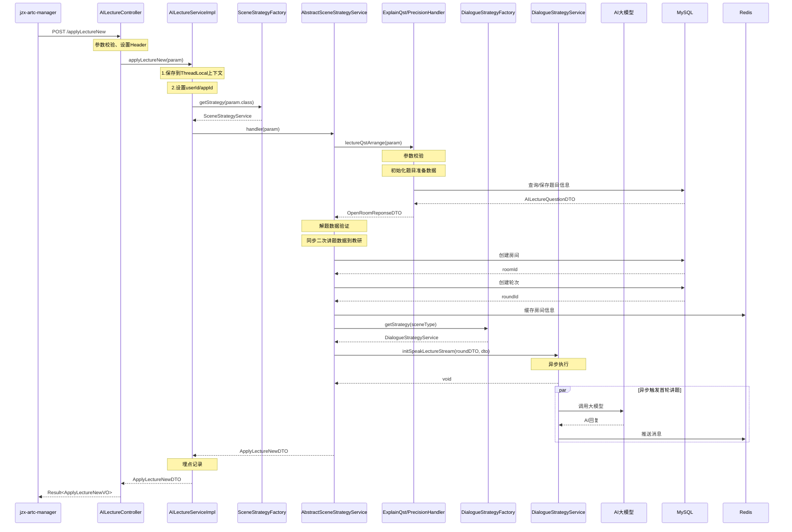
```mermaid
sequenceDiagram
    participant Client as jzx-artc-manager
    participant Ctrl as AILectureController
    participant Svc as AILectureServiceImpl
    participant SF as SceneStrategyFactory
    participant Handler as AbstractSceneStrategyService
    participant SubHandler as ExplainQst/PrecisionHandler
    participant DF as DialogueStrategyFactory
    participant Dialogue as DialogueStrategyService
    participant AI as AI大模型
    participant DB as MySQL
    participant Redis as Redis

    Client->>Ctrl: POST /applyLectureNew
    Note over Ctrl: 参数校验、设置Header

    Ctrl->>Svc: applyLectureNew(param)

    Note over Svc: 1.保存到ThreadLocal上下文
    Note over Svc: 2.设置userId/appId

    Svc->>SF: getStrategy(param.class)
    SF-->>Svc: SceneStrategyService

    Svc->>Handler: handler(param)

    Handler->>SubHandler: lectureQstArrange(param)
    Note over SubHandler: 参数校验
    Note over SubHandler: 初始化题目准备数据

    SubHandler->>DB: 查询/保存题目信息
    DB-->>SubHandler: AILectureQuestionDTO

    SubHandler-->>Handler: OpenRoomReponseDTO

    Note over Handler: 解题数据验证
    Note over Handler: 同步二次讲题数据到教研

    Handler->>DB: 创建房间
    DB-->>Handler: roomId

    Handler->>DB: 创建轮次
    DB-->>Handler: roundId

    Handler->>Redis: 缓存房间信息

    Handler->>DF: getStrategy(sceneType)
    DF-->>Handler: DialogueStrategyService

    Handler->>Dialogue: initSpeakLectureStream(roundDTO, dto)

    Note over Dialogue: 异步执行
    Dialogue-->>Handler: void

    par 异步触发首轮讲题
        Dialogue->>AI: 调用大模型
        AI-->>Dialogue: AI回复
        Dialogue->>Redis: 推送消息
    end

    Handler-->>Svc: ApplyLectureNewDTO

    Note over Svc: 埋点记录

    Svc-->>Ctrl: ApplyLectureNewDTO

    Ctrl-->>Client: Result<ApplyLectureNewVO>

```

#### 2.2.1 applyLectureNew 接口类图


```mermaid
classDiagram
    class AILectureController {
        -AILectureService aiLectureService
        -PollMessageService messagePollService
        -FeedbackService feedbackService
        +applyLectureNew(ApplyLectureNewBaseParam, String, Long) Result~ApplyLectureNewVO~
        +studentSpeakLectureStream(StudentSpeakLectureParam, Long) Result~Boolean~
    }

    class AILectureService {
        <<interface>>
        +applyLectureNew(ApplyLectureNewBaseParam) ApplyLectureNewDTO
        +studentSpeakLectureStream(StudentSpeakLectureParam) boolean
    }

    class AILectureServiceImpl {
        -ApplyLectureSceneStrategyFactory applyLectureSceneStrategyFactory
        -ApplyLectureDialogueStrategyFactory applyLectureDialogueStrategyFactory
        -AILectureQuestionService aiLectureQuestionService
        -LectureStudentServiceImpl lectureStudentService
        +applyLectureNew(ApplyLectureNewBaseParam) ApplyLectureNewDTO
        +studentSpeakLectureStream(StudentSpeakLectureParam) boolean
    }

    class ApplyLectureSceneStrategyFactory {
        -Map~Class, SceneStrategyService~ sceneStrategyMap
        +getStrategy(Class) SceneStrategyService
    }

    class SceneStrategyService~T~ {
        <<interface>>
        +getType() List~String~
        +handler(T) ApplyLectureNewDTO
    }

    class AbstractSceneStrategyService~T~ {
        #ApplyLectureDialogueStrategyFactory dialogueFactory
        #AILectureQuestionService aiLectureQuestionService
        +handler(T) ApplyLectureNewDTO
        #lectureQstArrange(T)* OpenRoomReponseDTO
        #openLectureRoom() OpenRoomReponseDTO
        #initRoomRoundEvent() void
    }

    class ExplainQstSceneHandler {
        +getType() List~String~
        #lectureQstArrange(ApplyLectureHomeworkTutoringParam) OpenRoomReponseDTO
    }

    class PrecisionOneLearningSceneHandler {
        +getType() List~String~
        #lectureQstArrange(ApplyLecturePrecisionOneLearningParam) OpenRoomReponseDTO
    }

    class ApplyLectureNewBaseParam {
        +String sceneType
        +Double ttsSpeed
        +String subject
        +String jzxChannel
        +String route
        +Long feedbackId
        +String gkType
    }

    class ApplyLectureHomeworkTutoringParam {
        +String imgUrl
        +Long pid
        +Integer qid
        +List~String~ cutImgUrls
    }

    class ApplyLecturePrecisionOneLearningParam {
        +String gkQid
        +String paperId
        +String paperType
    }

    class ApplyLectureNewDTO {
        +Long roomId
        +Long roundId
        +String lectureQuestionId
        +String gkId
        +String stemImage
    }

    AILectureController --> AILectureService
    AILectureServiceImpl ..|> AILectureService
    AILectureServiceImpl --> ApplyLectureSceneStrategyFactory
    ApplyLectureSceneStrategyFactory --> SceneStrategyService
    AbstractSceneStrategyService~T~ ..|> SceneStrategyService~T~
    ExplainQstSceneHandler --|> AbstractSceneStrategyService
    PrecisionOneLearningSceneHandler --|> AbstractSceneStrategyService
    ApplyLectureHomeworkTutoringParam --|> ApplyLectureNewBaseParam
    ApplyLecturePrecisionOneLearningParam --|> ApplyLectureNewBaseParam

```

## 2.4 studentSpeakLectureStream

#### 2.4.1 studentSpeakLectureStream 接口时序图

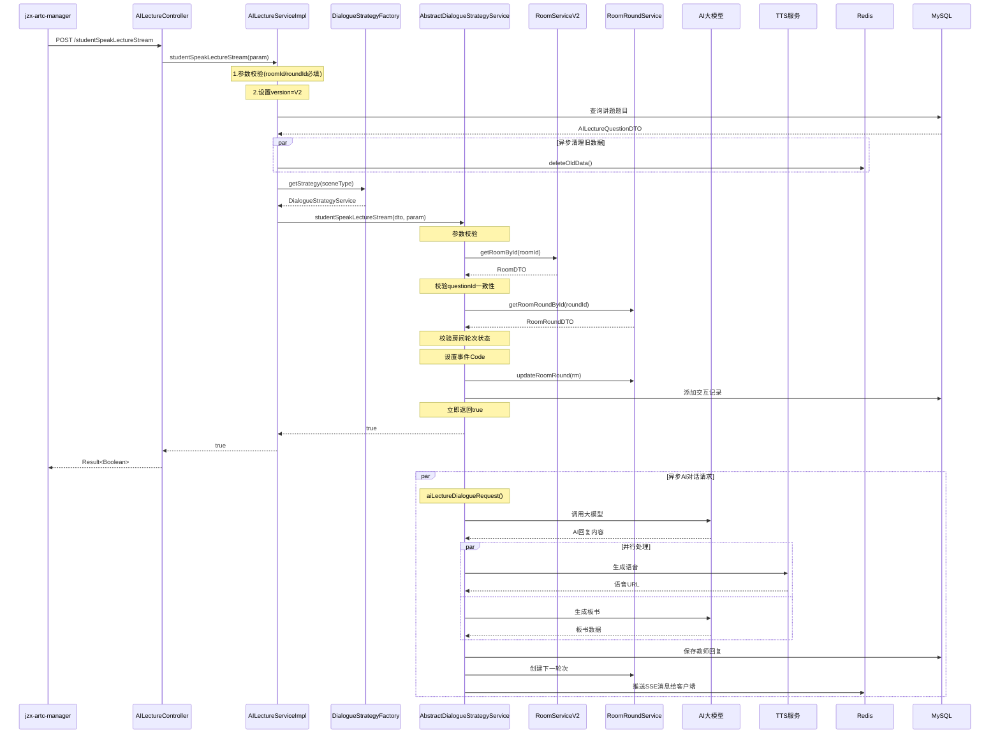
```mermaid
sequenceDiagram
    participant Client as jzx-artc-manager
    participant Ctrl as AILectureController
    participant Svc as AILectureServiceImpl
    participant DF as DialogueStrategyFactory
    participant Dialogue as AbstractDialogueStrategyService
    participant Room as RoomServiceV2
    participant Round as RoomRoundService
    participant AI as AI大模型
    participant TTS as TTS服务
    participant Redis as Redis
    participant DB as MySQL

    Client->>Ctrl: POST /studentSpeakLectureStream

    Ctrl->>Svc: studentSpeakLectureStream(param)

    Note over Svc: 1.参数校验(roomId/roundId必填)
    Note over Svc: 2.设置version=V2

    Svc->>DB: 查询讲题题目
    DB-->>Svc: AILectureQuestionDTO

    par 异步清理旧数据
        Svc->>Redis: deleteOldData()
    end

    Svc->>DF: getStrategy(sceneType)
    DF-->>Svc: DialogueStrategyService

    Svc->>Dialogue: studentSpeakLectureStream(dto, param)

    Note over Dialogue: 参数校验

    Dialogue->>Room: getRoomById(roomId)
    Room-->>Dialogue: RoomDTO

    Note over Dialogue: 校验questionId一致性

    Dialogue->>Round: getRoomRoundById(roundId)
    Round-->>Dialogue: RoomRoundDTO

    Note over Dialogue: 校验房间轮次状态
    Note over Dialogue: 设置事件Code

    Dialogue->>Round: updateRoomRound(rm)

    Dialogue->>DB: 添加交互记录

    Note over Dialogue: 立即返回true
    Dialogue-->>Svc: true
    Svc-->>Ctrl: true
    Ctrl-->>Client: Result<Boolean>

    par 异步AI对话请求
        Note over Dialogue: aiLectureDialogueRequest()
        Dialogue->>AI: 调用大模型
        AI-->>Dialogue: AI回复内容

        par 并行处理
            Dialogue->>TTS: 生成语音
            TTS-->>Dialogue: 语音URL
        and
            Dialogue->>AI: 生成板书
            AI-->>Dialogue: 板书数据
        end

        Dialogue->>DB: 保存教师回复
        Dialogue->>Round: 创建下一轮次
        Dialogue->>Redis: 推送SSE消息给客户端
    end

```

#### 2.4.2 studentSpeakLectureStream 接口类图

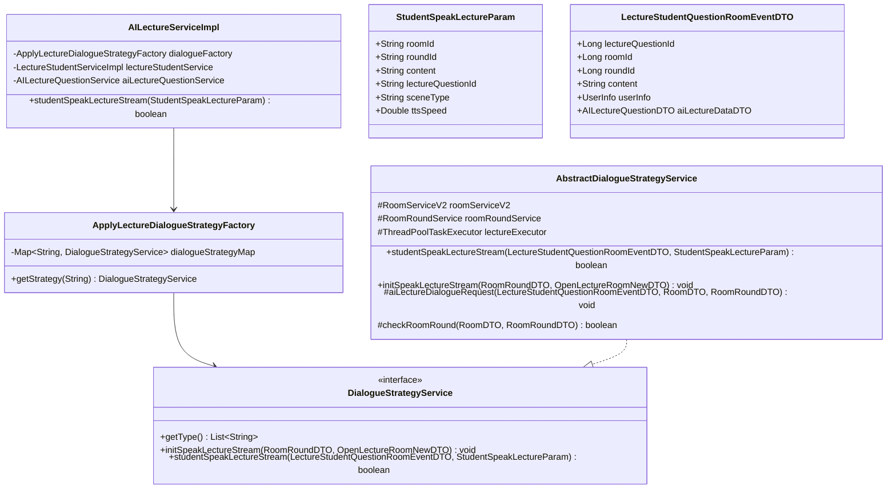
```mermaid
classDiagram
    class AILectureServiceImpl {
        -ApplyLectureDialogueStrategyFactory dialogueFactory
        -LectureStudentServiceImpl lectureStudentService
        -AILectureQuestionService aiLectureQuestionService
        +studentSpeakLectureStream(StudentSpeakLectureParam) boolean
    }

    class ApplyLectureDialogueStrategyFactory {
        -Map~String, DialogueStrategyService~ dialogueStrategyMap
        +getStrategy(String) DialogueStrategyService
    }

    class DialogueStrategyService {
        <<interface>>
        +getType() List~String~
        +initSpeakLectureStream(RoomRoundDTO, OpenLectureRoomNewDTO) void
        +studentSpeakLectureStream(LectureStudentQuestionRoomEventDTO, StudentSpeakLectureParam) boolean
    }

    class AbstractDialogueStrategyService {
        #RoomServiceV2 roomServiceV2
        #RoomRoundService roomRoundService
        #ThreadPoolTaskExecutor lectureExecutor
        +studentSpeakLectureStream(LectureStudentQuestionRoomEventDTO, StudentSpeakLectureParam) boolean
        +initSpeakLectureStream(RoomRoundDTO, OpenLectureRoomNewDTO) void
        #aiLectureDialogueRequest(LectureStudentQuestionRoomEventDTO, RoomDTO, RoomRoundDTO) void
        #checkRoomRound(RoomDTO, RoomRoundDTO) boolean
    }

    class StudentSpeakLectureParam {
        +String roomId
        +String roundId
        +String content
        +String lectureQuestionId
        +String sceneType
        +Double ttsSpeed
    }

    class LectureStudentQuestionRoomEventDTO {
        +Long lectureQuestionId
        +Long roomId
        +Long roundId
        +String content
        +UserInfo userInfo
        +AILectureQuestionDTO aiLectureDataDTO
    }

    AILectureServiceImpl --> ApplyLectureDialogueStrategyFactory
    ApplyLectureDialogueStrategyFactory --> DialogueStrategyService
    AbstractDialogueStrategyService ..|> DialogueStrategyService

```

---

# 三、目标架构

## 3.1 目标架构


```mermaid
graph LR
    %% 定义节点
    Start["对话组件"]
    AIDM["AIDM"]
    Router["应用路由"]
    
    %% 定义应用簇
    subgraph Apps ["应用"]
        direction TB
        A1["作业辅导应用"]
        A2["精准学应用"]
        A3["作业批改应用"]
        A4["一对一讲题应用"]
        A5["错题本辅导应用"]
        A6["错题本精准学应用"]
        A7["错题批改应用"]
        A8["错题本一对一应用"]
    end

    End["讲题组件"]

    %% 定义连接关系
    Start --> AIDM
    AIDM -- "剥离" --> Router
    Router --> Apps
    Apps --> End

    %% 样式美化
    style AIDM fill:#ff9999,stroke:#333,stroke-width:2px
    style Apps fill:#99ff99,stroke:#333,stroke-dasharray: 5 5
    style Start fill:#fff,stroke:#333,border-radius:10px
    style End fill:#fff,stroke:#333
```

## 重构策略

1.  应用拆分，完成应用级别服务拆分与E2E通过；
    
2.  组件抽取，完成讲题接口的唯一调用；
    
3.  BPMN重构，完成业务代码BPMN(包含时序、冗余代码优化)；
    

## 3.2应用拆分 

### 重构原则

> **重要原则：不改变之前的时序，不改变相关的表结构**

| 原则 | 说明 |
| --- | --- |
| **时序不变** | 保持原有的调用时序，确保业务逻辑等价 |
| **表结构不变** | 不修改现有数据库表结构，保证数据兼容 |
| **接口兼容** | 入参/出参保持一致，调用方无感知 |
| **最小改动** | 优先复制代码，保持原有逻辑不变 |

核心时序【服务】

### 路由模块设计【路由表】

| 类型 (sceneType) | 应用模块 | applyLecture 接口 | studentSpeak 接口 |
| --- | --- | --- | --- |
| `AI_EXPLAIN_QST` | jzx-ai-explain-qst-lecture | `/explain/applyLecture` | `/explain/studentSpeak` |
| `AI_CORRECT_HOMEWORK_QST` | jzx-ai-correct-homework-qst-lecture | `/correct/applyLecture` | `/correct/studentSpeak` |
| `AI_WRONG_EXPLAIN_QST` | jzx-ai-wrong-explain-qst-lecture | `/wrong-explain/applyLecture` | `/wrong-explain/studentSpeak` |
| `AI_WRONG_CORRECT_HOMEWORK_QST` | jzx-ai-wrong-correct-homework-qst-lecture | `/wrong-correct/applyLecture` | `/wrong-correct/studentSpeak` |
| `AI_PRECISION_QST` | jzx-ai-precision-qst-lecture | `/precision/applyLecture` | `/precision/studentSpeak` |
| `AI_ONE_ON_ONE_QST` | jzx-ai-one-on-one-qst-lecture | `/one-on-one/applyLecture` | `/one-on-one/studentSpeak` |
| `AI_WRONG_PRECISION_QST` | jzx-ai-wrong-precision-qst-lecture | `/wrong-precision/applyLecture` | `/wrong-precision/studentSpeak` |
| `AI_WRONG_ONE_ON_ONE_QST` | jzx-ai-wrong-one-on-one-qst-lecture | `/wrong-one-on-one/applyLecture` | `/wrong-one-on-one/studentSpeak` |

#### 路由枚举定义

```plaintext
```java
/**
 * 应用路由枚举
 */
public enum SceneRouteEnum {

    AI_EXPLAIN_QST(
        "AI_EXPLAIN_QST",
        "作业辅导",
        "jzx-ai-explain-qst-lecture",
        "/explain/applyLecture",
        "/explain/studentSpeak"
    ),
    AI_CORRECT_HOMEWORK_QST(
        "AI_CORRECT_HOMEWORK_QST",
        "作业批改",
        "jzx-ai-correct-homework-qst-lecture",
        "/correct/applyLecture",
        "/correct/studentSpeak"
    ),
    AI_WRONG_EXPLAIN_QST(
        "AI_WRONG_EXPLAIN_QST",
        "错题本辅导",
        "jzx-ai-wrong-explain-qst-lecture",
        "/wrong-explain/applyLecture",
        "/wrong-explain/studentSpeak"
    ),
    AI_WRONG_CORRECT_HOMEWORK_QST(
        "AI_WRONG_CORRECT_HOMEWORK_QST",
        "错题本批改",
        "jzx-ai-wrong-correct-homework-qst-lecture",
        "/wrong-correct/applyLecture",
        "/wrong-correct/studentSpeak"
    ),
    AI_PRECISION_QST(
        "AI_PRECISION_QST",
        "精准学",
        "jzx-ai-precision-qst-lecture",
        "/precision/applyLecture",
        "/precision/studentSpeak"
    ),
    AI_ONE_ON_ONE_QST(
        "AI_ONE_ON_ONE_QST",
        "一对一",
        "jzx-ai-one-on-one-qst-lecture",
        "/one-on-one/applyLecture",
        "/one-on-one/studentSpeak"
    ),
    AI_WRONG_PRECISION_QST(
        "AI_WRONG_PRECISION_QST",
        "错题本精准学",
        "jzx-ai-wrong-precision-qst-lecture",
        "/wrong-precision/applyLecture",
        "/wrong-precision/studentSpeak"
    ),
    AI_WRONG_ONE_ON_ONE_QST(
        "AI_WRONG_ONE_ON_ONE_QST",
        "错题本一对一",
        "jzx-ai-wrong-one-on-one-qst-lecture",
        "/wrong-one-on-one/applyLecture",
        "/wrong-one-on-one/studentSpeak"
    );

    private final String sceneType;
    private final String sceneName;
    private final String serviceName;
    private final String applyLectureUrl;
    private final String studentSpeakUrl;

    // constructor, getter...

    public static SceneRouteEnum getBySceneType(String sceneType) {
        for (SceneRouteEnum e : values()) {
            if (e.getSceneType().equals(sceneType)) {
                return e;
            }
        }
        return null;
    }
}
```
```

### 应用拆分设计

#### 工程结构

```plaintext
jzx-composition/
├── jzx-lecture-router/                       # 路由模块 (新增)
│   ├── src/main/java/
│   │   └── com/jzx/lecture/router/
│   │       ├── controller/
│   │       │   └── LectureRouterController.java
│   │       ├── service/
│   │       │   └── LectureRouterService.java
│   │       └── client/                       # 应用客户端
│   │           ├── LectureAppClient.java
│   │           └── impl/
│   └── pom.xml
│
├── jzx-home-tutoring/                        # 业务编排层
│   │
│   ├── jzx-home-tutoring-lecture-common/     # 公共模块 (90%+共用代码)
│   │   ├── src/main/java/
│   │   │   └── com/jzx/home/tutoring/lecture/common/
│   │   │       ├── controller/
│   │   │       │   └── AbstractLectureController.java    # 抽象Controller
│   │   │       ├── service/
│   │   │       │   ├── AbstractLectureService.java       # 抽象Service
│   │   │       │   └── AbstractDialogueService.java      # 抽象对话Service
│   │   │       ├── bpmn/
│   │   │       │   ├── delegate/                         # 通用Delegate
│   │   │       │   │   ├── AbstractValidateDelegate.java
│   │   │       │   │   ├── AbstractGetQuestionDelegate.java
│   │   │       │   │   ├── AbstractNormalizationDelegate.java
│   │   │       │   │   ├── AbstractCreateRoomDelegate.java
│   │   │       │   │   └── AbstractTriggerLectureDelegate.java
│   │   │       │   └── process/
│   │   │       │       └── AbstractLectureProcess.java   # 抽象流程
│   │   │       ├── model/
│   │   │       │   ├── param/                            # 通用入参
│   │   │       │   ├── dto/                              # 通用DTO
│   │   │       │   └── vo/                               # 通用VO
│   │   │       ├── context/
│   │   │       │   └── LectureContext.java               # 讲题上下文
│   │   │       └── util/                                 # 工具类
│   │   ├── src/main/resources/
│   │   │   └── bpmn/
│   │   │       ├── common-open-room.bpmn                 # 通用开房间流程模板
│   │   │       └── common-stud-speak.bpmn                # 通用学生发言流程模板
│   │   └── pom.xml
│   │
│   ├── jzx-ai-explain-qst-lecture/           # 作业辅导应用 (extends common)
│   │   ├── src/main/java/
│   │   │   └── com/jzx/home/tutoring/lecture/explain/
│   │   │       ├── controller/
│   │   │       │   └── ExplainQstController.java         # extends AbstractLectureController
│   │   │       ├── service/
│   │   │       │   └── ExplainQstServiceImpl.java        # extends AbstractLectureService
│   │   │       └── bpmn/delegate/                        # 应用特有Delegate (如有)
│   │   ├── src/main/resources/bpmn/
│   │   │   └── explain-qst-open-room.bpmn                # 应用特有流程 (可选)
│   │   └── pom.xml                                       # 依赖 common
│   │
│   ├── jzx-ai-correct-homework-qst-lecture/  # 作业批改应用 (extends common)
│   │   └── ...                                           # 结构同上，差异化实现
│   │
│   ├── jzx-ai-wrong-explain-qst-lecture/     # 错题本辅导应用 (extends common)
│   │   └── ...
│   │
│   ├── jzx-ai-wrong-correct-homework-qst-lecture/  # 错题本批改应用 (extends common)
│   │   └── ...
│   │
│   ├── jzx-ai-precision-qst-lecture/         # 精准学应用 (extends common)
    │   └── ...
    │
    ├── jzx-ai-one-on-one-qst-lecture/        # 一对一讲题应用 (extends common)
    │   └── ...
    │
    ├── jzx-ai-wrong-precision-qst-lecture/   # 错题本精准学应用 (extends common)
    │   └── ...
    │
    └── jzx-ai-wrong-one-on-one-qst-lecture/  # 错题本一对一应用 (extends common)
        └── ...
 
jzx-business-components/                  # 组件层
    ├── jzx-business-components-lecture/      # 讲题组件
    └── jzx-business-components-cleanrender/  # 清洗组件

```

接口-【含接口定义】

UML类图【新老类的关系】

时序图【类颗粒度】

#### APP-1: 作业辅导应用

###### 应用信息

| 属性 | 值 |
| --- | --- |
| 应用名称 | 作业辅导应用 |
| 场景类型 | AI\_EXPLAIN\_QST |
| 模块名称 | jzx-ai-explain-qst-lecture |
| 接口前缀 | /explain |

######  接口定义

###### 接口1：申请讲题

| 属性 | 说明 |
| --- | --- |
| **接口地址** | POST `/explain/applyLecture` |
| **接口描述** | 作业辅导场景申请讲题 |

**入参 (ApplyLectureHomeworkParam)**

| 字段 | 类型 | 必填 | 说明 |
| --- | --- | --- | --- |
| sceneType | String | 是 | 场景类型，固定值：`AI_EXPLAIN_QST` |
| imgUrl | String | 是 | 题目图片URL |
| pid | Long | 否 | 拍题任务ID |
| qid | Integer | 否 | 题目序号 |
| subQid | Integer | 否 | 小题序号 |
| cutImgUrls | List<String> | 否 | 切图URL列表 |
| route | String | 否 | 路由类型：`quark`/`ocr` |
| subject | String | 否 | 学科 |
| ttsSpeed | Double | 否 | TTS语速 |
| gkType | String | 否 | GK类型：`GK2`/`GK4` |

###### 出参 (ApplyLectureNewVO)

| 字段 | 类型 | 说明 |
| --- | --- | --- |
| roomId | Long | 房间ID |
| roundId | Long | 轮次ID |
| lectureQuestionId | String | 讲题问题ID |
| stemImage | String | 题干图片URL |
| keywordStemImage | String | 关键字提取图片URL |
| currentSubQid | String | 当前小题ID |
| gkId | String | GK ID |
| gkType | String | GK类型 |

---

###### 接口2：学生发言

| 属性 | 说明 |
| --- | --- |
| **接口地址** | POST `/explain/studentSpeak` |
| **接口描述** | 作业辅导场景学生发言 |

**入参 (StudentSpeakLectureParam)**

| 字段 | 类型 | 必填 | 说明 |
| --- | --- | --- | --- |
| sceneType | String | 是 | 场景类型，固定值：`AI_EXPLAIN_QST` |
| roomId | String | 是 | 房间ID |
| roundId | String | 是 | 轮次ID |
| lectureQuestionId | String | 是 | 讲题问题ID |
| content | String | 否 | 学生发言内容 |
| ttsSpeed | Double | 否 | TTS语速 |

**出参**

| 字段 | 类型 | 说明 |
| --- | --- | --- |
| \- | Boolean | 是否成功，`true`/`false` |

##### UML类图\[DTO-VO等全部展开\]

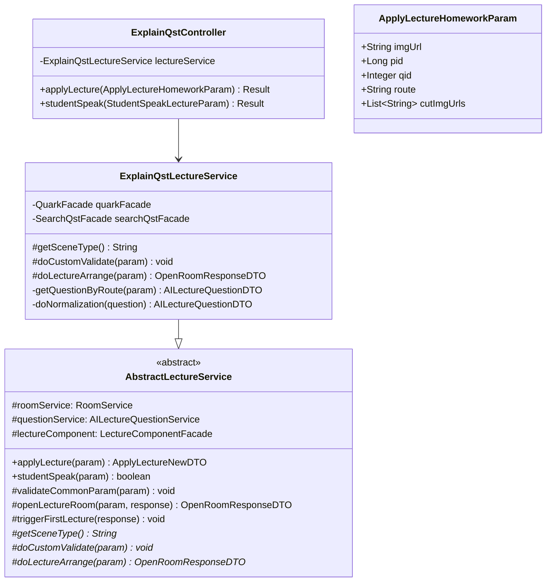
```mermaid
classDiagram
    class ExplainQstController {
        -ExplainQstLectureService lectureService
        +applyLecture(ApplyLectureHomeworkParam) Result
        +studentSpeak(StudentSpeakLectureParam) Result
    }

    class ExplainQstLectureService {
        -QuarkFacade quarkFacade
        -SearchQstFacade searchQstFacade
        #getSceneType() String
        #doCustomValidate(param) void
        #doLectureArrange(param) OpenRoomResponseDTO
        -getQuestionByRoute(param) AILectureQuestionDTO
        -doNormalization(question) AILectureQuestionDTO
    }

    class AbstractLectureService {
        <<abstract>>
        #roomService: RoomService
        #questionService: AILectureQuestionService
        #lectureComponent: LectureComponentFacade
        +applyLecture(param) ApplyLectureNewDTO
        +studentSpeak(param) boolean
        #validateCommonParam(param) void
        #openLectureRoom(param, response) OpenRoomResponseDTO
        #triggerFirstLecture(response) void
        #getSceneType()* String
        #doCustomValidate(param)* void
        #doLectureArrange(param)* OpenRoomResponseDTO
    }

    class ApplyLectureHomeworkParam {
        +String imgUrl
        +Long pid
        +Integer qid
        +String route
        +List~String~ cutImgUrls
    }

    ExplainQstController --> ExplainQstLectureService
    ExplainQstLectureService --|> AbstractLectureService

```

##### 时序图 - 类级别

###### applyLecture 类级别时序图

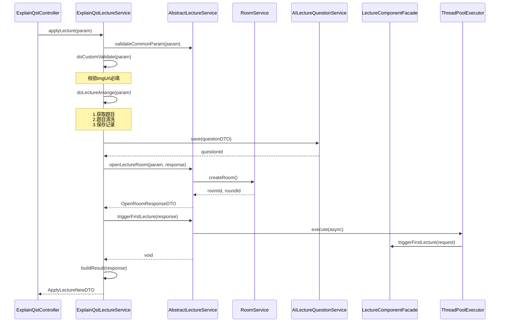
```mermaid
sequenceDiagram
    participant Ctrl as ExplainQstController
    participant Svc as ExplainQstLectureService
    participant Abstract as AbstractLectureService
    participant RoomSvc as RoomService
    participant QstSvc as AILectureQuestionService
    participant Comp as LectureComponentFacade
    participant Executor as ThreadPoolExecutor

    Ctrl->>Svc: applyLecture(param)

    Svc->>Abstract: validateCommonParam(param)

    Svc->>Svc: doCustomValidate(param)
    Note over Svc: 校验imgUrl必填

    Svc->>Svc: doLectureArrange(param)
    Note over Svc: 1.获取题目<br/>2.题目清洗<br/>3.保存记录

    Svc->>QstSvc: save(questionDTO)
    QstSvc-->>Svc: questionId

    Svc->>Abstract: openLectureRoom(param, response)
    Abstract->>RoomSvc: createRoom()
    RoomSvc-->>Abstract: roomId, roundId
    Abstract-->>Svc: OpenRoomResponseDTO

    Svc->>Abstract: triggerFirstLecture(response)
    Abstract->>Executor: execute(async)
    Executor->>Comp: triggerFirstLecture(request)
    Abstract-->>Svc: void

    Svc->>Svc: buildResult(response)
    Svc-->>Ctrl: ApplyLectureNewDTO

```

###### studentSpeak 类级别时序图

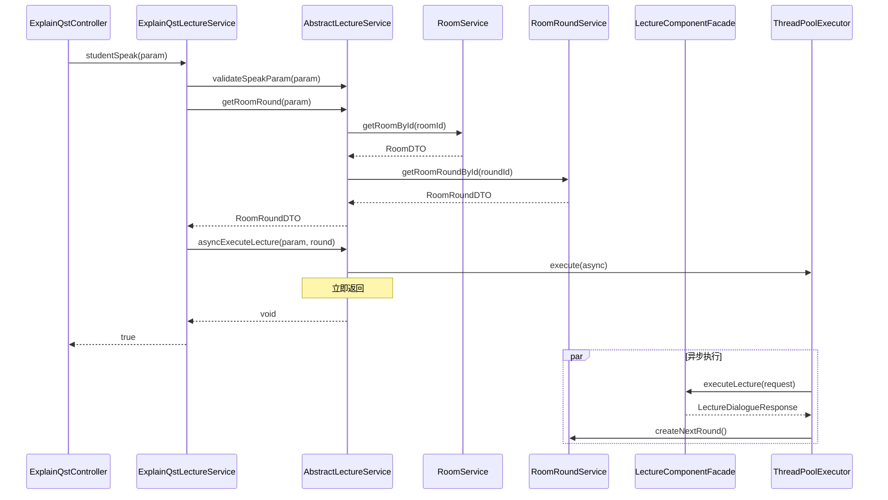
```mermaid
sequenceDiagram
    participant Ctrl as ExplainQstController
    participant Svc as ExplainQstLectureService
    participant Abstract as AbstractLectureService
    participant RoomSvc as RoomService
    participant RoundSvc as RoomRoundService
    participant Comp as LectureComponentFacade
    participant Executor as ThreadPoolExecutor

    Ctrl->>Svc: studentSpeak(param)

    Svc->>Abstract: validateSpeakParam(param)

    Svc->>Abstract: getRoomRound(param)
    Abstract->>RoomSvc: getRoomById(roomId)
    RoomSvc-->>Abstract: RoomDTO
    Abstract->>RoundSvc: getRoomRoundById(roundId)
    RoundSvc-->>Abstract: RoomRoundDTO
    Abstract-->>Svc: RoomRoundDTO

    Svc->>Abstract: asyncExecuteLecture(param, round)
    Abstract->>Executor: execute(async)

    Note over Abstract: 立即返回
    Abstract-->>Svc: void
    Svc-->>Ctrl: true

    par 异步执行
        Executor->>Comp: executeLecture(request)
        Comp-->>Executor: LectureDialogueResponse
        Executor->>RoundSvc: createNextRound()
    end

```

###### 时序图 - 服务级别

###### applyLecture 服务级别时序图

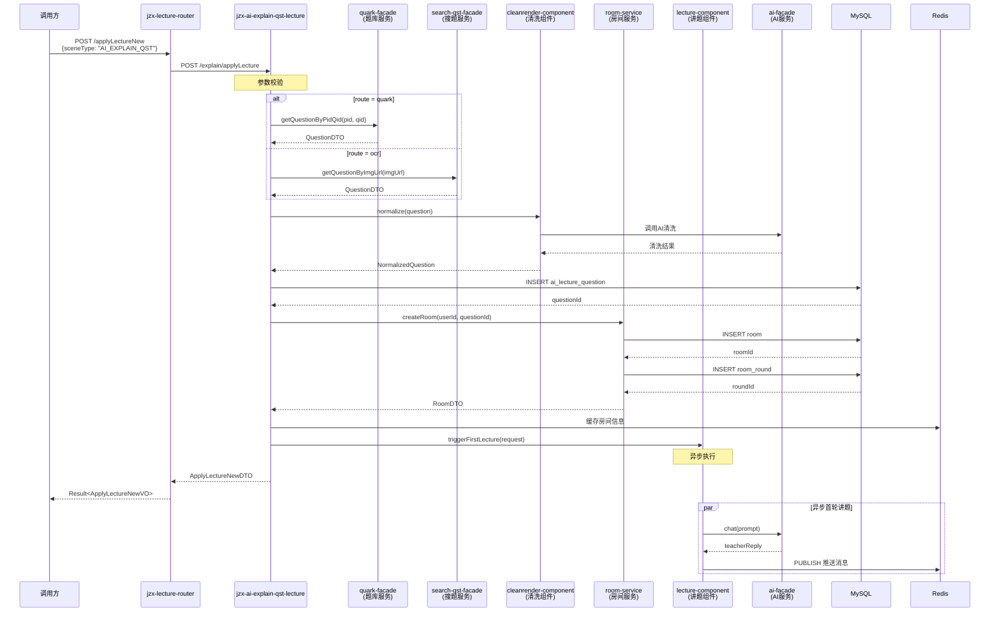
```mermaid
sequenceDiagram
    participant Client as 调用方
    participant Router as jzx-lecture-router
    participant App as jzx-ai-explain-qst-lecture
    participant Quark as quark-facade<br/>(题库服务)
    participant Search as search-qst-facade<br/>(搜题服务)
    participant Clean as cleanrender-component<br/>(清洗组件)
    participant Room as room-service<br/>(房间服务)
    participant Lecture as lecture-component<br/>(讲题组件)
    participant AI as ai-facade<br/>(AI服务)
    participant DB as MySQL
    participant Redis as Redis

    Client->>Router: POST /applyLectureNew<br/>{sceneType: "AI_EXPLAIN_QST"}

    Router->>App: POST /explain/applyLecture

    Note over App: 参数校验

    alt route = quark
        App->>Quark: getQuestionByPidQid(pid, qid)
        Quark-->>App: QuestionDTO
    else route = ocr
        App->>Search: getQuestionByImgUrl(imgUrl)
        Search-->>App: QuestionDTO
    end

    App->>Clean: normalize(question)
    Clean->>AI: 调用AI清洗
    AI-->>Clean: 清洗结果
    Clean-->>App: NormalizedQuestion

    App->>DB: INSERT ai_lecture_question
    DB-->>App: questionId

    App->>Room: createRoom(userId, questionId)
    Room->>DB: INSERT room
    DB-->>Room: roomId
    Room->>DB: INSERT room_round
    DB-->>Room: roundId
    Room-->>App: RoomDTO

    App->>Redis: 缓存房间信息

    App->>Lecture: triggerFirstLecture(request)
    Note over Lecture: 异步执行

    App-->>Router: ApplyLectureNewDTO

    Router-->>Client: Result<ApplyLectureNewVO>

    par 异步首轮讲题
        Lecture->>AI: chat(prompt)
        AI-->>Lecture: teacherReply
        Lecture->>Redis: PUBLISH 推送消息
    end

```

###### studentSpeak 服务级别时序图

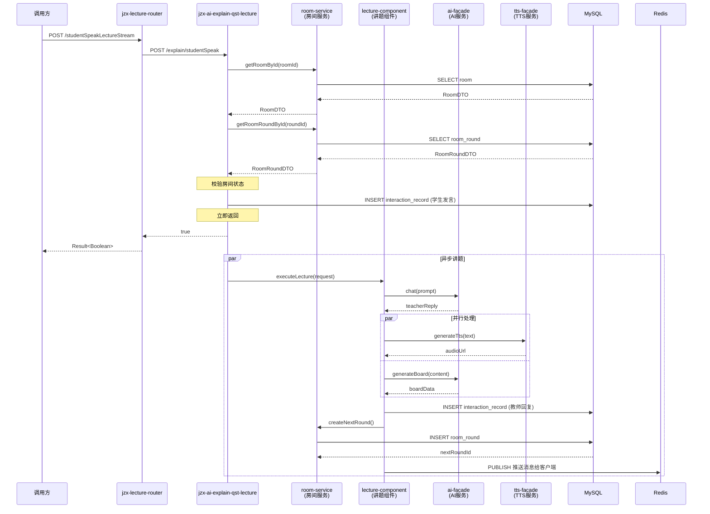
```mermaid
sequenceDiagram
    participant Client as 调用方
    participant Router as jzx-lecture-router
    participant App as jzx-ai-explain-qst-lecture
    participant Room as room-service<br/>(房间服务)
    participant Lecture as lecture-component<br/>(讲题组件)
    participant AI as ai-facade<br/>(AI服务)
    participant TTS as tts-facade<br/>(TTS服务)
    participant DB as MySQL
    participant Redis as Redis

    Client->>Router: POST /studentSpeakLectureStream

    Router->>App: POST /explain/studentSpeak

    App->>Room: getRoomById(roomId)
    Room->>DB: SELECT room
    DB-->>Room: RoomDTO
    Room-->>App: RoomDTO

    App->>Room: getRoomRoundById(roundId)
    Room->>DB: SELECT room_round
    DB-->>Room: RoomRoundDTO
    Room-->>App: RoomRoundDTO

    Note over App: 校验房间状态

    App->>DB: INSERT interaction_record (学生发言)

    Note over App: 立即返回
    App-->>Router: true
    Router-->>Client: Result<Boolean>

    par 异步讲题
        App->>Lecture: executeLecture(request)

        Lecture->>AI: chat(prompt)
        AI-->>Lecture: teacherReply

        par 并行处理
            Lecture->>TTS: generateTts(text)
            TTS-->>Lecture: audioUrl
        and
            Lecture->>AI: generateBoard(content)
            AI-->>Lecture: boardData
        end

        Lecture->>DB: INSERT interaction_record (教师回复)

        Lecture->>Room: createNextRound()
        Room->>DB: INSERT room_round
        DB-->>Room: nextRoundId

        Lecture->>Redis: PUBLISH 推送消息给客户端
    end

```
---

#### APP-2: 作业批改应用

##### 应用信息

| 属性 | 值 |
| --- | --- |
| 应用名称 | 作业批改应用 |
| 场景类型 | AI\_CORRECT\_HOMEWORK\_QST |
| 模块名称 | jzx-ai-correct-homework-qst-lecture |
| 接口前缀 | /correct |
| **特有逻辑** | 批改模式设置、答案校验 |

##### 接口定义

###### 接口1：申请讲题

| 属性 | 说明 |
| --- | --- |
| **接口地址** | POST `/correct/applyLecture` |
| **接口描述** | 作业批改场景申请讲题 |

**入参 (ApplyLectureHomeworkParam)** - 与APP-1相同，额外字段：

| 字段 | 类型 | 必填 | 说明 |
| --- | --- | --- | --- |
| sceneType | String | 是 | 场景类型，固定值：`AI_CORRECT_HOMEWORK_QST` |
| studentAnswer | String | 否 | **【批改特有】** 学生答案 |
| imgUrl | String | 是 | 题目图片URL |
| ... | ... | ... | 其他字段同APP-1 |

**出参 (ApplyLectureNewVO)** - 同APP-1

---

###### 接口2：学生发言

| 属性 | 说明 |
| --- | --- |
| **接口地址** | POST `/correct/studentSpeak` |
| **接口描述** | 作业批改场景学生发言 |

**入参 (StudentSpeakLectureParam)** - 同APP-1，sceneType固定为 `AI_CORRECT_HOMEWORK_QST`

**出参** - 同APP-1

##### UML类图

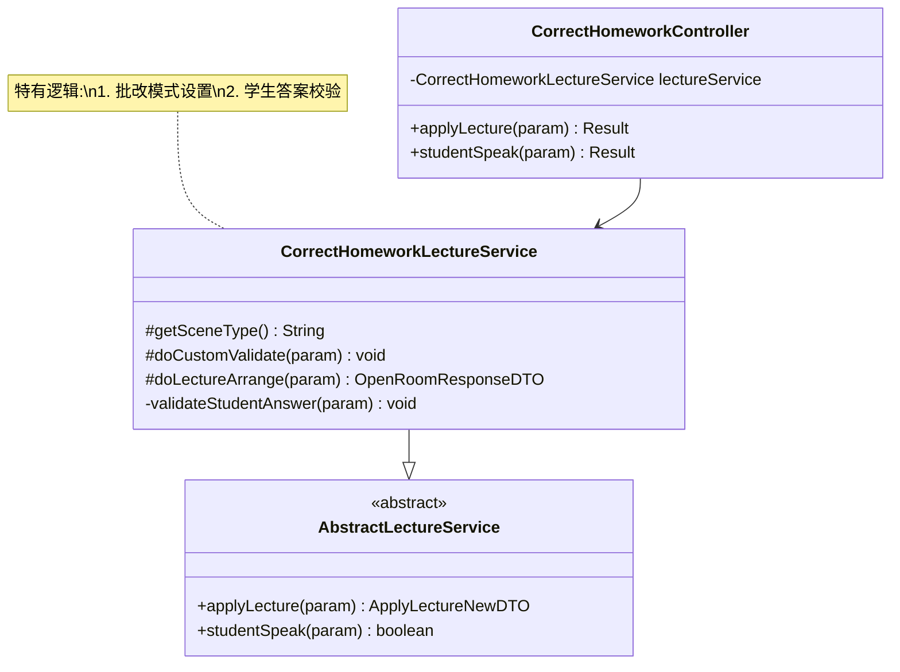
```mermaid
classDiagram
    class CorrectHomeworkController {
        -CorrectHomeworkLectureService lectureService
        +applyLecture(param) Result
        +studentSpeak(param) Result
    }

    class CorrectHomeworkLectureService {
        #getSceneType() String
        #doCustomValidate(param) void
        #doLectureArrange(param) OpenRoomResponseDTO
        -validateStudentAnswer(param) void
    }

    class AbstractLectureService {
        <<abstract>>
        +applyLecture(param) ApplyLectureNewDTO
        +studentSpeak(param) boolean
    }

    CorrectHomeworkController --> CorrectHomeworkLectureService
    CorrectHomeworkLectureService --|> AbstractLectureService

    note for CorrectHomeworkLectureService "特有逻辑:\n1. 批改模式设置\n2. 学生答案校验"

```

###### 时序图 - 类级别

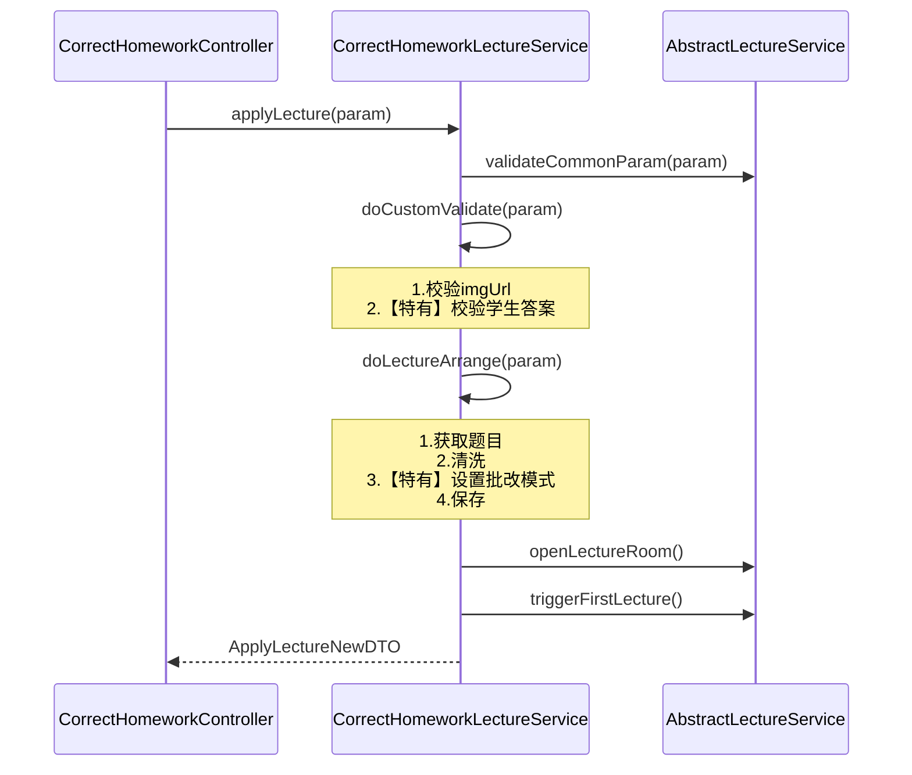
```mermaid
sequenceDiagram
    participant Ctrl as CorrectHomeworkController
    participant Svc as CorrectHomeworkLectureService
    participant Abstract as AbstractLectureService

    Ctrl->>Svc: applyLecture(param)

    Svc->>Abstract: validateCommonParam(param)

    Svc->>Svc: doCustomValidate(param)
    Note over Svc: 1.校验imgUrl<br/>2.【特有】校验学生答案

    Svc->>Svc: doLectureArrange(param)
    Note over Svc: 1.获取题目<br/>2.清洗<br/>3.【特有】设置批改模式<br/>4.保存

    Svc->>Abstract: openLectureRoom()
    Svc->>Abstract: triggerFirstLecture()

    Svc-->>Ctrl: ApplyLectureNewDTO

```

###### 时序图 - 服务级别

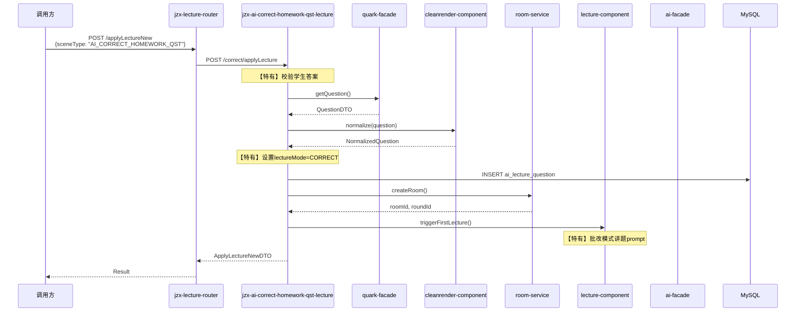
```mermaid
sequenceDiagram
    participant Client as 调用方
    participant Router as jzx-lecture-router
    participant App as jzx-ai-correct-homework-qst-lecture
    participant Quark as quark-facade
    participant Clean as cleanrender-component
    participant Room as room-service
    participant Lecture as lecture-component
    participant AI as ai-facade
    participant DB as MySQL

    Client->>Router: POST /applyLectureNew<br/>{sceneType: "AI_CORRECT_HOMEWORK_QST"}

    Router->>App: POST /correct/applyLecture

    Note over App: 【特有】校验学生答案

    App->>Quark: getQuestion()
    Quark-->>App: QuestionDTO

    App->>Clean: normalize(question)
    Clean-->>App: NormalizedQuestion

    Note over App: 【特有】设置lectureMode=CORRECT

    App->>DB: INSERT ai_lecture_question

    App->>Room: createRoom()
    Room-->>App: roomId, roundId

    App->>Lecture: triggerFirstLecture()
    Note over Lecture: 【特有】批改模式讲题prompt

    App-->>Router: ApplyLectureNewDTO
    Router-->>Client: Result

```
---

#### APP-3: 错题本辅导应用

##### 应用信息

| 属性 | 值 |
| --- | --- |
| 应用名称 | 错题本辅导应用 |
| 场景类型 | AI\_WRONG\_EXPLAIN\_QST |
| 模块名称 | jzx-ai-wrong-explain-qst-lecture |
| 接口前缀 | /wrong-explain |
| **特有逻辑** | 错题本数据初始化 |

###### 接口定义

###### 接口1：申请讲题

| 属性 | 说明 |
| --- | --- |
| **接口地址** | POST `/wrong-explain/applyLecture` |
| **接口描述** | 错题本辅导场景申请讲题 |

**入参 (ApplyLectureWrongQstParam)** - 错题本特有参数

| 字段 | 类型 | 必填 | 说明 |
| --- | --- | --- | --- |
| sceneType | String | 是 | 场景类型，固定值：`AI_WRONG_EXPLAIN_QST` |
| wrongQstSourceId | String | 是 | **【错题本特有】** 错题本来源ID |
| wrongQstSourceType | String | 否 | **【错题本特有】** 错题本来源类型 |
| subject | String | 否 | 学科 |
| ttsSpeed | Double | 否 | TTS语速 |
| gkType | String | 否 | GK类型 |

**出参 (ApplyLectureNewVO)** - 同APP-1

---

###### 接口2：学生发言

| 属性 | 说明 |
| --- | --- |
| **接口地址** | POST `/wrong-explain/studentSpeak` |
| **接口描述** | 错题本辅导场景学生发言 |

**入参 (StudentSpeakLectureParam)** - 同APP-1，sceneType固定为 `AI_WRONG_EXPLAIN_QST`

**出参** - 同APP-1

##### UML类图

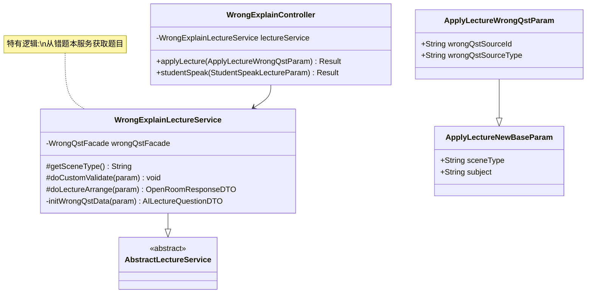
```mermaid
classDiagram
    class WrongExplainController {
        -WrongExplainLectureService lectureService
        +applyLecture(ApplyLectureWrongQstParam) Result
        +studentSpeak(StudentSpeakLectureParam) Result
    }

    class WrongExplainLectureService {
        -WrongQstFacade wrongQstFacade
        #getSceneType() String
        #doCustomValidate(param) void
        #doLectureArrange(param) OpenRoomResponseDTO
        -initWrongQstData(param) AILectureQuestionDTO
    }

    class AbstractLectureService {
        <<abstract>>
    }

    class ApplyLectureWrongQstParam {
        +String wrongQstSourceId
        +String wrongQstSourceType
    }

    class ApplyLectureNewBaseParam {
        +String sceneType
        +String subject
    }

    WrongExplainController --> WrongExplainLectureService
    WrongExplainLectureService --|> AbstractLectureService
    ApplyLectureWrongQstParam --|> ApplyLectureNewBaseParam

    note for WrongExplainLectureService "特有逻辑:\n从错题本服务获取题目"

```

##### 时序图 - 服务级别

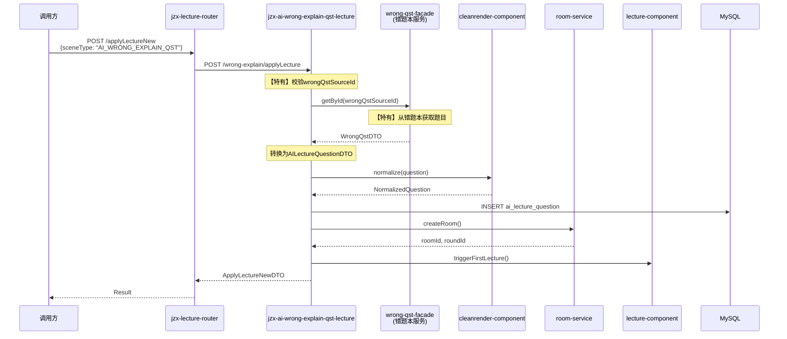
```mermaid
sequenceDiagram
    participant Client as 调用方
    participant Router as jzx-lecture-router
    participant App as jzx-ai-wrong-explain-qst-lecture
    participant Wrong as wrong-qst-facade<br/>(错题本服务)
    participant Clean as cleanrender-component
    participant Room as room-service
    participant Lecture as lecture-component
    participant DB as MySQL

    Client->>Router: POST /applyLectureNew<br/>{sceneType: "AI_WRONG_EXPLAIN_QST"}

    Router->>App: POST /wrong-explain/applyLecture

    Note over App: 【特有】校验wrongQstSourceId

    App->>Wrong: getById(wrongQstSourceId)
    Note over Wrong: 【特有】从错题本获取题目
    Wrong-->>App: WrongQstDTO

    Note over App: 转换为AILectureQuestionDTO

    App->>Clean: normalize(question)
    Clean-->>App: NormalizedQuestion

    App->>DB: INSERT ai_lecture_question

    App->>Room: createRoom()
    Room-->>App: roomId, roundId

    App->>Lecture: triggerFirstLecture()

    App-->>Router: ApplyLectureNewDTO
    Router-->>Client: Result

```
---

#### APP-4: 错题本批改应用

##### 应用信息

| 属性 | 值 |
| --- | --- |
| 应用名称 | 错题本批改应用 |
| 场景类型 | AI\_WRONG\_CORRECT\_HOMEWORK\_QST |
| 模块名称 | jzx-ai-wrong-correct-homework-qst-lecture |
| 接口前缀 | /wrong-correct |
| **特有逻辑** | 错题本数据初始化 + 批改模式 |

##### 接口定义

###### 接口1：申请讲题

| 属性 | 说明 |
| --- | --- |
| **接口地址** | POST `/wrong-correct/applyLecture` |
| **接口描述** | 错题本批改场景申请讲题 |

**入参 (ApplyLectureWrongQstParam)** - 错题本 + 批改特有参数

| 字段 | 类型 | 必填 | 说明 |
| --- | --- | --- | --- |
| sceneType | String | 是 | 场景类型，固定值：`AI_WRONG_CORRECT_HOMEWORK_QST` |
| wrongQstSourceId | String | 是 | **【错题本特有】** 错题本来源ID |
| wrongQstSourceType | String | 否 | **【错题本特有】** 错题本来源类型 |
| studentAnswer | String | 否 | **【批改特有】** 学生答案 |
| subject | String | 否 | 学科 |
| ttsSpeed | Double | 否 | TTS语速 |

**出参 (ApplyLectureNewVO)** - 同APP-1

---

###### 学生发言

| 属性 | 说明 |
| --- | --- |
| **接口地址** | POST `/wrong-correct/studentSpeak` |
| **接口描述** | 错题本批改场景学生发言 |

**入参 (StudentSpeakLectureParam)** - 同APP-1，sceneType固定为 `AI_WRONG_CORRECT_HOMEWORK_QST`

**出参** - 同APP-1

##### 时序图 - 服务级别

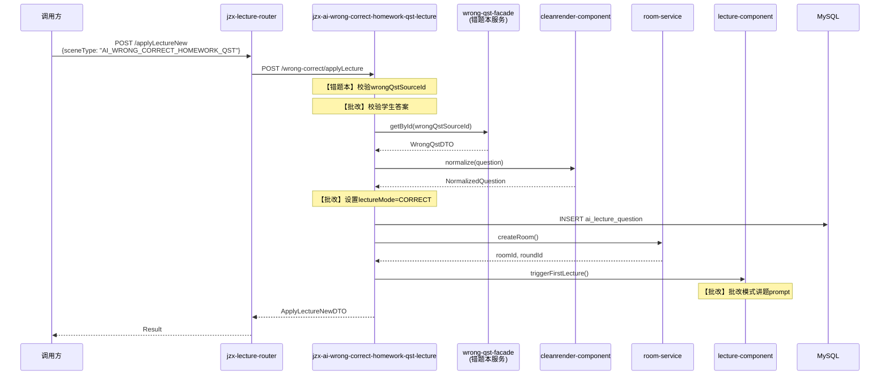
```mermaid
sequenceDiagram
    participant Client as 调用方
    participant Router as jzx-lecture-router
    participant App as jzx-ai-wrong-correct-homework-qst-lecture
    participant Wrong as wrong-qst-facade<br/>(错题本服务)
    participant Clean as cleanrender-component
    participant Room as room-service
    participant Lecture as lecture-component
    participant DB as MySQL

    Client->>Router: POST /applyLectureNew<br/>{sceneType: "AI_WRONG_CORRECT_HOMEWORK_QST"}

    Router->>App: POST /wrong-correct/applyLecture

    Note over App: 【错题本】校验wrongQstSourceId
    Note over App: 【批改】校验学生答案

    App->>Wrong: getById(wrongQstSourceId)
    Wrong-->>App: WrongQstDTO

    App->>Clean: normalize(question)
    Clean-->>App: NormalizedQuestion

    Note over App: 【批改】设置lectureMode=CORRECT

    App->>DB: INSERT ai_lecture_question

    App->>Room: createRoom()
    Room-->>App: roomId, roundId

    App->>Lecture: triggerFirstLecture()
    Note over Lecture: 【批改】批改模式讲题prompt

    App-->>Router: ApplyLectureNewDTO
    Router-->>Client: Result

```
---

#### APP-5: 精准学应用

##### 应用信息

| 属性 | 值 |
| --- | --- |
| 应用名称 | 精准学应用 |
| 场景类型 | AI\_PRECISION\_QST |
| 模块名称 | jzx-ai-precision-qst-lecture |
| 接口前缀 | /precision |
| **特有逻辑** | 推荐题目获取、3-9年级数学跳过清洗、应用题特殊路由 |

##### 接口定义

###### 接口1：申请讲题

| 属性 | 说明 |
| --- | --- |
| **接口地址** | POST `/precision/applyLecture` |
| **接口描述** | 精准学场景申请讲题 |

**入参 (ApplyLecturePrecisionParam)** - 精准学特有参数

| 字段 | 类型 | 必填 | 说明 |
| --- | --- | --- | --- |
| sceneType | String | 是 | 场景类型，固定值：`AI_PRECISION_QST` |
| gkQid | String | 是 | **【精准学特有】** GK题目ID |
| paperId | String | 否 | **【精准学特有】** 试卷ID |
| paperType | String | 否 | **【精准学特有】** 试卷类型 |
| subject | String | 否 | 学科（用于判断是否跳过清洗） |
| ttsSpeed | Double | 否 | TTS语速 |
| gkType | String | 否 | GK类型：`GK2`/`GK4` |

**出参 (ApplyLectureNewVO)** - 同APP-1

**特有处理逻辑：**

*   从GK服务获取推荐题目
    
*   3-9年级数学跳过清洗
    
*   应用题特殊路由
    

---

###### 接口2：学生发言

| 属性 | 说明 |
| --- | --- |
| **接口地址** | POST `/precision/studentSpeak` |
| **接口描述** | 精准学场景学生发言 |

**入参 (StudentSpeakLectureParam)** - 同APP-1，sceneType固定为 `AI_PRECISION_QST`

**出参** - 同APP-1

##### UML类图

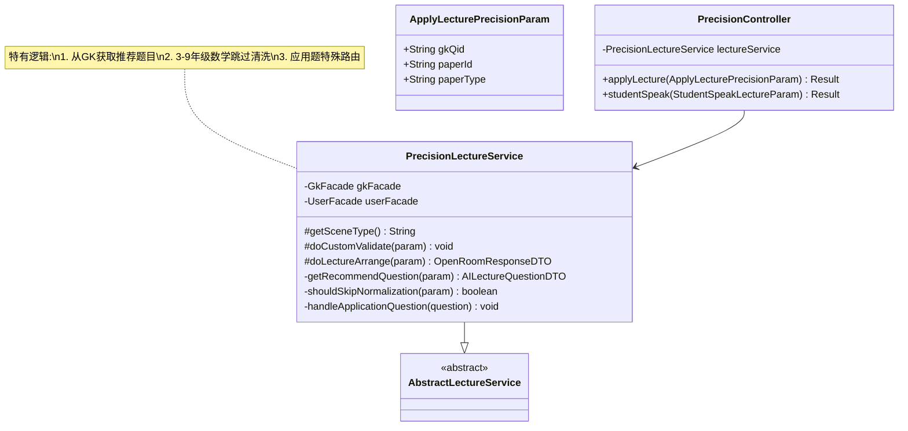
```mermaid
classDiagram
    class PrecisionController {
        -PrecisionLectureService lectureService
        +applyLecture(ApplyLecturePrecisionParam) Result
        +studentSpeak(StudentSpeakLectureParam) Result
    }

    class PrecisionLectureService {
        -GkFacade gkFacade
        -UserFacade userFacade
        #getSceneType() String
        #doCustomValidate(param) void
        #doLectureArrange(param) OpenRoomResponseDTO
        -getRecommendQuestion(param) AILectureQuestionDTO
        -shouldSkipNormalization(param) boolean
        -handleApplicationQuestion(question) void
    }

    class AbstractLectureService {
        <<abstract>>
    }

    class ApplyLecturePrecisionParam {
        +String gkQid
        +String paperId
        +String paperType
    }

    PrecisionController --> PrecisionLectureService
    PrecisionLectureService --|> AbstractLectureService

    note for PrecisionLectureService "特有逻辑:\n1. 从GK获取推荐题目\n2. 3-9年级数学跳过清洗\n3. 应用题特殊路由"

```

##### 时序图 - 服务级别

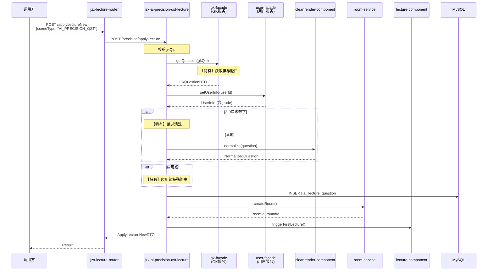
```mermaid
sequenceDiagram
    participant Client as 调用方
    participant Router as jzx-lecture-router
    participant App as jzx-ai-precision-qst-lecture
    participant GK as gk-facade<br/>(GK服务)
    participant User as user-facade<br/>(用户服务)
    participant Clean as cleanrender-component
    participant Room as room-service
    participant Lecture as lecture-component
    participant DB as MySQL

    Client->>Router: POST /applyLectureNew<br/>{sceneType: "AI_PRECISION_QST"}

    Router->>App: POST /precision/applyLecture

    Note over App: 校验gkQid

    App->>GK: getQuestion(gkQid)
    Note over GK: 【特有】获取推荐题目
    GK-->>App: GkQuestionDTO

    App->>User: getUserInfo(userId)
    User-->>App: UserInfo (含grade)

    alt 3-9年级数学
        Note over App: 【特有】跳过清洗
    else 其他
        App->>Clean: normalize(question)
        Clean-->>App: NormalizedQuestion
    end

    alt 应用题
        Note over App: 【特有】应用题特殊路由
    end

    App->>DB: INSERT ai_lecture_question

    App->>Room: createRoom()
    Room-->>App: roomId, roundId

    App->>Lecture: triggerFirstLecture()

    App-->>Router: ApplyLectureNewDTO
    Router-->>Client: Result

```
---

#### APP-6: 一对一讲题应用

##### 应用信息

| 属性 | 值 |
| --- | --- |
| 应用名称 | 一对一讲题应用 |
| 场景类型 | AI\_ONE\_ON\_ONE\_QST |
| 模块名称 | jzx-ai-one-on-one-qst-lecture |
| 接口前缀 | /one-on-one |
| **特有逻辑** | 分配题目获取 |

##### 接口定义

###### 接口1：申请讲题

| 属性 | 说明 |
| --- | --- |
| **接口地址** | POST `/one-on-one/applyLecture` |
| **接口描述** | 一对一场景申请讲题 |

**入参 (ApplyLecturePrecisionParam)** - 与精准学参数相同

| 字段 | 类型 | 必填 | 说明 |
| --- | --- | --- | --- |
| sceneType | String | 是 | 场景类型，固定值：`AI_ONE_ON_ONE_QST` |
| gkQid | String | 是 | **【一对一特有】** GK题目ID |
| paperId | String | 否 | 试卷ID |
| paperType | String | 否 | 试卷类型 |
| subject | String | 否 | 学科 |
| ttsSpeed | Double | 否 | TTS语速 |

**出参 (ApplyLectureNewVO)** - 同APP-1

**特有处理逻辑：**

*   从GK服务获取分配题目（非推荐题目）
    

---

###### 接口2：学生发言

| 属性 | 说明 |
| --- | --- |
| **接口地址** | POST `/one-on-one/studentSpeak` |
| **接口描述** | 一对一场景学生发言 |

**入参 (StudentSpeakLectureParam)** - 同APP-1，sceneType固定为 `AI_ONE_ON_ONE_QST`

**出参** - 同APP-1

##### 时序图 - 服务级别

```mermaid
sequenceDiagram
    participant Client as 调用方
    participant Router as jzx-lecture-router
    participant App as jzx-ai-one-on-one-qst-lecture
    participant GK as gk-facade<br/>(GK服务)
    participant Clean as cleanrender-component
    participant Room as room-service
    participant Lecture as lecture-component
    participant DB as MySQL

    Client->>Router: POST /applyLectureNew<br/>{sceneType: "AI_ONE_ON_ONE_QST"}

    Router->>App: POST /one-on-one/applyLecture

    App->>GK: getAssignedQuestion(gkQid)
    Note over GK: 【特有】获取分配题目
    GK-->>App: GkQuestionDTO

    App->>Clean: normalize(question)
    Clean-->>App: NormalizedQuestion

    App->>DB: INSERT ai_lecture_question

    App->>Room: createRoom()
    Room-->>App: roomId, roundId

    App->>Lecture: triggerFirstLecture()

    App-->>Router: ApplyLectureNewDTO
    Router-->>Client: Result

```
---

#### APP-7: 错题本精准学应用

##### 应用信息

| 属性 | 值 |
| --- | --- |
| 应用名称 | 错题本精准学应用 |
| 场景类型 | AI\_WRONG\_PRECISION\_QST |
| 模块名称 | jzx-ai-wrong-precision-qst-lecture |
| 接口前缀 | /wrong-precision |
| **特有逻辑** | 错题本初始化 + 推荐题目 + 跳过清洗 |

##### 接口定义

###### 接口1：申请讲题

| 属性 | 说明 |
| --- | --- |
| **接口地址** | POST `/wrong-precision/applyLecture` |
| **接口描述** | 错题本精准学场景申请讲题 |

**入参 (ApplyLectureWrongPrecisionParam)** - 错题本 + 精准学特有参数

| 字段 | 类型 | 必填 | 说明 |
| --- | --- | --- | --- |
| sceneType | String | 是 | 场景类型，固定值：`AI_WRONG_PRECISION_QST` |
| wrongQstSourceId | String | 是 | **【错题本特有】** 错题本来源ID |
| wrongQstSourceType | String | 否 | **【错题本特有】** 错题本来源类型 |
| subject | String | 否 | 学科（用于判断是否跳过清洗） |
| ttsSpeed | Double | 否 | TTS语速 |

**出参 (ApplyLectureNewVO)** - 同APP-1

**特有处理逻辑：**

*   从错题本服务获取题目
    
*   3-9年级数学跳过清洗
    
*   应用题特殊路由
    

---

###### 接口2：学生发言

| 属性 | 说明 |
| --- | --- |
| **接口地址** | POST `/wrong-precision/studentSpeak` |
| **接口描述** | 错题本精准学场景学生发言 |

**入参 (StudentSpeakLectureParam)** - 同APP-1，sceneType固定为 `AI_WRONG_PRECISION_QST`

**出参** - 同APP-1

##### 时序图 - 服务级别

```mermaid
sequenceDiagram
    participant Client as 调用方
    participant Router as jzx-lecture-router
    participant App as jzx-ai-wrong-precision-qst-lecture
    participant Wrong as wrong-qst-facade<br/>(错题本服务)
    participant User as user-facade<br/>(用户服务)
    participant Clean as cleanrender-component
    participant Room as room-service
    participant Lecture as lecture-component
    participant DB as MySQL

    Client->>Router: POST /applyLectureNew<br/>{sceneType: "AI_WRONG_PRECISION_QST"}

    Router->>App: POST /wrong-precision/applyLecture

    Note over App: 【错题本】校验wrongQstSourceId

    App->>Wrong: getById(wrongQstSourceId)
    Note over Wrong: 【错题本】获取题目
    Wrong-->>App: WrongQstDTO

    App->>User: getUserInfo(userId)
    User-->>App: UserInfo

    alt 3-9年级数学
        Note over App: 【精准学】跳过清洗
    else 其他
        App->>Clean: normalize(question)
        Clean-->>App: NormalizedQuestion
    end

    alt 应用题
        Note over App: 【精准学】应用题路由
    end

    App->>DB: INSERT ai_lecture_question

    App->>Room: createRoom()
    Room-->>App: roomId, roundId

    App->>Lecture: triggerFirstLecture()

    App-->>Router: ApplyLectureNewDTO
    Router-->>Client: Result

```
---

#### APP-8: 错题本一对一应用

##### 应用信息

| 属性 | 值 |
| --- | --- |
| 应用名称 | 错题本一对一应用 |
| 场景类型 | AI\_WRONG\_ONE\_ON\_ONE\_QST |
| 模块名称 | jzx-ai-wrong-one-on-one-qst-lecture |
| 接口前缀 | /wrong-one-on-one |
| **特有逻辑** | 错题本初始化 + 分配题目 |

##### 接口定义

###### 接口1：申请讲题

| 属性 | 说明 |
| --- | --- |
| **接口地址** | POST `/wrong-one-on-one/applyLecture` |
| **接口描述** | 错题本一对一场景申请讲题 |

**入参 (ApplyLectureWrongQstParam)** - 错题本特有参数

| 字段 | 类型 | 必填 | 说明 |
| --- | --- | --- | --- |
| sceneType | String | 是 | 场景类型，固定值：`AI_WRONG_ONE_ON_ONE_QST` |
| wrongQstSourceId | String | 是 | **【错题本特有】** 错题本来源ID |
| wrongQstSourceType | String | 否 | **【错题本特有】** 错题本来源类型 |
| subject | String | 否 | 学科 |
| ttsSpeed | Double | 否 | TTS语速 |

**出参 (ApplyLectureNewVO)** - 同APP-1

**特有处理逻辑：**

*   从错题本服务获取题目
    

---

###### 接口2：学生发言

| 属性 | 说明 |
| --- | --- |
| **接口地址** | POST `/wrong-one-on-one/studentSpeak` |
| **接口描述** | 错题本一对一场景学生发言 |

**入参 (StudentSpeakLectureParam)** - 同APP-1，sceneType固定为 `AI_WRONG_ONE_ON_ONE_QST`

**出参** - 同APP-1

##### 时序图 - 服务级别

```mermaid
sequenceDiagram
    participant Client as 调用方
    participant Router as jzx-lecture-router
    participant App as jzx-ai-wrong-one-on-one-qst-lecture
    participant Wrong as wrong-qst-facade<br/>(错题本服务)
    participant Clean as cleanrender-component
    participant Room as room-service
    participant Lecture as lecture-component
    participant DB as MySQL

    Client->>Router: POST /applyLectureNew<br/>{sceneType: "AI_WRONG_ONE_ON_ONE_QST"}

    Router->>App: POST /wrong-one-on-one/applyLecture

    Note over App: 【错题本】校验wrongQstSourceId

    App->>Wrong: getById(wrongQstSourceId)
    Wrong-->>App: WrongQstDTO

    App->>Clean: normalize(question)
    Clean-->>App: NormalizedQuestion

    App->>DB: INSERT ai_lecture_question

    App->>Room: createRoom()
    Room-->>App: roomId, roundId

    App->>Lecture: triggerFirstLecture()

    App-->>Router: ApplyLectureNewDTO
    Router-->>Client: Result

```
---

## 3.3 组件抽取

UML组件图\[接口定义级别\]

**组件定义：**

```mermaid
classDiagram
    %% 将组件定义为类，并标注构造型
    class LectureComponent["«component»\njzx-business-components-lecture"] {
        <<Stateless>>
        +实时讲题：流式/实时响应
        +离线讲题：预生成/批量处理
        +板书生成：讲题板书生成
    }

    %% 定义核心接口
   
    class IChat["«interface»\nAI讲题对话接口"]

    %% 使用实现/关联线连接
    IChat -- LectureComponent
```

### 接口定义

```java
/**
 * 讲题对话服务 - AI讲题对话接口
 */
public interface LectureDialogueService {

    /**
     * 执行AI讲题对话
     *
     * 场景：用户发言后，AI进行对话回复
     * 特点：
     *   1. 同步执行，返回讲题结果
     *   2. AI根据用户发言内容和上下文进行对话
     *   3. 生成TTS语音和板书
     *   4. 结果设置到redis中
     *
     * @param request 讲题请求
     * @return 讲题响应（包含教师回复、TTS、板书）
     */
    LectureDialogueResponse doDialogue(LectureDialogueRequest request);
}

```

#### 请求参数定义

| 字段 | 类型 | 必填 | 说明 |
| --- | --- | --- | --- |
| roomId | Long | 是 | 房间ID |
| roundId | Long | 是 | 轮次ID |
| lectureQuestionId | Long | 是 | 讲题问题ID |
| studentContent | String | 是 | 学生发言内容 |
| sceneType | String | 是 | 场景类型（如AI\_EXPLAIN\_QST） |
| eventCode | String | 是 | 事件码（如STUDENT\_SPEAK） |
| ttsSpeed | Double | 否 | TTS语速，默认1.0 |
| questionInfo | AILectureQuestionDTO | 是 | 题目信息（题干、答案、解析等） |
| userInfo | UserInfo | 是 | 用户信息 |

```java
/**
 * 讲题对话请求
 */
@Data
@Builder
public class LectureDialogueRequest {
    /** 房间ID */
    private Long roomId;
    /** 轮次ID */
    private Long roundId;
    /** 讲题问题ID */
    private Long lectureQuestionId;
    /** 学生发言内容 */
    private String studentContent;
    /** 场景类型 */
    private String sceneType;
    /** 事件码 */
    private String eventCode;
    /** TTS语速 */
    private Double ttsSpeed;
    /** 题目信息 */
    private AILectureQuestionDTO questionInfo;
    /** 用户信息 */
    private UserInfo userInfo;
}

```

#### 响应参数定义

| 字段 | 类型 | 说明 |
| --- | --- | --- |
| teacherReply | String | 教师回复内容 |
| ttsUrl | String | TTS语音URL |
| boardNote | BoardNoteData | 板书数据 |
| isFinished | Boolean | 是否讲题结束 |

```java
/**
 * 讲题对话响应
 */
@Data
@Builder
public class LectureDialogueResponse {
    /** 教师回复内容 */
    private String teacherReply;
    /** TTS语音URL */
    private String ttsUrl;
    /** 板书数据 */
    private BoardNoteData boardNote;
    /** 是否讲题结束 */
    private Boolean isFinished;
}

```

### 类图

```mermaid
classDiagram
    %% ========== 接口定义 ==========
    class LectureDialogueService {
        <<interface>>
        +doDialogue(LectureDialogueRequest request) LectureDialogueResponse
    }

    %% ========== 实现类 ==========
    class LectureDialogueServiceImpl {
        -AiFacade aiFacade
        -TtsService ttsService
        -BoardNoteService boardNoteService
        -MessagePushService pushService
        +doDialogue(LectureDialogueRequest request) LectureDialogueResponse
        -buildDialoguePrompt(request) String
        -parseAiResponse(response) ParsedResponse
        -checkIsFinished(response) boolean
    }

    %% ========== 依赖服务 ==========
    class TtsService {
        <<interface>>
        +generateTts(TtsRequest request) TtsResponse
    }

    class BoardNoteService {
        <<interface>>
        +generateBoardNote(BoardNoteRequest request) BoardNoteResponse
    }

    class MessagePushService {
        <<interface>>
        +pushLectureMessage(LectureMessage message) void
    }

    %% ========== 外部依赖 ==========
    class AiFacade {
        <<external>>
        +chat(String prompt) String
    }

    %% ========== 请求/响应对象 ==========
    class LectureDialogueRequest {
        +Long roomId
        +Long roundId
        +Long lectureQuestionId
        +String studentContent
        +String sceneType
        +String eventCode
        +Double ttsSpeed
        +AILectureQuestionDTO questionInfo
        +UserInfo userInfo
    }

    class LectureDialogueResponse {
        +String teacherReply
        +String ttsUrl
        +BoardNoteData boardNote
        +Boolean isFinished
    }

    %% ========== 关系 ==========
    LectureDialogueServiceImpl ..|> LectureDialogueService
    LectureDialogueServiceImpl --> AiFacade
    LectureDialogueServiceImpl --> TtsService
    LectureDialogueServiceImpl --> BoardNoteService
    LectureDialogueServiceImpl --> MessagePushService
    LectureDialogueServiceImpl ..> LectureDialogueRequest : uses
    LectureDialogueServiceImpl ..> LectureDialogueResponse : returns

```

### 时序图

```mermaid
sequenceDiagram
    participant App as 应用层<br/>AbstractLectureService
    participant Svc as LectureDialogueService
    participant AI as AiFacade
    participant TTS as TtsService
    participant Board as BoardNoteService
    participant Push as MessagePushService 

    App->>Svc: doDialogue(request)

    Note over Svc: 1. 构建对话提示词
    Svc->>Svc: buildDialoguePrompt(request)
    Note over Svc: 包含：题目信息 + 历史对话 + 学生发言

    Note over Svc: 2. 调用AI进行对话
    Svc->>AI: chat(prompt)
    AI-->>Svc: AI回复内容

    Note over Svc: 3. 解析AI回复
    Svc->>Svc: parseAiResponse(response)
    Svc->>Svc: checkIsFinished(response)

    par 4. 并行处理TTS和板书
        Svc->>TTS: generateTts(teacherReply, speed)
        TTS-->>Svc: TtsResponse(audioUrl)
    and
        Svc->>Board: generateBoardNote(teacherReply)
        Board-->>Svc: BoardNoteResponse(boardData)
    end

    Note over Svc: 5. 推送消息给客户端
    Svc->>Push: pushLectureMessage(message)
     
    
    Push-->>Svc: void

    Note over Svc: 6. 构建响应
    Svc->>Svc: buildResponse()

    Svc-->>App: LectureDialogueResponse

```
---

## 3.4 BPMN重构

重构策略：

1.  变量抽取
    
2.  分支外化
    
3.  异常处理
    

### 重构范围：按照应用-接口-流程的颗粒度关系梳理：

| 应用 | 接口 | 流程 |
| --- | --- | --- |
| 作业辅导应用 | `/explain/applyLecture` | flow1.bpmn |
|  | `/explain/studentSpeak` |  |
| 作业批改应用 | `/correct/applyLecture` |  |
|  | `/correct/studentSpeak` |  |
| 错题本辅导应用 | `/wrong-explain/applyLecture` |  |
|  | `/wrong-explain/studentSpeak` |  |
| 错题本批改应用 | `/wrong-correct/applyLecture` |  |
|  | `/wrong-correct/studentSpeak` |  |
| 精准学应用 | `/precision/applyLecture` |  |
|  | `/precision/studentSpeak` |  |
| 一对一讲题应用 | `/one-on-one/applyLecture` |  |
|  | `/one-on-one/studentSpeak` |  |
| 错题本精准学应用 | `/wrong-precision/applyLecture` |  |
|  | `/wrong-precision/studentSpeak` |  |
| 错题本一对一应用 | `/wrong-one-on-one/applyLecture` |  |
|  | `/wrong-one-on-one/studentSpeak` |  |

应用xxx

接口11时序：

原始时序图(class->method)

接口11流程图：

xxx

###### APP-1: AI\_EXPLAIN\_QST (作业辅导) 

##### applyLectureNew 接口时序

##### applyLectureNew 接口流程图

```mermaid
flowchart TB
    Start([开始]) --> InitVars[1.初始化流程变量<br/>initProcessVariables]

    InitVars --> ValidateUser{2.用户校验}
    ValidateUser -->|失败| ErrorEnd1([异常结束:<br/>USER_NOT_EXIST])
    ValidateUser -->|成功| CalcConditions[3. 设置分支条件变量<br/>calculateConditions]

    CalcConditions --> CheckFeedback{4.有反馈ID?}

    CheckFeedback -->|是| FeedbackFlow[5a.反馈流程<br/>getAILectureQuestionDTO<br/>FromFeedback]
    CheckFeedback -->|否| ArrangeStart

    %% ========== 讲题编排子流程开始 ==========
    subgraph ArrangeSubProcess[讲题编排子流程 lectureQstArrange]
        ArrangeStart([子流程开始]) --> CheckParam[5b-1.参数校验<br/>checkParam]
        CheckParam -->|失败| ParamError([PARAM_ERROR])
        CheckParam -->|成功| InitPid[5b-2.错题本PID初始化<br/>initPidPreparation]

        InitPid --> CheckMath{5b-3.数学计算题?}

        CheckMath -->|是| MathFlow[数学计算题流程<br/>getMathCalcQuestion]
        MathFlow --> ArrangeEnd

        CheckMath -->|否| CheckGk2{5b-4.GK2类型?}

        CheckGk2 -->|是| Gk2Handle[GK2处理<br/>handleGk2Task]
        Gk2Handle --> Gk2Save[保存题目]
        Gk2Save --> Gk2Room[开启房间]
        Gk2Room --> Gk2Update[更新GK房间]
        Gk2Update --> ArrangeEnd

        CheckGk2 -->|否| CheckParamOther[5b-5.额外参数校验<br/>checkParamOther]

        %% ========== 普通讲题流程（原handleLectureCommonTask） ==========
        CheckParamOther --> FillQuestion[5b-6.填充题目信息<br/>fillAILectureQuestion]
        FillQuestion --> SubjectSelect[5b-7.学科选择<br/>subjectSelection]

        SubjectSelect --> RouteGateway{5b-8. 业务类型?}

        RouteGateway -->|QUARK| QuarkQuery[查询Quark题库<br/>queryFromQuark]
        RouteGateway -->|OCR| OcrProcess[OCR处理<br/>processOcrQuestion]
        RouteGateway -->|INTERNAL| InternalProcess[内部题目处理<br/>processInternal]

        QuarkQuery --> GetKeywords
        OcrProcess --> SameJudge{同题判断?}
        SameJudge -->|是| SameQuestion[同题处理] --> GetKeywords
        SameJudge -->|否| GetKeywords
        InternalProcess --> GetKeywords

        GetKeywords[5b-9.获取题目关键词<br/>getQuestionKeywords] --> Normalization

        Normalization[5b-10.题目清洗<br/>normalizationLatest]
        Normalization -->|失败重试| NormRetry{重试次数<3?}
        NormRetry -->|是| Normalization
        NormRetry -->|否| NormFallback[降级:使用原始题目]
        Normalization -->|成功| AsyncCheck
        NormFallback --> AsyncCheck

        AsyncCheck[5b-11.中英文题型检测<br/>checkChineseEnglishAsync<br/>异步] --> MindMap

        MindMap[5b-12.思维导图生成<br/>asyncGenerateMindMap<br/>异步] --> SaveQuestion

        SaveQuestion[5b-13.保存讲题问题<br/>saveLectureQuestion] --> OpenRoom

        OpenRoom[5b-14.开启房间<br/>openLectureRoom] --> ParallelStart

        ParallelStart{并行网关} --> AsyncSolve[5b-15a.异步解题<br/>asyncParallelQst<br/>Processing]
        ParallelStart --> ReadQuestion[5b-15b.读题+触发讲题<br/>readQuestionLecture]

        AsyncSolve --> ParallelJoin{并行合并}
        ReadQuestion --> ParallelJoin

        ParallelJoin --> ArrangeEnd([子流程结束])
    end
    %% ========== 讲题编排子流程结束 ==========

    FeedbackFlow --> ValidateQuestion
    ArrangeEnd --> ValidateQuestion

    ValidateQuestion{6.问题数据有效?}
    ValidateQuestion -->|否| ErrorEnd2([异常结束:<br/>QUESTION_CLEAN_ERROR])
    ValidateQuestion -->|是| PushSolved[7.推送已解答题目<br/>pushSolvedQuestion]

    PushSolved --> EnsureRoom[8.确保房间创建/触发讲题<br/>getOpenRoomReponseDTO/]

    EnsureRoom --> UpdateQuestion[9.更新讲题任务状态<br/>updateAiLectureQuestion]

    UpdateQuestion --> SimilarAsync[10.相似题处理<br/>similarQuestionHandlerAsync<br/>异步]

    SimilarAsync --> CheckGk{11.需要GK任务?<br/>gkType != GK2}
    CheckGk -->|是| GkTask[12.GK任务处理<br/>gkTaskAsync]
    CheckGk -->|否| CheckIncentive
    GkTask --> CheckIncentive

    CheckIncentive{13.需要激励消息?<br/>sceneType=ONE_ON_ONE}
    CheckIncentive -->|是| SendIncentive[14.发送激励消息<br/>sendIncentiveMessage]
    CheckIncentive -->|否| BuildResult
    SendIncentive --> BuildResult

    BuildResult[15.构建返回结果<br/>getApplyLectureNewDTO]

    BuildResult --> End([正常结束])

    style Start fill:#90EE90
    style End fill:#90EE90
    style ErrorEnd1 fill:#FFB6C1
    style ErrorEnd2 fill:#FFB6C1
    style ParamError fill:#FFB6C1
    style ArrangeSubProcess fill:#E6F3FF
```

```mermaid
flowchart TD
    START((开始)) --> VALIDATE[参数校验<br/>ValidateParamDelegate]

    VALIDATE --> ROUTE_CHECK{路由类型<br/>判断}

    ROUTE_CHECK -->|route=quark| QUARK[从题库获取题目<br/>GetQuestionFromQuarkDelegate]
    ROUTE_CHECK -->|route=ocr| OCR[从OCR获取题目<br/>GetQuestionFromOcrDelegate]

    QUARK --> KEYWORD[关键字提取<br/>GetKeywordDelegate]
    OCR --> KEYWORD

    KEYWORD --> NORMALIZE[题目清洗<br/>NormalizationDelegate]

    NORMALIZE --> CHECK_TYPE[题型校验<br/>CheckQuestionTypeDelegate]

    CHECK_TYPE --> SIMILAR[相似题匹配<br/>SimilarQuestionDelegate]

    SIMILAR --> SAME_JUDGE[同题判断<br/>SameQuestionJudgeDelegate]

    SAME_JUDGE --> READ_QST[读题/串场<br/>ReadQuestionDelegate]

    READ_QST --> TRIGGER[触发首轮讲题<br/>TriggerLectureDelegate]

    TRIGGER --> SAVE_RECORD[保存讲题记录<br/>SaveLectureRecordDelegate]

    SAVE_RECORD --> CREATE_ROOM[创建房间<br/>CreateRoomDelegate]

    CREATE_ROOM --> END_NODE((结束))

    style START fill:#90EE90
    style END_NODE fill:#FFB6C1
    style VALIDATE fill:#87CEEB
    style ROUTE_CHECK fill:#FFD700
    style QUARK fill:#DDA0DD
    style OCR fill:#DDA0DD
    style KEYWORD fill:#87CEEB
    style NORMALIZE fill:#87CEEB
    style CHECK_TYPE fill:#87CEEB
    style SIMILAR fill:#87CEEB
    style SAME_JUDGE fill:#87CEEB
    style READ_QST fill:#87CEEB
    style TRIGGER fill:#FF6347
    style SAVE_RECORD fill:#87CEEB
    style CREATE_ROOM fill:#87CEEB

```

###### APP-2: AI\_CORRECT\_HOMEWORK\_QST (作业批改) 流程图

```mermaid
flowchart TD
    START((开始)) --> VALIDATE[参数校验<br/>ValidateParamDelegate]

    VALIDATE --> CORRECT_MODE[设置批改模式<br/>lectureMode=CORRECT]

    CORRECT_MODE --> ROUTE_CHECK{路由类型<br/>判断}

    ROUTE_CHECK -->|route=quark| QUARK[从题库获取题目<br/>GetQuestionFromQuarkDelegate]
    ROUTE_CHECK -->|route=ocr| OCR[从OCR获取题目<br/>GetQuestionFromOcrDelegate]

    QUARK --> KEYWORD[关键字提取<br/>GetKeywordDelegate]
    OCR --> KEYWORD

    KEYWORD --> NORMALIZE[题目清洗<br/>NormalizationDelegate]

    NORMALIZE --> CHECK_TYPE[题型校验<br/>CheckQuestionTypeDelegate]

    CHECK_TYPE --> ANSWER_CHECK[答案校验<br/>AnswerValidateDelegate]

    ANSWER_CHECK --> SIMILAR[相似题匹配<br/>SimilarQuestionDelegate]

    SIMILAR --> SAME_JUDGE[同题判断<br/>SameQuestionJudgeDelegate]

    SAME_JUDGE --> READ_QST[读题/串场<br/>ReadQuestionDelegate]

    READ_QST --> TRIGGER[触发首轮讲题<br/>TriggerLectureDelegate<br/>批改模式]

    TRIGGER --> SAVE_RECORD[保存讲题记录<br/>SaveLectureRecordDelegate]

    SAVE_RECORD --> CREATE_ROOM[创建房间<br/>CreateRoomDelegate]

    CREATE_ROOM --> END_NODE((结束))

    style START fill:#90EE90
    style END_NODE fill:#FFB6C1
    style CORRECT_MODE fill:#FFA500
    style ANSWER_CHECK fill:#FFA500

```

###### APP-3: AI\_WRONG\_EXPLAIN\_QST (错题本作业辅导) 流程图

```mermaid
flowchart TD
    START((开始)) --> VALIDATE[参数校验<br/>ValidateParamDelegate]

    VALIDATE --> WRONG_CHECK{是否错题本<br/>场景?}

    WRONG_CHECK -->|是| INIT_WRONG[初始化错题本数据<br/>InitWrongQstDataDelegate]

    INIT_WRONG --> LOAD_WRONG[加载错题本题目<br/>wrongQstSourceId]

    LOAD_WRONG --> KEYWORD[关键字提取<br/>GetKeywordDelegate]

    KEYWORD --> NORMALIZE[题目清洗<br/>NormalizationDelegate]

    NORMALIZE --> CHECK_TYPE[题型校验<br/>CheckQuestionTypeDelegate]

    CHECK_TYPE --> SIMILAR[相似题匹配<br/>SimilarQuestionDelegate]

    SIMILAR --> SAME_JUDGE[同题判断<br/>SameQuestionJudgeDelegate]

    SAME_JUDGE --> READ_QST[读题/串场<br/>ReadQuestionDelegate]

    READ_QST --> TRIGGER[触发首轮讲题<br/>TriggerLectureDelegate]

    TRIGGER --> SAVE_RECORD[保存讲题记录<br/>SaveLectureRecordDelegate<br/>标记:错题本来源]

    SAVE_RECORD --> CREATE_ROOM[创建房间<br/>CreateRoomDelegate]

    CREATE_ROOM --> END_NODE((结束))

    style START fill:#90EE90
    style END_NODE fill:#FFB6C1
    style WRONG_CHECK fill:#FFD700
    style INIT_WRONG fill:#FF69B4
    style LOAD_WRONG fill:#FF69B4

```

###### APP-4: AI\_WRONG\_CORRECT\_HOMEWORK\_QST (错题本作业批改) 流程图

```mermaid
flowchart TD
    START((开始)) --> VALIDATE[参数校验<br/>ValidateParamDelegate]

    VALIDATE --> CORRECT_MODE[设置批改模式<br/>lectureMode=CORRECT]

    CORRECT_MODE --> WRONG_CHECK{是否错题本<br/>场景?}

    WRONG_CHECK -->|是| INIT_WRONG[初始化错题本数据<br/>InitWrongQstDataDelegate]

    INIT_WRONG --> LOAD_WRONG[加载错题本题目<br/>wrongQstSourceId]

    LOAD_WRONG --> KEYWORD[关键字提取<br/>GetKeywordDelegate]

    KEYWORD --> NORMALIZE[题目清洗<br/>NormalizationDelegate]

    NORMALIZE --> CHECK_TYPE[题型校验<br/>CheckQuestionTypeDelegate]

    CHECK_TYPE --> ANSWER_CHECK[答案校验<br/>AnswerValidateDelegate]

    ANSWER_CHECK --> SIMILAR[相似题匹配<br/>SimilarQuestionDelegate]

    SIMILAR --> SAME_JUDGE[同题判断<br/>SameQuestionJudgeDelegate]

    SAME_JUDGE --> READ_QST[读题/串场<br/>ReadQuestionDelegate]

    READ_QST --> TRIGGER[触发首轮讲题<br/>TriggerLectureDelegate<br/>批改模式]

    TRIGGER --> SAVE_RECORD[保存讲题记录<br/>SaveLectureRecordDelegate<br/>标记:错题本来源]

    SAVE_RECORD --> CREATE_ROOM[创建房间<br/>CreateRoomDelegate]

    CREATE_ROOM --> END_NODE((结束))

    style START fill:#90EE90
    style END_NODE fill:#FFB6C1
    style CORRECT_MODE fill:#FFA500
    style WRONG_CHECK fill:#FFD700
    style INIT_WRONG fill:#FF69B4
    style LOAD_WRONG fill:#FF69B4
    style ANSWER_CHECK fill:#FFA500

```

###### APP-5: AI\_PRECISION\_QST (精准学讲题) 流程图

```mermaid
flowchart TD
    START((开始)) --> VALIDATE[参数校验<br/>ValidateParamDelegate]

    VALIDATE --> PRECISION_MODE[设置精准学模式<br/>lectureMode=PRECISION]

    PRECISION_MODE --> GET_RECOMMEND[获取推荐题目<br/>GetRecommendQuestionDelegate]

    GET_RECOMMEND --> GRADE_CHECK{年级判断<br/>3-9年级数学?}

    GRADE_CHECK -->|是| SKIP_CLEAN[跳过清洗<br/>skipNormalization=true]
    GRADE_CHECK -->|否| KEYWORD[关键字提取<br/>GetKeywordDelegate]

    SKIP_CLEAN --> QST_TYPE_CHECK{题型判断}
    KEYWORD --> NORMALIZE[题目清洗<br/>NormalizationDelegate]

    NORMALIZE --> QST_TYPE_CHECK

    QST_TYPE_CHECK -->|应用题| APP_ROUTE[应用题路由<br/>ApplicationQuestionDelegate]
    QST_TYPE_CHECK -->|GK2题型| GK2_ROUTE[GK2任务处理<br/>HandleGk2TaskDelegate]
    QST_TYPE_CHECK -->|其他| DEFAULT_ROUTE[默认处理]

    APP_ROUTE --> SIMILAR[相似题匹配<br/>SimilarQuestionDelegate]
    GK2_ROUTE --> SIMILAR
    DEFAULT_ROUTE --> SIMILAR

    SIMILAR --> SAME_JUDGE[同题判断<br/>SameQuestionJudgeDelegate]

    SAME_JUDGE --> READ_QST[读题/串场<br/>ReadQuestionDelegate]

    READ_QST --> TRIGGER[触发首轮讲题<br/>TriggerLectureDelegate<br/>精准学模式]

    TRIGGER --> SAVE_RECORD[保存讲题记录<br/>SaveLectureRecordDelegate]

    SAVE_RECORD --> CREATE_ROOM[创建房间<br/>CreateRoomDelegate]

    CREATE_ROOM --> END_NODE((结束))

    style START fill:#90EE90
    style END_NODE fill:#FFB6C1
    style PRECISION_MODE fill:#9370DB
    style GET_RECOMMEND fill:#9370DB
    style GRADE_CHECK fill:#FFD700
    style SKIP_CLEAN fill:#98FB98
    style QST_TYPE_CHECK fill:#FFD700
    style APP_ROUTE fill:#DDA0DD
    style GK2_ROUTE fill:#DDA0DD

```

###### APP-6: AI\_ONE\_ON\_ONE\_QST (一对一讲题) 流程图

```mermaid
flowchart TD
    START((开始)) --> VALIDATE[参数校验<br/>ValidateParamDelegate]

    VALIDATE --> ONE_ON_ONE_MODE[设置一对一模式<br/>lectureMode=ONE_ON_ONE]

    ONE_ON_ONE_MODE --> GET_ASSIGNED[获取分配题目<br/>GetAssignedQuestionDelegate]

    GET_ASSIGNED --> KEYWORD[关键字提取<br/>GetKeywordDelegate]

    KEYWORD --> NORMALIZE[题目清洗<br/>NormalizationDelegate]

    NORMALIZE --> CHECK_TYPE[题型校验<br/>CheckQuestionTypeDelegate]

    CHECK_TYPE --> SIMILAR[相似题匹配<br/>SimilarQuestionDelegate]

    SIMILAR --> SAME_JUDGE[同题判断<br/>SameQuestionJudgeDelegate]

    SAME_JUDGE --> READ_QST[读题/串场<br/>ReadQuestionDelegate]

    READ_QST --> TRIGGER[触发首轮讲题<br/>TriggerLectureDelegate<br/>一对一模式]

    TRIGGER --> SAVE_RECORD[保存讲题记录<br/>SaveLectureRecordDelegate]

    SAVE_RECORD --> CREATE_ROOM[创建房间<br/>CreateRoomDelegate]

    CREATE_ROOM --> END_NODE((结束))

    style START fill:#90EE90
    style END_NODE fill:#FFB6C1
    style ONE_ON_ONE_MODE fill:#20B2AA
    style GET_ASSIGNED fill:#20B2AA

```

###### APP-7: AI\_WRONG\_PRECISION\_QST (错题本精准学) 流程图

```mermaid
flowchart TD
    START((开始)) --> VALIDATE[参数校验<br/>ValidateParamDelegate]

    VALIDATE --> PRECISION_MODE[设置精准学模式<br/>lectureMode=PRECISION]

    PRECISION_MODE --> WRONG_CHECK{是否错题本<br/>场景?}

    WRONG_CHECK -->|是| INIT_WRONG[初始化错题本数据<br/>InitWrongQstDataDelegate]

    INIT_WRONG --> LOAD_WRONG[加载错题本题目<br/>wrongQstSourceId]

    LOAD_WRONG --> GRADE_CHECK{年级判断<br/>3-9年级数学?}

    GRADE_CHECK -->|是| SKIP_CLEAN[跳过清洗<br/>skipNormalization=true]
    GRADE_CHECK -->|否| KEYWORD[关键字提取<br/>GetKeywordDelegate]

    SKIP_CLEAN --> QST_TYPE_CHECK{题型判断}
    KEYWORD --> NORMALIZE[题目清洗<br/>NormalizationDelegate]

    NORMALIZE --> QST_TYPE_CHECK

    QST_TYPE_CHECK -->|应用题| APP_ROUTE[应用题路由<br/>ApplicationQuestionDelegate]
    QST_TYPE_CHECK -->|GK2题型| GK2_ROUTE[GK2任务处理<br/>HandleGk2TaskDelegate]
    QST_TYPE_CHECK -->|其他| DEFAULT_ROUTE[默认处理]

    APP_ROUTE --> SIMILAR[相似题匹配<br/>SimilarQuestionDelegate]
    GK2_ROUTE --> SIMILAR
    DEFAULT_ROUTE --> SIMILAR

    SIMILAR --> SAME_JUDGE[同题判断<br/>SameQuestionJudgeDelegate]

    SAME_JUDGE --> READ_QST[读题/串场<br/>ReadQuestionDelegate]

    READ_QST --> TRIGGER[触发首轮讲题<br/>TriggerLectureDelegate<br/>精准学模式]

    TRIGGER --> SAVE_RECORD[保存讲题记录<br/>SaveLectureRecordDelegate<br/>标记:错题本来源]

    SAVE_RECORD --> CREATE_ROOM[创建房间<br/>CreateRoomDelegate]

    CREATE_ROOM --> END_NODE((结束))

    style START fill:#90EE90
    style END_NODE fill:#FFB6C1
    style PRECISION_MODE fill:#9370DB
    style WRONG_CHECK fill:#FFD700
    style INIT_WRONG fill:#FF69B4
    style LOAD_WRONG fill:#FF69B4
    style GRADE_CHECK fill:#FFD700
    style SKIP_CLEAN fill:#98FB98
    style QST_TYPE_CHECK fill:#FFD700

```

###### APP-8: AI\_WRONG\_ONE\_ON\_ONE\_QST (错题本一对一) 流程图

```mermaid
flowchart TD
    START((开始)) --> VALIDATE[参数校验<br/>ValidateParamDelegate]

    VALIDATE --> ONE_ON_ONE_MODE[设置一对一模式<br/>lectureMode=ONE_ON_ONE]

    ONE_ON_ONE_MODE --> WRONG_CHECK{是否错题本<br/>场景?}

    WRONG_CHECK -->|是| INIT_WRONG[初始化错题本数据<br/>InitWrongQstDataDelegate]

    INIT_WRONG --> LOAD_WRONG[加载错题本题目<br/>wrongQstSourceId]

    LOAD_WRONG --> KEYWORD[关键字提取<br/>GetKeywordDelegate]

    KEYWORD --> NORMALIZE[题目清洗<br/>NormalizationDelegate]

    NORMALIZE --> CHECK_TYPE[题型校验<br/>CheckQuestionTypeDelegate]

    CHECK_TYPE --> SIMILAR[相似题匹配<br/>SimilarQuestionDelegate]

    SIMILAR --> SAME_JUDGE[同题判断<br/>SameQuestionJudgeDelegate]

    SAME_JUDGE --> READ_QST[读题/串场<br/>ReadQuestionDelegate]

    READ_QST --> TRIGGER[触发首轮讲题<br/>TriggerLectureDelegate<br/>一对一模式]

    TRIGGER --> SAVE_RECORD[保存讲题记录<br/>SaveLectureRecordDelegate<br/>标记:错题本来源]

    SAVE_RECORD --> CREATE_ROOM[创建房间<br/>CreateRoomDelegate]

    CREATE_ROOM --> END_NODE((结束))

    style START fill:#90EE90
    style END_NODE fill:#FFB6C1
    style ONE_ON_ONE_MODE fill:#20B2AA
    style WRONG_CHECK fill:#FFD700
    style INIT_WRONG fill:#FF69B4
    style LOAD_WRONG fill:#FF69B4

```
---

#### 学生发言流程图

```mermaid
flowchart TD
    START((开始)) --> VALIDATE[参数验证<br/>StudSpeakValidateDelegate]

    VALIDATE --> GET_INFO[获取讲题信息<br/>GetLectureInfoDelegate]

    GET_INFO --> RECORD_STUDENT[记录学生发言<br/>RecordStudentSpeechDelegate]

    RECORD_STUDENT --> AI_LECTURE[调用AI讲题<br/>AiLectureDelegate]

    AI_LECTURE --> AI_SUCCESS{AI调用<br/>成功?}

    AI_SUCCESS -->|是| PARALLEL_PROCESS[并行处理]
    AI_SUCCESS -->|否| FALLBACK[兜底回复<br/>FallbackReplyDelegate]

    FALLBACK --> RECORD_TEACHER[记录老师回复<br/>RecordTeacherReplyDelegate]

    subgraph PARALLEL["并行处理"]
        PARALLEL_PROCESS --> TTS[TTS语音合成<br/>TtsDelegate]
        PARALLEL_PROCESS --> BOARD[生成板书<br/>BoardNoteDelegate]
        PARALLEL_PROCESS --> MATCH_DEMO[匹配演示脚本<br/>MatchDemoScriptDelegate]
    end

    TTS --> SYNC_POINT[同步点]
    BOARD --> SYNC_POINT
    MATCH_DEMO --> SYNC_POINT

    SYNC_POINT --> RECORD_TEACHER

    RECORD_TEACHER --> CHECK_FINISH{是否结束<br/>讲题?}

    CHECK_FINISH -->|是| GENERATE_SUMMARY[生成总结<br/>GenerateSummaryDelegate]
    CHECK_FINISH -->|否| CREATE_NEXT[创建下轮<br/>CreateNextRoundDelegate]

    GENERATE_SUMMARY --> REPORT_PARENT[上报家长<br/>ReportToParentDelegate]

    REPORT_PARENT --> SEND_INCENTIVE[发送奖励<br/>SendIncentiveDelegate]

    SEND_INCENTIVE --> UPDATE_STATUS[更新完成状态<br/>UpdateFinishStatusDelegate]

    CREATE_NEXT --> UPDATE_STATUS

    UPDATE_STATUS --> END_NODE((结束))

    style START fill:#90EE90
    style END_NODE fill:#FFB6C1
    style AI_SUCCESS fill:#FFD700
    style CHECK_FINISH fill:#FFD700
    style PARALLEL_PROCESS fill:#87CEEB
    style TTS fill:#DDA0DD
    style BOARD fill:#DDA0DD
    style MATCH_DEMO fill:#DDA0DD
    style FALLBACK fill:#FF6347
    style GENERATE_SUMMARY fill:#98FB98
    style REPORT_PARENT fill:#98FB98
    style SEND_INCENTIVE fill:#98FB98

```