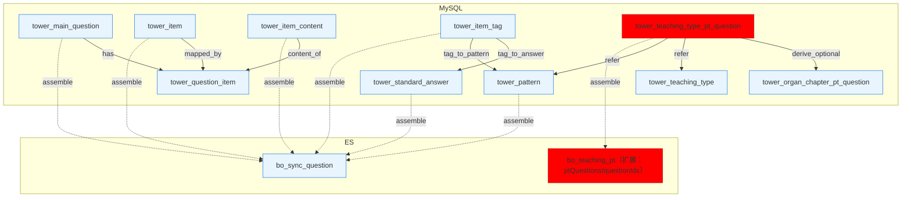
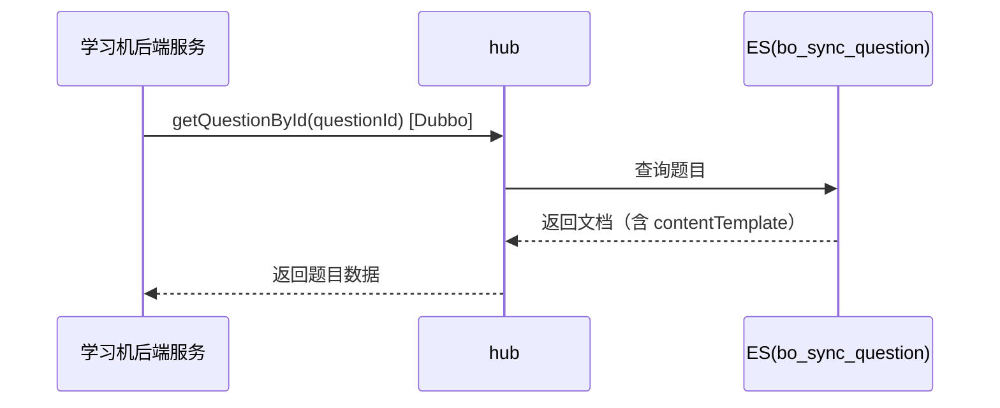
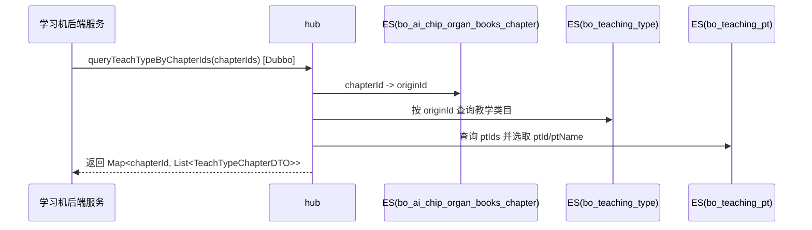
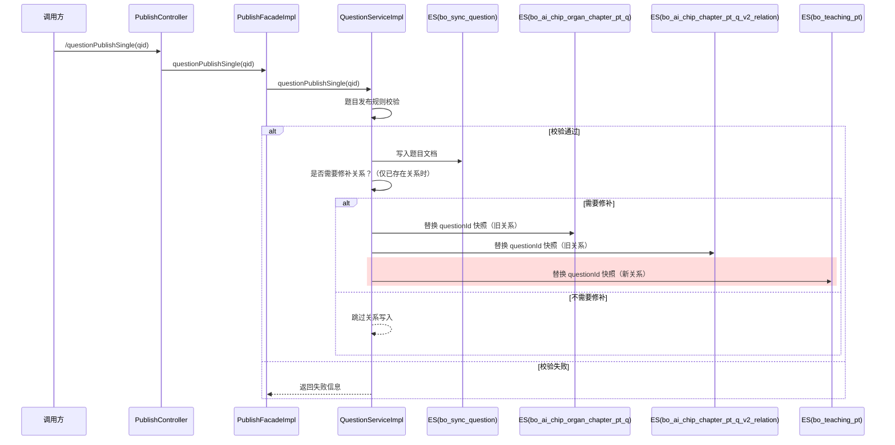
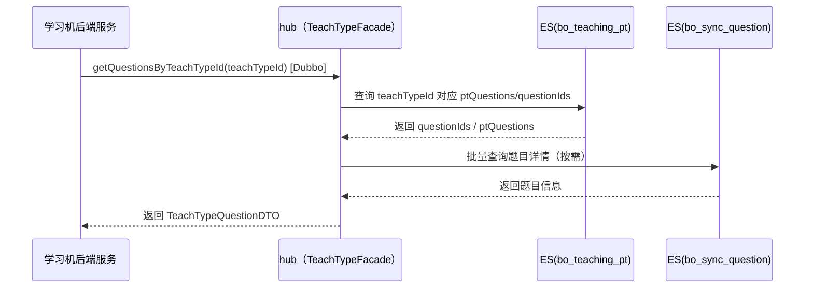
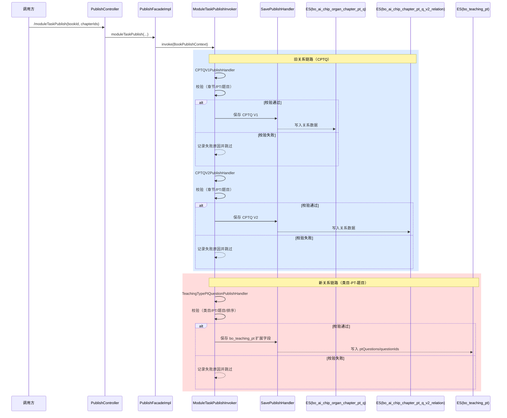
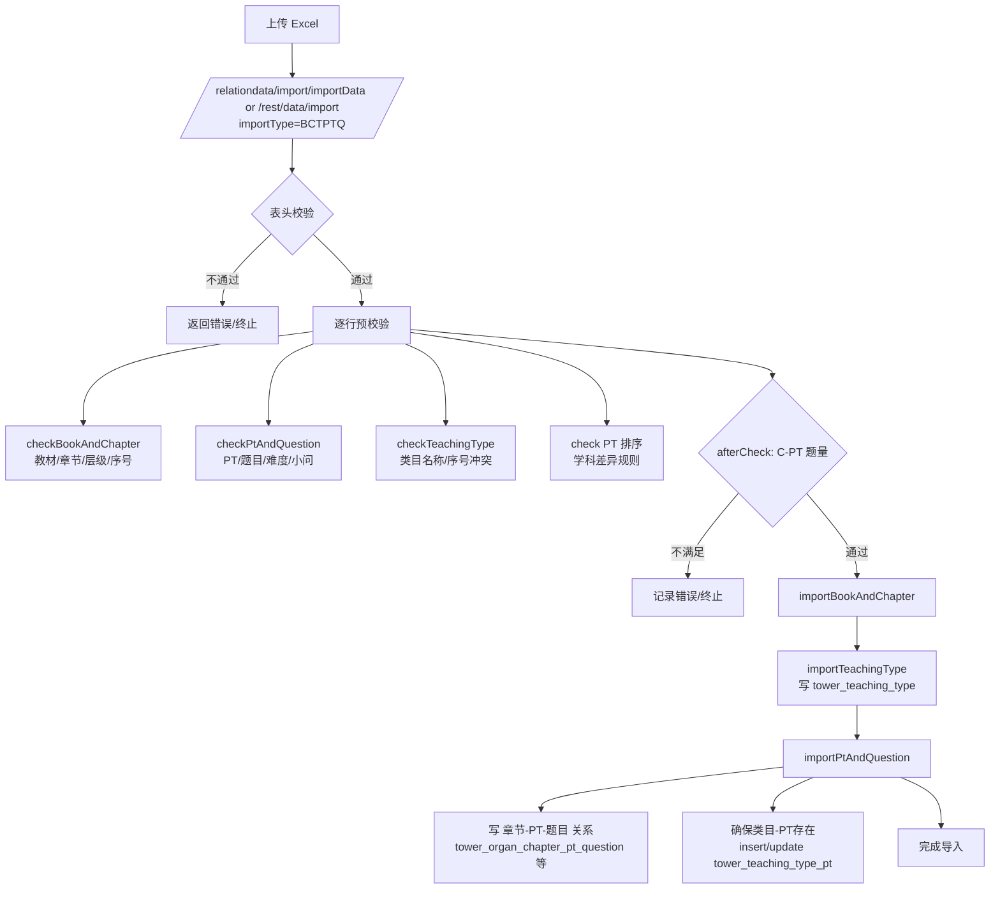

# 技术方案：对计算专项场景提供竖式排版内容格式支持

日期：2026-01-27  范围：`/reasearch-publish` + `/reasearch-hub`

## 需求输入（来自《【教研】计算专项方案》）

基于 `【教研】计算专项方案.md`，当前需求要点如下（摘取与本次改造直接相关部分）：

*   题目类型包含：
    
    *   竖式计算：`type=800`
        
    *   横式计算：`type=700`
        
*   竖式题（800）在入库前调用竖式工具生成 `content`（竖式帧/模板），并写入题目完整信息快照（`question_publish.lastinfo`）
    

**需求描述：**

1.  对计算专项场景提供竖式排版内容格式支持（hub 侧、publish 侧）；
    
2.  提供“按二级章节查询教学类目 + pt 信息”的能力（hub 侧）；
    
3.  提供“按教学类目（teachTypeId）查询题目列表”的能力（hub 侧）。
    

## 技术方案

*   **变更**，hub系统-题目查询接口，新增字段，dubbo；
    
*   **新增**，hub系统-教学类目查询接口（按章节批量），dubbo；
    
*   **新增**，hub系统-类目题目查询接口（teachTypeId → questions），dubbo；
    
*   **变更**，publish系统-单题发布接口，新增字段，新增类目‑PT‑题目关系更新，http；
    
*   **变更**，publish系统-关系发布接口，新增类目‑PT‑题目关系发布（写入 bo\_teaching\_pt 扩展字段）。
    

ER图：



颜色说明：蓝色为旧模型，红色为新增模型/字段。

### 新增表字段说明（tower\_teaching\_type\_pt\_question） $\color{#0089FF}{@沈佳文}$ 

| **字段** | **类型** | **含义** | **备注** |
| --- | --- | --- | --- |
| id | bigint | 主键 | 自增 |
| teaching\_type\_id | bigint | 类目ID | TeachType |
| pt\_id | varchar(64) | PT ID | patternId |
| question\_id | varchar(255) | 题目ID | originId |
| pt\_order\_num | int | PT排序 | 可选 |
| ~~question\_order\_num~~ | ~~int~~ | ~~题目排序~~ | ~~可选~~ |
| ~~question\_tag~~ | ~~int~~ | ~~题目标记~~ | ~~可选~~ |
| ~~question\_tag\_desc~~ | ~~varchar(255)~~ | ~~题目标记描述~~ | ~~可选~~ |
| ~~publish\_status~~ | ~~tinyint~~ | ~~发布状态~~ | ~~0/1~~ |
| is\_delete | tinyint | 软删 | 0/1 |
| create\_time | bigint | 创建时间 | 毫秒 |
| update\_time | bigint | 更新时间 | 毫秒 |
| create\_user | varchar(64) | 创建人 | 可选 |
| modify\_user | varchar(64) | 修改人 | 可选 |

多表汇总说明：

*   以 `tower_main_question` 为主，通过 `tower_question_item` 关联 `tower_item` 与 `tower_item_content` 汇聚题干/解析/答案/模板等内容；
    
*   通过 `tower_item_tag` 关联 `tower_standard_answer / tower_pattern` 补充标准答案与难度；
    
*   最终组装为 `bo_sync_question` 单文档。
    
*   类目维度的题目关系由 `tower_teaching_type_pt_question` 维护（类目+PT+题目），发布后写入 `bo_teaching_pt` 的扩展字段（`ptQuestions/questionIds`）。
    

结构关系说明：

*   `tower_item.type` 用于区分题目内容类型（Content/Analyse/Answer/.../ContentTemplate）
    
*   1 题多问：`tower_main_question` 可关联多个 `tower_question_item`
    
*   1 问多解：同一题目可存在多个 `Answer item` 或多条标准答案
    
*   示例（1 题含多项内容）：`Content`（题干）+ `ContentTemplate`（占位模板）+ `Answer × N`（多个答案）+ `Analyse`（解析）
    
*   类目‑PT‑Q 为严格约束链路：`teachType → PT → Q`（`teachType` 隶属章节）
    

MySQL item type 枚举（发布侧，来源：tower\_item.type）：

| **itemType** | **含义** |
| --- | --- |
| Content | 题干内容 |
| Analyse | 解析 |
| Answer | 答案 |
| Difficulty | 难度 |
| LabelName | 题目标识/标签 |
| Method | 解题方法 |
| Discuss | 讨论/点评 |
| Option | 选项 |
| ContentTemplate | 占位模板 |

### 2.1 题目查询（hub，Dubbo）

接口（Dubbo）：`QuestionFacade.getEsQuestionById(String questionId)`

入参 Schema（Java）：

```plaintext
String questionId

```

出参 Schema（Java，核心字段）：

```plaintext
EsQuestionDTO

```

字段说明（核心字段）：

*   `id`：题目 id
    
*   `originId`：来源题目 id
    
*   `content`：题干内容
    
*   `**contentTemplate**`**：题干占位模板（本次新增）**
    
*   `contentPng` / `imageMetadatas`：题干图片与元信息
    
*   `answers` / `answersPng`：答案与图片
    
*   `analyse` / `analysePng`：解析与图片
    
*   `type`：题型
    
*   `formatType`：渲染格式
    
*   `subject`：学科
    

变更：

*   **新增字段**：`contentTemplate`
    

#### 2.1.1 接口时序



#### 2.1.2 改动分析

1.  对学习机计算题业务 **有影响**   原因：题目查询接口出参新增题型（700/800）相关数据字段，且新增 `contentTemplate` 字段用于竖式渲染。学习机侧需确认是否需要使用该字段完成渲染与解析。 $\color{#0089FF}{@叶成龙}$ 
    
2.  其他调用题目查询的业务 **无影响**   原因：
    

*   ES 索引 `bo_sync_question` 开启了 **动态字段**，新增字段不会影响已有读写流程；
    
*   `contentTemplate` 的来源是新增的 `itemType = ContentTemplate` 数据（通过 `tower_item` + `tower_item_content` 关联），属于 **新增 item 类型数据**，不需要进行 MySQL 表字段迁移；
    
*   非计算题型的题目数据 schema 未变，原有接口出参保持兼容。 $\color{#0089FF}{@马浩(马浩(小马哥))}$  哪些仓库调用了，用表格的方式列出
    

| **仓库** | **业务/场景** |
| --- | --- |
| jzx-server（toc+tob） | 全科精准学、文科一对一 |
| poseidon（toc+tob） | 数学一对一 |
| jzx-prepare-exam | 备考中考 |
| aidm | 讲作业 |

#### 2.1.3 性能设计

1.  总体影响：本次改动为字段透传与批量查询接口设计，未增加发布链路的外部依赖调用；批量接口可降低下游多次查询成本。
    
2.  读性能：读性能主要由 ES 查询与序列化影响；新增字段为轻量级文本，不改变查询条件。建议在上线前做 RT 监控与压测验证 20–50ms 目标。批量查询，限制limit： 命中速度和命中的返回量。单个查询关注maxsize
    
3.  兼容性：通过 Dubbo SDK 调用。已经和调用方沟通过，技术方案不会影响之前的调用方式。
    

#### 2.1.4 改动清单（hub 侧，contentTemplate 字段打通）

目标：hub 从 ES 读到 contentTemplate，并对外返回。

拟改动点：

*   新增：private String contentTemplate;
    

说明：

*   BeanUtils.copyProperties(...) + MapStruct（QuestionTransfer）通常会按同名字段透传，字段补齐后大概率无需额外逻辑。
    

#### 2.1.5 验证路径

hub：

*   调用 question 相关接口，确认返回体中存在 contentTemplate
    

### 2.2 教学类目查询（hub，Dubbo）

接口（Dubbo）：`TeachTypeFacade.queryTeachTypeByChapterIds(List<String> chapterIds)`

入参 Schema（Java）：

```plaintext
List<String> chapterIds

```

出参 Schema（Java）：

```plaintext
Map<String, List<TeachTypeChapterDTO>>

```

TeachTypeChapterDTO 核心字段：

```plaintext
id, chapterId, teachingTypeName, ptName, ptId, twoChapterName, twoChapterOrderNum, bookId

```

变更：

*   **新增接口**：`queryTeachTypeByChapterIds`
    
*   **新增字段**：`ptId`（与 `ptName` 单值对应）
    

#### 2.2.1 接口时序



#### 2.2.2 改动分析

*   新增批量接口 queryTeachTypeByChapterIds，对外仅新增查询能力，**不影响既有接口**。
    
*   返回结构按 chapterId 分组，并补充 ptId（与 ptName 单值一致）。
    
*   数据来源均为 ES，只读不写，涉及索引：
    
    *   章节索引（chapterId → originId）
        
    *   教学类目索引（按 originId）
        
    *   PT 索引（按 teachingType）
        
*   当章节/教学类目/pt 不存在时返回空列表，不抛错。
    

#### 2.2.3 性能设计

*   **批量查询减少下游多次调用开销。**
    
*   对 chapterIds 做**去重与上限控制**（**limit=100**，避免过大请求影响 ES 查询延迟）。
    
*   **可结合调用方场景设置合理的请求大小与超时策略（默认3s）。**
    

#### 2.2.4 改动清单（hub 侧，TeachTypeFacade 批量接口 + ptId）

目标：补齐“根据二级章节 id 批量查询 teachType 列表”的对外能力，并在 DTO 中返回 ptId（单值）。

拟改动点：

1.  API 定义  reasearch-hub-api/src/main/java/com/zstt/reasearch/api/service/TeachTypeFacade.java  新增方法：Map<String, List> queryTeachTypeByChapterIds(List chapterIds);
    
2.  DTO 补字段（单值）  reasearch-hub-api/src/main/java/com/zstt/reasearch/api/model/dto/interactionTask/TeachTypeChapterDTO.java  新增：private String ptId;
    
3.  参考 InteractionTaskFacade 的实现路径  重点参考：reasearch-hub-service/src/main/java/com/zstt/reasearch/service/provider/impl/InteractionTaskFacadeImpl.java  其逻辑包含 ES 路径 + 旧库 fallback
    

#### 2.2.5 验证路径

hub：

*   调用新的 queryTeachTypeByChapterIds，确认能按 chapterId 分组并返回 ptId + ptName
    

### 2.3 单题发布（publish，HTTP）

接口：`/newpublish/publish/questionPublishSingle`（GET）

入参 Schema（Query）：

```plaintext
qid=题目ID

```

出参 Schema（JSON）：

```plaintext
{
  "success": true,
  "data": {
    "success": true,
    "infos": [ ],
    "pts": [ ]
  }
}

```

#### 2.3.1 接口时序



说明：红色部分是新增。

#### 2.3.2 改动分析

*   单题发布接口**维持原有调用方式**，新增 contentTemplate 的发布透传。
    
*   contentTemplate 来源于新增的 itemType（ContentTemplate），**不涉及 MySQL 表结构变更。**
    
*   **仅影响计算题（700/800）相关题目；非计算题的发布结果保持一致。**
    
*   发布结果仍写入 ES（bo\_sync\_question），对外查询可见。
    
*   **发布规则**：  $\color{#0089FF}{@张奎(大奔)}$ 
    
    *   题目必须为可发布状态（editStatus=1），否则直接判失败。
        
    *   题干与题干图片（content / contentPng）必须存在；且禁止引用 `http://img.jyeoo.net/quiz/images\` 外链内容。
        
    *   对非 `NoCheck` 类型（300/700/800 以外）且非特定学科的题目，要求解析/讲解/方法与对应图片字段必须存在（analyse/discuss/method + PNG）。
        
    *   **热区题（type转成字符串长度 ≥ 8 且第 8 位数字 > 1 时）必须有热区数据，且热区类型不可为空。** $\color{#0089FF}{@马浩(马浩(小马哥))}$ 
        
    *   选择题（type=100）必须有选项与答案；填空题（type=200）在非机批场景必须有答案，且标准答案图片不可为空。
        
    *   复合题（type=300）需校验子题内容/图片/方法/图片及标准答案提示图等；无子题时父题方法/图片必须存在；机批题需标准答案或子题。
        
*   关系修补：
    
    *   **旧关系修补不变**：若该题已存在 CPTQ 关系并产生新快照，会替换 `bo_ai_chip_organ_chapter_pt_q` 与 `bo_ai_chip_chapter_pt_q_v2_relation` 中的 questionId 快照。
        
    *   **新增关系修补：若该题已存在类目‑PT‑题目关系并产生新快照，会替换** `**bo_teaching_pt**` **中** `**ptQuestions/questionIds**` **的 questionId 快照。**
        

#### 2.3.3 性能设计

*   单题发布为低频触发接口，性能主要受 MySQL 读取与 ES 写入影响。
    
*   **新增字段为轻量文本，组装成本可忽略。**
    
*   继续复用现有幂等/校验流程，避免重复发布导致额外负载。
    
*   如果后续批量发布场景增加，再评估并发、超时与失败重试策略。
    

#### 2.3.4 当前链路（代码侧确认）

上游“数据生产”环节写 MySQL；publish 从 MySQL 读数开始，将题目发布到 ES；hub 从 ES 读数并对外提供查询/编排能力。

关键数据落点（MySQL → 组装 → ES）

发布链路读取与组装的关键表如下（均来自 TowerMainQuestionMapper.xml 与调用链）：

*   tower\_main\_question：题目主信息（题型、子题数、质检状态等）
    
*   tower\_question\_item：题目与 item 的关联关系
    
*   tower\_item\_content：题目内容明细（content 实际来源）
    
*   tower\_item：item 类型（Content/Analyse/Answer 等）
    
*   tower\_item\_tag：题目与标签关系（标准答案/热点/难度）
    
*   tower\_standard\_answer：标准答案与提示等
    
*   tower\_pattern：题目难度（通过 tag 关联）
    

组装过程简述：

*   questionPublishSingle 触发发布
    
*   QuestionServiceImpl 调用 selectQuestionBodyLikeQuestionId
    
*   SQL 通过 tower\_question\_item 关联 tower\_item\_content 与 tower\_item
    
*   QuestionBody 被解析为 SyncQuestionMetadata（题干/解析/答案等）
    
*   QuestionMetadatasParser 将 metadata 转为 EsQuestionPO
    
*   写入 ES 索引：bo\_sync\_question
    

关于 contentTemplate 的实际存储方式（基于当前表结构与链路理解）：

*   tower\_item 中存在 type = ContentTemplate 的 item 记录
    
*   通过 tower\_question\_item 关联到题目
    
*   在 tower\_item\_content 中读取该 item 的 content，其值即为模板内容（contentTemplate）
    

#### 2.3.5 改造总览（最小闭环）

为了让 contentTemplate 真正“从发布到查询可见”，需要 publish 与 hub 两侧都打通字段链路：

*   publish：MySQL/组装 → 发布 DTO → ES 文档
    
*   hub：ES 文档 → DAO 视图 → API DTO 同时补齐 teachType 侧的新接口与 ptId 字段。
    

#### 2.3.6 改动清单（publish 侧，拟实施）

目标：在发布时把 contentTemplate 一并写入 ES 文档。

拟改动点：

1.  发布链路 DTO 增字段
    

*   新增：private String contentTemplate;
    

1.  ES 文档模型增字段
    

*   新增：private String contentTemplate;
    

1.  组装时赋值（真实来源）
    

*   位置：parseMainQuestionBody(...) 中 QuestionContentType.CONTENT\_TEMPLATE 分支
    
*   策略（按真实来源）：
    
*   contentTemplate 来自 tower\_item.type = ContentTemplate 对应的 tower\_item\_content.content
    

1.  发布解析器透传字段
    

*   在 latex/html 结构中增加对 contentTemplate 的透传
    
*   规则：
    
*   latex：convert2Latex(contentTemplate)
    
*   html：直接透传 contentTemplate
    

#### 2.3.7 验证路径

publish：

*   触发单题发布（questionPublishSingle 或现有发布入口）
    
*   在 ES 文档中确认 contentTemplate 字段存在
    

#### 2.3.8 PNG 生成机制（代码侧确认，既有代码确认，无改动）

本项目中的 \*Png 字段并非来自 MySQL，而是由发布链路根据内容计算生成：

*   生成规则：MD5(content) + ".png"
    
*   生成位置：QuestionServiceImpl 中对各类内容字段调用 MD5Utils.md5Png(...)
    
*   真正的图片生成：QuestionMetadatasParser.questionWidthAndHeight(...) 调用 generatePng(...)， 由 QuestionPngService 通过 handoutstoPng HTTP 服务生成图片并回写尺寸信息到 imageMetadatas
    

当前结论（重要）：

*   contentTemplatePng 目前不会生成  原因：无对应字段、无 MD5 生成、也未被 questionWidthAndHeight 纳入处理列表。
    

### 2.4 类目题目查询（hub，Dubbo）

接口（Dubbo）：TeachTypeFacade.getQuestionsByTeachTypeId(String teachTypeId) $\color{#0089FF}{@叶成龙}$ 

入参 Schema（Java）：

```plaintext
String teachTypeId

```

出参 Schema（Java）：

```plaintext
TeachTypeQuestionDTO

```

TeachTypeQuestionDTO 核心字段：

```plaintext
teachTypeId
questionIds           // 类目下全部题目（UI 直接使用，强制生成）

ptQuestions[ ]         // 按 PT 分组的题目集合（强制生成）

  - ptId
  - ptName            // 需要展示
  - questionIds

```

变更：

*   新增接口：getQuestionsByTeachTypeId
    
*   目标：严格约束“类目”维度，确保同一 PT 在不同类目下题目集合可区分
    
*   数据模型（MySQL）：新增关系表 `tower_teaching_type_pt_question`
    
*   数据模型（ES）：扩展索引 `bo_teaching_pt`（新增 `ptQuestions / questionIds`）
    

#### 2.4.1 接口时序



#### 2.4.2 改动分析 $\color{#0089FF}{@马浩(马浩(小马哥))}$ 

*   新增“类目‑PT‑题目”发布链路，旧“章节‑PT‑题目”链路不变，**两条链路并存**。
    
*   新链路写入 `bo_teaching_pt` 扩展字段，旧链路继续写入 `bo_ai_chip_chapter_pt_q_v2_relation`，互不覆盖。
    
*   存在双写：同一批题目会同时落旧关系表与新关系表，形成两套 ES 视图；**仅影响新增接口，旧接口不受影响**。
    

#### 2.4.3 ES 索引结构（bo\_teaching\_pt 扩展）

```plaintext
{
  "id": "teachTypeId",
  "teachingId": "teachTypeId",
  "ptIds": ["pt1", "pt2"],
  "ptQuestions": [
    { "ptId": "pt1", "questionIds": ["q1","q2"] },
    { "ptId": "pt2", "questionIds": ["q3"] }
  ],
  "questionIds": ["q1","q2","q3"]
}
```

#### 2.4.4 性能设计

*   单次查询命中 `bo_teaching_pt`，避免跨索引拼接。
    
*   建议限制单次题目数量（maxSize）与超时，避免大类目导致延迟。
    

### 2.5 关系发布（publish，HTTP）

接口：/newpublish/publish/moduleTaskPublish（POST）

入参 Schema（JSON）：

```json
{
  "bookId": "string",
  "chapterIds": ["string", "string"]
}

```

出参 Schema（JSON）：

```json
{
  "success": true
}

```

说明：该接口为关系发布入口，用于批量构建关系索引。

#### 2.5.1 接口时序



说明：红色是新增逻辑。

#### 2.5.2 改动分析

*   接口签名不变，本次改动在发布链路内部新增“类目‑PT‑题目关系”写入（写入 `bo_teaching_pt` 扩展字段）。
    
*   **旧关系链路（CPTQ ）不变**：继续按章节‑PT‑题目发布，旧接口与旧索引不受影响。
    
*   **新关系链路只影响新增能力**：`bo_teaching_pt` 文档体积变大，供新接口 `getQuestionsByTeachTypeId` 消费；未调用新接口的业务无感知。
    
*   发布依赖新增的 MySQL 表数据：若生产侧未落库，会导致新关系为空或校验失败，但不影响旧 CPTQ 发布。
    
*   发布时长可能增加：批量发布会多一次 MySQL 读取 + ES 写入（bo\_teaching\_pt 扩展字段）。
    
*   发布校验：
    
    *   **旧链路 CPTQ 校验不变：**
        

*   章节与 PT 基础关系存在（chapterId/ptId 在关系表中可定位）。
    
*   题目集合为空时拒绝发布（避免空文档覆盖）。
    
*   题目数量/排序字段满足旧链路规则（与历史逻辑一致）。
    
    *   **新增 类目‑PT‑题目 校验：**
        

*   类目存在：`teachingTypeId` 在类目索引/表中可查。
    
*   PT 存在：`ptId` 在 `tower_pattern` 中可查。
    
*   类目‑PT 关系存在：`tower_teaching_type_pt` 中可定位。
    
*   题目必须出现在 CPTQ 关系内（同章节/pt 下存在），否则拒绝。
    
*   每个 PT 至少包含 1 道题（不允许空集合）。
    
*   `pt_order_num` / `question_order_num` 不得为空（排序字段缺失拒绝）。
    

#### 2.5.3 性能设计

*   批量发布按 bookId + chapterIds 进行；执行时间取决于章节规模与题量。
    
*   离线操作。
    

附录：BCTPTQ 完整导入流程图（tower）

