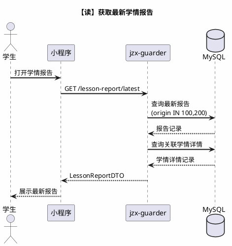
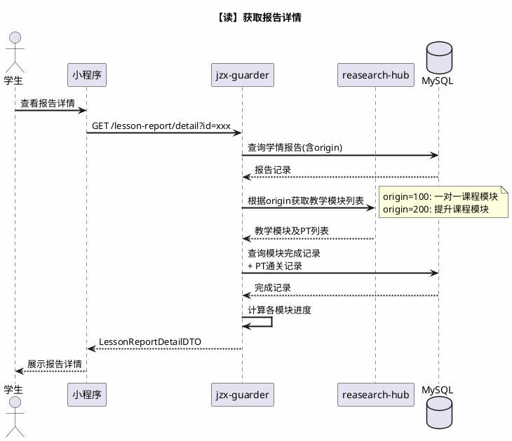
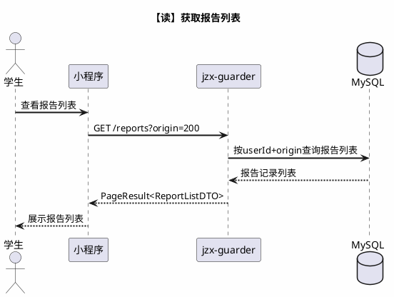
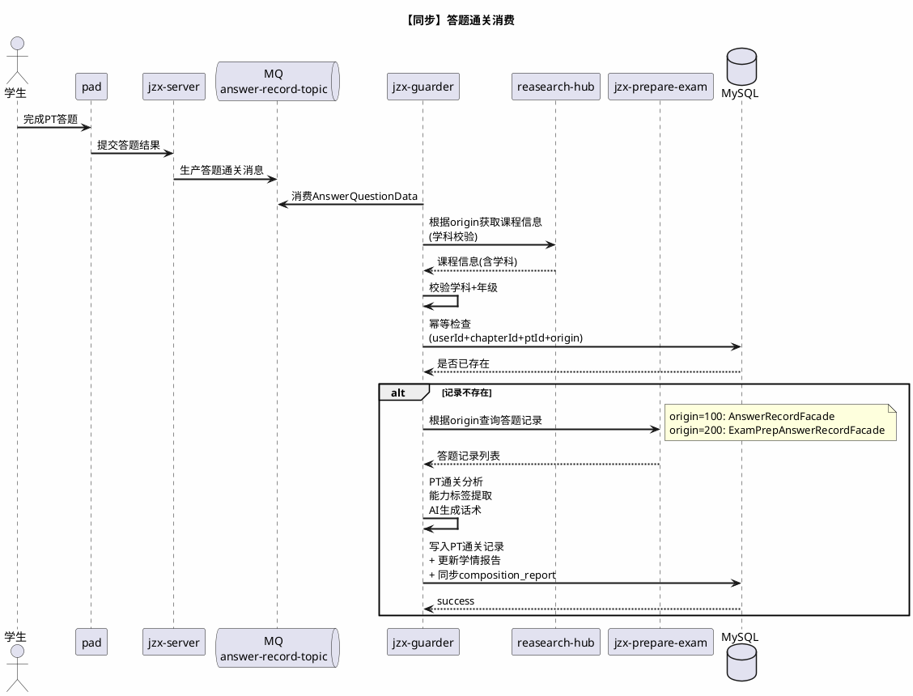
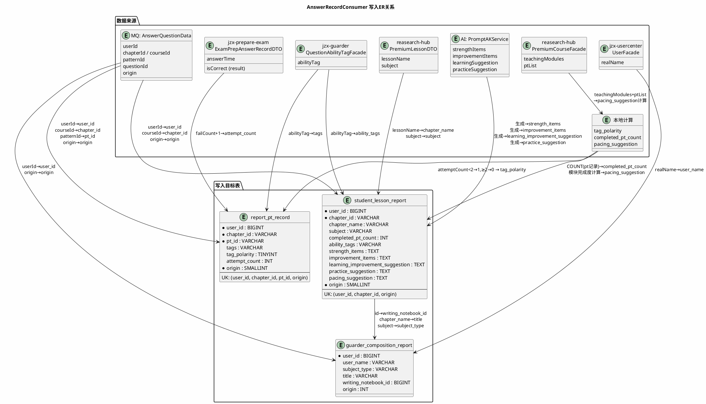
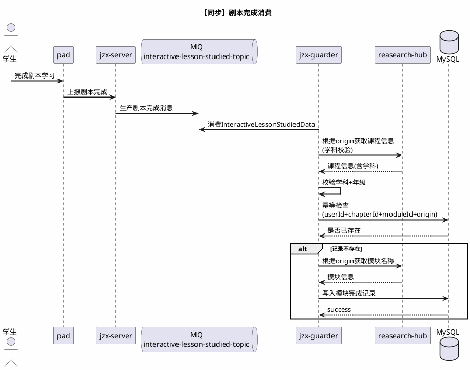
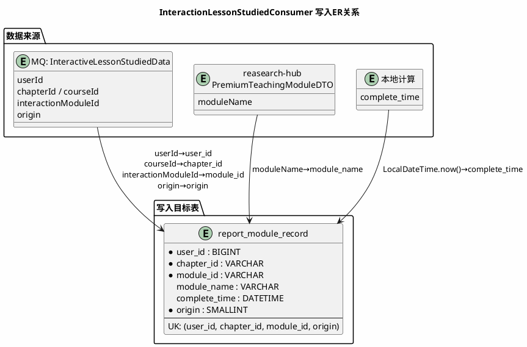

# 提升课程学情报告 - 技术方案

> 版本：v4.0 日期：2026-01-29 作者：技术团队

---

# 一、需求评估

## 1.1 需求背景

为3-9年级语文、英语提升课程（Premium Course）新增学情报告生成能力。复用现有一对一课程的学情报告体系，通过 `origin` 字段区分数据来源。

## 1.2 学情报告字段分析

| 数据项 | 内涵 | 口径（字段与计算逻辑） |
| --- | --- | --- |
| 数据来源（origin） | 标识学情报告数据产生自哪种课程体系 | 枚举值：100表示一对一课程（默认），200表示提升课程（本次新增） |
| 课程标识（chapter\_id） | 一次课程学习的唯一标识 | 从 answer-record-topic 中获取 courseId 字段 |
| 课文名称（chapter\_name） | 课程的展示名称 | 通过 courseId 调用 reasearch-hub 服务获取 PremiumLessonDTO.lessonName |
| 学科（subject） | 课程所属学科，仅处理语文和英语 | 通过 courseId 调用 reasearch-hub 服务获取 PremiumLessonDTO.subject |
| 教学模块名称（module\_name） | 课程内教学环节的名称 | 从 interactive-lesson-studied-topic 中获取 interactionModuleId，调用 reasearch-hub 服务获取 PremiumTeachingModuleDTO.moduleName |
| 已通关PT数（completed\_pt\_count） | 用户在本课程中已通关的PT数量 | 按 user\_id + chapter\_id + origin 统计 report\_pt\_record 记录总数，每次PT通关后重新统计 |
| 尝试次数（attempt\_count） | 用户在某个PT上的答题轮次数 | 从 answer-record-topic 中获取 patternId，调用 jzx-prepare-exam 服务查询答题记录，统计失败次数+1（failCount+1） |
| 能力标签（ability\_tags） | 从PT关联题目中提取的知识点/能力维度标签 | 每次报告更新时，从当天新增的PT通关记录中随机取2个PT，查询其关联题目的能力标签，取前2个 |
| 标签极性（tag\_polarity） | 判定PT通关表现为优势还是待提升 | attempt\_count < 2 判定为正向（优势），>= 2 判定为负向（待提升） |
| 优势项目（strength\_items） | AI生成的学习优势描述 | 将正向 ability\_tags 作为输入，调用AI生成优势描述，最多2条 |
| 提升空间（improvement\_items） | AI生成的待提升描述 | 将负向 ability\_tags 作为输入，调用AI生成待提升描述，最多2条 |
| 学习建议（learning\_improvement\_suggestion） | AI生成的综合学习建议 | 基于当次报告的 ability\_tags 和答题表现，调用AI生成综合学习建议 |
| 练习建议（practice\_suggestion） | AI生成的练习方向建议 | 基于当次报告的 ability\_tags 和答题表现，调用AI生成练习方向建议 |
| 学习节奏建议（pacing\_suggestion） | 基于课程教学模块和PT完成度给出的建议 | 通过 courseId 调用 reasearch-hub 服务获取全部教学模块和PT列表，计算完成度。全部完成则"继续下一节"，PT未完成则"继续完成考点训练" |
| 考核参与度（assessmentParticipation） | 反映学生整体答题顺畅程度 | 检查该课程所有PT的 attempt\_count：全部 < 2 则"整体顺利"，存在 >= 2 则"部分考点多次尝试" |
| 模块进度（progress） | 某个教学模块的学习完成百分比 | 剧本类（SHOW）：report\_module\_record 有记录为100%，无则0%。考点训练类（PT\_TRAINING）：已完成PT数 / 总PT数 × 100 |

---

# 二、方案总体设计

## 2.1 交付接口总览

| 接口名称 | 接口类型 | 非功能性指标 |
| --- | --- | --- |
| 获取最新学情报告 | 查询 | 查询RT ≤ 50ms |
| 获取报告详情 | 查询 | 查询RT ≤ 200ms |
| 获取报告列表 | 查询 | 查询RT ≤ 50ms |
| 答题通关消费（AnswerRecordConsumer） | 同步 | 时效性：单条消费 ≤ 3s，积压容忍 ≤ 10条 |
| 剧本完成消费（InteractionLessonStudiedConsumer） | 同步 | 时效性：单条消费 ≤ 500ms，积压容忍 ≤ 10条 |

## 2.2 风险清单

| 风险项 | 等级 | 说明 | 应对措施 |
| --- | --- | --- | --- |
| 消息来源字段缺失 | **高** | 生产者不发送origin/courseId，Consumer无法路由 | 与发送方确认必填性；兜底默认origin=100 |
| `PremiumLessonDTO.subject` 字段缺失 | **中** | reasearch-hub侧未返回subject | 本次新增该字段，需联调确认 |
| `exam_prep_answer_record` 索引缺失 | **中** | 新Facade查询慢 | 上线前确认索引 `idx_user_pt(user_id, pt_id)` |

---

# 三、详细设计

---

数据一致性：用户在PAD完成答题后，再进入小程序测查询，间隔时长秒最快在5秒左右，伪实时方案；

## 3.1 【读】获取最新学情报告

### 3.1.1 接口定义

| 项 | 说明 |
| --- | --- |
| **路径** | `GET /lesson-report/latest` |
| **入参** | `userId`（从登录态获取） |
| **变化点** | 查询去掉origin过滤，取100和200中最新的一条 |

**出参字段与来源**：

| 出参字段 | 类型 | 描述 | 来源 |
| --- | --- | --- | --- |
| `id` | Long | 报告ID | `guarder_composition_report.id` |
| `chapterName` | String | 课文名称 | `student_lesson_report.chapter_name` （通过 `writing_notebook_id` 关联） |
| `studentName` | String | 学生姓名 | `guarder_composition_report.user_name` |
| `learningDate` | LocalDateTime | 学习日期 | `guarder_composition_report.modify_time` |
| `subject` | String | 学科 | `guarder_composition_report.subject_type` |
| `completedPtCount` | Integer | 已通关PT数 | `student_lesson_report.completed_pt_count` |
| `abilityTags` | String | 能力标签 | `student_lesson_report.ability_tags` |

### 3.1.2 时序图


---

## 3.2 【读】获取报告详情

### 3.2.1 接口定义

| 项 | 说明 |
| --- | --- |
| **路径** | `GET /lesson-report/detail?id=xxx` |
| **入参** | `reportId` |
| **变化点** | 教学模块列表的数据源根据 `origin` 选择不同策略 |

**出参字段与来源**：

| 出参字段 | 类型 | 描述 | 来源 |
| --- | --- | --- | --- |
| `id` | Long | 报告ID | `student_lesson_report.id` |
| `chapterName` | String | 课文名称 | `student_lesson_report.chapter_name` |
| `subject` | String | 学科 | `student_lesson_report.subject` |
| `completedPtCount` | Integer | 已通关PT数 | `student_lesson_report.completed_pt_count` |
| `abilityTags` | String | 能力标签 | `student_lesson_report.ability_tags` |
| `strengthItems` | String | 优势项目 | `student_lesson_report.strength_items` |
| `improvementItems` | String | 提升空间 | `student_lesson_report.improvement_items` |
| `learningImprovementSuggestion` | String | 学习建议 | `student_lesson_report.learning_improvement_suggestion` |
| `practiceSuggestion` | String | 练习建议 | `student_lesson_report.practice_suggestion` |
| `pacingSuggestion` | String | 学习节奏建议 | `student_lesson_report.pacing_suggestion` |
| `assessmentParticipation` | String | 考核参与度 | 运行时计算：所有PT尝试<2次→"整体顺利"，存在≥2次→"部分考点多次尝试" |
| `lessonModuleProgressList` | List | 模块进度列表 | 运行时计算（见下表） |

**lessonModuleProgressList 子字段与来源**：

| 子字段 | 类型 | 描述 | 来源 |
| --- | --- | --- | --- |
| `moduleName` | String | 模块名称 | origin=100: `InteractionTaskFacade` → `moduleName`；origin=200: `PremiumCourseFacade.queryCourseTeachingModules()` → `moduleName` |
| `moduleType` | String | 模块类型 | `SHOW`（剧本） / `PT_TRAINING`（考点训练） |
| `progress` | Integer | 完成进度(%) | SHOW: 查 `report_module_record` 有记录=100，无=0；PT\_TRAINING: 查 `report_pt_record` 已完成数/总数×100 |

### 3.2.2 时序图


---

## 3.3 【读】获取报告列表

### 3.3.1 接口定义

| 项 | 说明 |
| --- | --- |
| **路径** | `GET /reports?origin=200` |
| **入参** | `userId, origin` |
| **变化点** | 新增origin=200的查询支持 |

**出参字段与来源**：

| 出参字段 | 类型 | 描述 | 来源 |
| --- | --- | --- | --- |
| `id` | Long | 报告ID | `guarder_composition_report.id` |
| `title` | String | 课文名称 | `guarder_composition_report.title` |
| `subjectType` | String | 学科 | `guarder_composition_report.subject_type` |
| `modifyTime` | LocalDateTime | 更新时间 | `guarder_composition_report.modify_time` |

### 3.3.2 时序图


---

## 3.4 【同步】AnswerRecordConsumer — 答题通关消费

### 3.4.1 消息Payload定义

**Topic**: `answer-record-topic`

**AnswerQuestionData 完整字段**：

| 字段 | 类型 | 必填 | 说明 | 新增 |
| --- | --- | --- | --- | --- |
| `userId` | Long | 是 | 用户ID（来自BaseMessage） |  |
| `chapterId` | String | 是 | 章节ID（一对一场景） |  |
| `patternId` | String | 是 | PT标识 |  |
| `questionId` | String | 是 | 题目ID |  |
| `origin` | Integer | 否（默认100） | 数据来源：100-一对一，200-提升课 | ✅ |
| `courseId` | Long | origin=200时必填 | 提升课程ID | ✅ |

### 3.4.2 时序图



### 3.4.3 写入ER图



### 3.4.4 表字段说明

**report\_pt\_record**（每次PT通关写入一条）：

| 字段 | 类型 | 说明 | 来源 |
| --- | --- | --- | --- |
| `user_id` | BIGINT | 用户ID | MQ `BaseMessage.userId` |
| `chapter_id` | VARCHAR | 课程标识 | origin=100: MQ `chapterId`；origin=200: MQ `courseId` |
| `pt_id` | VARCHAR | PT标识 | MQ `patternId` |
| `tags` | VARCHAR | 能力标签 | `QuestionAbilityTagFacade.queryAbilityTagByQuestionIds()` |
| `tag_polarity` | TINYINT | 标签极性（1=正向，0=负向） | 本地计算：attemptCount<2→1，≥2→0 |
| `attempt_count` | INT | 尝试次数 | origin=100: `AnswerRecordFacade.listByUserIdAndPtId()` 失败次数+1；origin=200: `ExamPrepAnswerRecordFacade.listByUserIdAndPtId()` 失败次数+1 |
| `origin` | SMALLINT | 数据来源 | 策略返回值：100或200 |

**student\_lesson\_report**（每个用户+课程+origin一条，UPSERT）：

| 字段 | 类型 | 说明 | 来源 |
| --- | --- | --- | --- |
| `user_id` | BIGINT | 用户ID | MQ `BaseMessage.userId` |
| `chapter_id` | VARCHAR | 课程标识 | 同 report\_pt\_record |
| `chapter_name` | VARCHAR | 课文名称 | origin=100: `InteractionTaskFacade` → `BookChapterDTO.chapterName`；origin=200: `PremiumCourseFacade` → `PremiumLessonDTO.lessonName` |
| `subject` | VARCHAR | 学科 | origin=100: `BookChapterDTO.subject`；origin=200: `PremiumLessonDTO.subject`（**本次新增**） |
| `completed_pt_count` | INT | 已通关PT数 | `ReportPtRecordMapper` COUNT(user\_id, chapter\_id, origin) |
| `ability_tags` | VARCHAR | 能力标签 | 随机取2个PT → `QuestionAbilityTagFacade` 取前2标签 |
| `strength_items` | TEXT | 优势项目 | `PromptAKService.generateStrengthItems()` AI生成 |
| `improvement_items` | TEXT | 提升空间 | `PromptAKService.generateImprovementItems()` AI生成 |
| `learning_improvement_suggestion` | TEXT | 学习建议 | `PromptAKService` AI生成 |
| `practice_suggestion` | TEXT | 练习建议 | `PromptAKService` AI生成 |
| `pacing_suggestion` | TEXT | 节奏建议 | origin=100: `InteractionTaskFacade` 多方法计算；origin=200: `PremiumCourseFacade.queryCourseTeachingModules()` 计算 |
| `origin` | SMALLINT | 数据来源 | 策略返回值：100或200 |

**guarder\_composition\_report**（同步写入，用于报告列表和最新报告查询）：

| 字段 | 类型 | 说明 | 来源 |
| --- | --- | --- | --- |
| `user_id` | BIGINT | 用户ID | MQ `BaseMessage.userId` |
| `user_name` | VARCHAR | 学生姓名 | `UserFacade.getUser()` → `UserDTO.realName` |
| `subject_type` | VARCHAR | 学科 | 同 student\_lesson\_report.subject |
| `title` | VARCHAR | 课文名称 | 同 student\_lesson\_report.chapter\_name |
| `writing_notebook_id` | BIGINT | 关联报告ID | `student_lesson_report.id` |
| `origin` | INT | 数据来源 | 100或200 |

---

## 3.5 【同步】InteractionLessonStudiedConsumer — 剧本完成消费

### 3.5.1 消息Payload定义

**Topic**: `interactive-lesson-studied-topic`

**InteractiveLessonStudiedData 完整字段**：

| 字段 | 类型 | 必填 | 说明 | 新增 |
| --- | --- | --- | --- | --- |
| `userId` | Long | 是 | 用户ID（来自BaseMessage） |  |
| `chapterId` | String | 是 | 章节ID（一对一场景） |  |
| `interactionModuleId` | String | 是 | 互动模块ID |  |
| `origin` | Integer | 否（默认100） | 数据来源：100-一对一，200-提升课 | ✅ |
| `courseId` | Long | origin=200时必填 | 提升课程ID | ✅ |
| `teachingModuleId` | Long | origin=200时必填 | 教学模块ID | ✅ |

### 3.5.2 时序图



### 3.5.3 写入ER图



### 3.5.4 表字段说明

**report\_module\_record**（每次剧本模块完成写入一条）：

| 字段 | 类型 | 说明 | 来源 |
| --- | --- | --- | --- |
| `user_id` | BIGINT | 用户ID | MQ `BaseMessage.userId` |
| `chapter_id` | VARCHAR | 课程标识 | origin=100: MQ `chapterId`；origin=200: MQ `courseId` |
| `module_id` | VARCHAR | 模块标识 | MQ `interactionModuleId` |
| `module_name` | VARCHAR | 模块名称 | origin=100: `InteractionTaskFacade.queryInteractionTaskByInteractionModuleId()` → `moduleName`；origin=200: `PremiumCourseFacade.queryPremiumTeachingModuleDTOById()` → `moduleName` |
| `complete_time` | DATETIME | 完成时间 | `LocalDateTime.now()` |
| `origin` | SMALLINT | 数据来源 | 策略返回值：100或200 |

---

# 四、数据库变更

## 4.1 变更总览

| 表名 | 变更 | 说明 |
| --- | --- | --- |
| `student_lesson_report` | 新增字段 | `origin SMALLINT NOT NULL DEFAULT 100` + 唯一索引 |
| `report_pt_record` | 新增字段 | `origin SMALLINT NOT NULL DEFAULT 100` + 唯一索引 |
| `report_module_record` | 新增字段 | `origin SMALLINT NOT NULL DEFAULT 100` + 唯一索引 |
| `guarder_composition_report` | 无变更 | origin字段已存在，新增枚举值200 |

## 4.2 DDL

```sql
-- student_lesson_report
ALTER TABLE `student_lesson_report`
  ADD COLUMN `origin` SMALLINT NOT NULL DEFAULT 100 COMMENT '数据来源：100-一对一，200-提升课' AFTER `pacing_suggestion`,
  ADD UNIQUE INDEX `uk_user_chapter_origin` (`user_id`, `chapter_id`, `origin`);

-- report_pt_record
ALTER TABLE `report_pt_record`
  ADD COLUMN `origin` SMALLINT NOT NULL DEFAULT 100 COMMENT '数据来源：100-一对一，200-提升课' AFTER `attempt_count`,
  ADD UNIQUE INDEX `uk_user_chapter_pt_origin` (`user_id`, `chapter_id`, `pt_id`, `origin`);

-- report_module_record
ALTER TABLE `report_module_record`
  ADD COLUMN `origin` SMALLINT NOT NULL DEFAULT 100 COMMENT '数据来源：100-一对一，200-提升课' AFTER `complete_time`,
  ADD UNIQUE INDEX `uk_user_chapter_module_origin` (`user_id`, `chapter_id`, `module_id`, `origin`);

```

**历史数据**：`DEFAULT 100`，无需迁移，自动归属一对一课程。