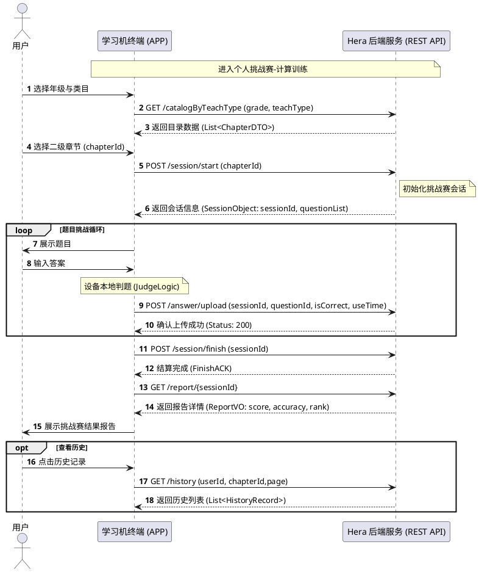
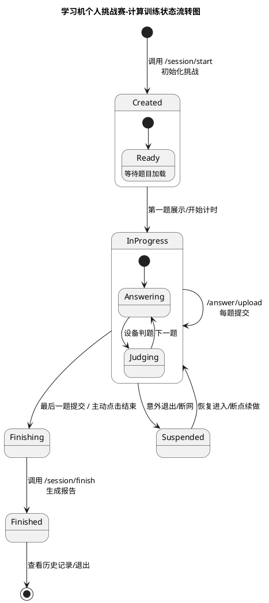
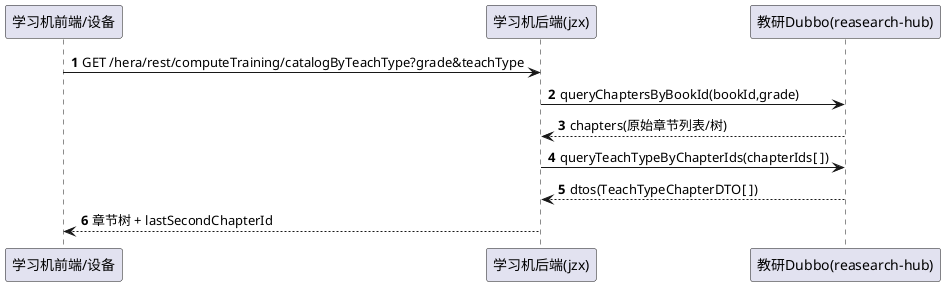
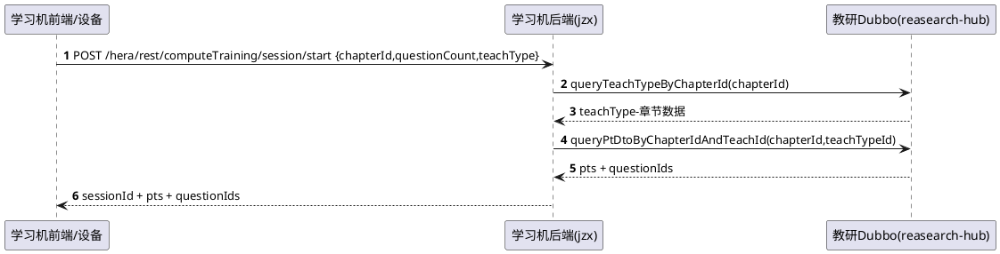
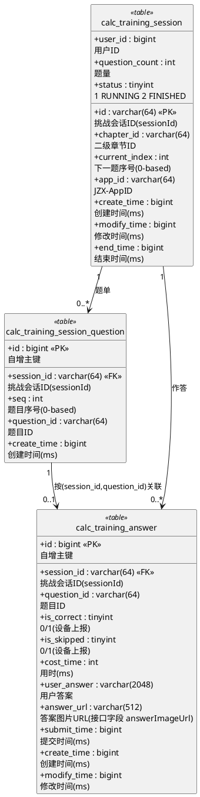

# 计算专项学习机方案

# 计算训练专项（个人挑战赛｜学习机后端）技术评审文档

## 0. 范围与边界

### 0.1 本期范围

*   入口目录：按 年级和计算题类型（技术侧教学类目）返回一级/二级章节（并返回 `最近挑战章节`）
    
*   抽题/开始挑战：创建挑战赛，根据用户选择题量，返回题目详情。
    
*   作答上报：用户做答后，设备端判题，支持单空实时批改，批改结果上报。
    
*   完成结算：用户完成全部题量后，完成挑战赛。
    
*   报告查询：`完成结算之后，展示本次挑战的报告。包含：correctCount/totalCostTime/speed/`
    
*   历史记录：历史的报告查询，按照二级章节展示。按照时间倒序，支持查看单个章节的多次挑战。
    

### 0.2 关键口径

*   错题口径：题单全集 - `correctQuestionIds`（跳过/答错均算 wrong）
    
*   速度口径：`speed = correctCount / (totalCostTime / 60000) 按分钟展示`；
    
*   正确率口径：用户答对题目/总题量
    

---

### 0.3 产品流程图



```

### 0.4状态流转图



## 1. 技术评审要点 1：功能点完备性覆盖（功能识别、接口、新/老接口）

### 1.1 功能点 → 接口/实现映射（覆盖表）

| 功能点 | 是否需要接口 | 新/老 | 对外接口/产出 |
| --- | --- | --- | --- |
| 目录页：按 `grade + teachType` 返回一级/二级章节 + `lastSecondChapterId` | 是 | 新 | `GET /hera/rest/computeTraining/catalogByTeachType` |
| 开始挑战：抽题 + 创建 session，返回 `pts + questionIds (+ currentIndex)` | 是 | 新 | `POST /hera/rest/computeTraining/session/start` |
| 设备上报作答（不判题）：落库 + 回算进度 | 是 | 新 | `POST /hera/rest/computeTraining/answer/upload` |
| 完成结算 | 是 | 新 | `POST /hera/rest/computeTraining/session/finish` |
| 报告查询（仅 FINISHED） | 是 | 新 | `GET /hera/rest/computeTraining/report/{sessionId}` |
| 历史记录（分页 + chapterId 过滤） | 是 | 新 | `GET /hera/rest/computeTraining/history` |
| 题目详情（题干/答案/解析/`contentTemplate`） | 是 | 老（需改造Dubbo接口） | 老接口保持不变，**新增返回字段** `contentTemplate`。TeachtypeFacade |

---

## 2. 技术评审要点 2：主要接口时序图

#### 2.1 目录：获取章节树



#### 2.2 开始挑战：创建 session + 返回题单



### 2.3 变量/状态逻辑

*   `finish` 幂等：重复 finish 不报错。
    
*   `report` 状态门控：非 FINISHED 不返回报告（返回 `409`）。
    

---

## 3. 技术评审要点 3：接口定义评审（字段完备性、冗余）

### 3.1 接口清单（本期）

| 接口 | 文档 |
| --- | --- |
| `GET /hera/rest/computeTraining/catalogByTeachType` | [http://office.91jzx.cn/#/view/a85W5Z1z](http://office.91jzx.cn/#/view/a85W5Z1z)<br>允许枚举空全查 |
| `POST /hera/rest/computeTraining/session/start` | [http://office.91jzx.cn/#/view/xXam3qvX](http://office.91jzx.cn/#/view/xXam3qvX) |
| `POST /hera/rest/computeTraining/answer/upload` | [http://office.91jzx.cn/#/view/V2Jo6Na8](http://office.91jzx.cn/#/view/V2Jo6Na8) answer和solution一致的结构。 |
| `POST /hera/rest/computeTraining/session/finish` | [http://office.91jzx.cn/#/view/L2ymVLa2](http://office.91jzx.cn/#/view/L2ymVLa2) |
| `GET /hera/rest/computeTraining/report/{sessionId}` | [http://office.91jzx.cn/#/view/mzW7OLdz](http://office.91jzx.cn/#/view/mzW7OLdz) |
| `GET /hera/rest/computeTraining/history` | [http://office.91jzx.cn/#/view/58pRapvz](http://office.91jzx.cn/#/view/58pRapvz) |

特别关注字段声明：。。。

### 3.2 统一约定

*   响应包装：统一 `ApiResponse`
    
*   Header：`JZX-AppID` 优先，兼容 `JZX-AppId`
    
*   鉴权：通过 `@RequestUser` 注入 userId
    

---

## 4. 技术评审要点 4：是否存在对外部写接口调用（数据写入）与影响评估

### 4.1 computeTraining 自身

*   对教研侧 Dubbo 的调用均为查询用途（目录/章节映射/PT/题单），不产生外部写副作用。
    
*   对外写入：仅写本地库（session/题单/作答）
    
*   影响评估：
    
    *   影响面主要是数据库写入与查询负载（history/report 计算）
        
    *   不会触发 MQ/Kafka/OSS 等外部副作用链路
        

---

## 5. 技术评审要点 5：核心问题与算法定义（理解一致性）

### 5.1关键算法口径

**(A) 选题算法**

*   在候选题集中，**优先选择用户未做过的题目**；数量不足时再补齐其它题目，直至满足 `questionCount`。
    
*   评审点：
    
    *   “用户没**见**过”的判定口径（是否仅限本专项/本 teachType/本 chapterId；是否包含跳过/未完成）
        
    *   当未做过题不足时的补齐策略与排序规则（是否保留 PT 组织/顺序） **随机**
        

**(B) 报告统计口径**

*   `correctQuestionIds`：`isCorrect=true` 的题目列表；`correctCount`：答对的数量。
    
*   `totalCostTime`：sum(costTime)。
    
*   `wrongQuestionIds`：题单全集 - `correctCount`。
    
*   `speed`：`correctCount / (totalCostTime / 60000)`；`totalCostTime<=0` 返回 0。
    

---

## 6. 技术评审要点 6：技术选型（是否引入新的中间件）

### 6.1 技术选型（无新增中间件）

*   题目详情字段扩展：`contentTemplate` 透传需要兼容旧版 SDK（可采用“反射兜底”策略）
    

### 6.2 并发与幂等：

*   upload 幂等策略在并发双写场景存在竞态风险；建议评审明确：
    
    *   是否需要 DB 唯一约束 `(session_id, question_id)`（作为最终兜底）
        
    *   是否需要 Redisson 锁
        

---

## 6.3 ER 图（表结构）

> DDL 来源：



### 6.3.1 关键约束/索引

*   *   PK：`id`
        
    *   索引：`idx_user_id(user_id)`、`idx_user_status(user_id,status)`、`idx_chapter_id(chapter_id)`、 `idx_modify_time(modify_time)`
        
*   *   约束：`uk_session_seq(session_id,seq)`
        
    *   索引：`idx_session_question(session_id,question_id)`
        
*   *   幂等唯一键：`uk_session_question(session_id,question_id)`
        
    *   索引：`idx_session_id(session_id)`、`idx_question_id(question_id)`、`idx_submit_time(submit_time)`
        

---

### 6.4 枚举类

1.  `teachType` 入参口径：中文名称 vs 枚举 code
    

*   口算练习：`ORAL_CALC`
    
*   竖式计算：`VERTICAL_CALC`
    
*   单位换算：`UNIT_CONVERSION`
    

2.  `session.status`
    

*   1:`RUNNING`
    
*   2:`FINISHED`