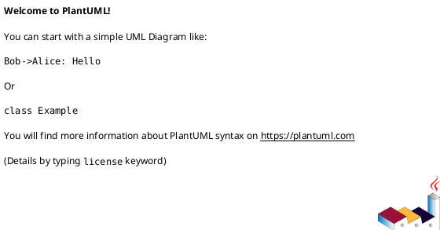
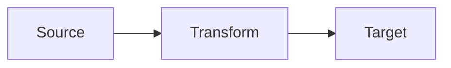

# Implementation Plan: [FEATURE] (Data)

**Branch**: `[###-feature-name]` | **Date**: [DATE] | **Spec**: [link]
**Input**: Feature specification from `/specs/[###-feature-name]/spec.md`

**Note**: This template is filled in by the `/speckit.plan.data` command.

## Summary

[Extract from feature spec: primary requirement + data approach]

## Technical Context

**Language/Version**: [e.g., Python 3.11 or NEEDS CLARIFICATION]  
**Primary Dependencies**: [e.g., Spark, Flink, Airflow or NEEDS CLARIFICATION]  
**Storage**: [e.g., data lake, warehouse, files or N/A]  
**Testing**: [e.g., pytest, dbt test or NEEDS CLARIFICATION]  
**Target Platform**: [e.g., Linux server, cloud service or NEEDS CLARIFICATION]

## Data Mode & SLA

- **Mode**: [real-time, batch, or hybrid]
- **Freshness/Latency**: [target]
- **Volume/Scale**: [records per day, size]

## Interfaces & Contracts

- **Input Contracts**: [schemas, versions, owners]
- **Output Contracts**: [schemas, consumers, SLAs]
- **Change Management**: [compatibility rules]

## Pipeline & Transformations

- **Stages**: [ingest, validate, transform, aggregate, publish]
- **ETL/ELT Strategy**: [where transformations occur]
- **Failure Handling**: [retries, quarantine, alerts]

## Data Quality Plan

- **Rules**: [completeness, accuracy, uniqueness, timeliness]
- **Thresholds**: [target values]
- **Validation Timing**: [pre-ingest, post-transform, pre-publish]

## Lineage & Dependencies

Provide a diagram using PlantUML or Mermaid.





## Backfill & Replay Strategy

- **Scope**: [time range, partitions]
- **Triggers**: [manual, automated]
- **Idempotency**: [dedupe, reconciliation]

## Monitoring & Alerting

- **Metrics**: [freshness, quality, failure rates]
- **Alerts**: [thresholds and on-call routing]

## Constitution Check

*GATE: Must pass before Phase 0 research. Re-check after Phase 1 design.*

[Gates determined based on constitution file]

## Project Structure

### Documentation (this feature)

```text
specs/[###-feature]/
├── plan.md
├── research.md
├── data-model.md
├── quickstart.md
├── contracts/
└── tasks.md
```

### Source Code (repository root)

```text
# [REPLACE WITH ACTUAL STRUCTURE]
```

**Structure Decision**: [Document the selected structure and reference the real directories]

## Complexity Tracking

> **Fill ONLY if Constitution Check has violations that must be justified**

| Violation | Why Needed | Simpler Alternative Rejected Because |
|-----------|------------|-------------------------------------|
| [e.g., 4th project] | [current need] | [why 3 projects insufficient] |
