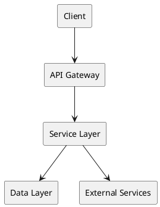

# Implementation Plan: [FEATURE]

**Branch**: `[###-feature-name]` | **Date**: [DATE] | **Spec**: [link]
**Input**: Feature specification from `/specs/[###-feature-name]/spec.md`

**Note**: This template is filled in by the `/speckit.plan` command. See `.specify/templates/commands/plan.md` for the execution workflow.

## Summary

[Extract from feature spec: primary requirement + technical approach from research]

## Technical Context

<!--
  ACTION REQUIRED: Replace the content in this section with the technical details
  for the project. The structure here is presented in advisory capacity to guide
  the iteration process.
-->

**Language/Version**: [e.g., Java 11, Python 3.11, Swift 5.9 or NEEDS CLARIFICATION]  
**Primary Framework**: [e.g., Spring Boot, FastAPI, Django or NEEDS CLARIFICATION]  
**Storage**: [if applicable, e.g., MySQL, PostgreSQL, Redis or N/A]  
**Testing**: [e.g., JUnit, pytest, XCTest or NEEDS CLARIFICATION]  
**Target Platform**: [e.g., Linux server, iOS 15+, Android or NEEDS CLARIFICATION]
**Project Type**: [single/web/mobile - determines source structure]  
**Performance Goals**: [domain-specific, e.g., 1000 req/s, <200ms RT, 60 fps or NEEDS CLARIFICATION]  
**Constraints**: [domain-specific, e.g., <200ms p95, <100MB memory, offline-capable or NEEDS CLARIFICATION]  
**Scale/Scope**: [domain-specific, e.g., 10k users, 100k QPS, 50 screens or NEEDS CLARIFICATION]

## Constitution Check

*GATE: Must pass before Phase 0 research. Re-check after Phase 1 design.*

[Gates determined based on constitution file]

## Project Structure

### Documentation (this feature)

```text
specs/[###-feature]/
├── plan.md              # This file (/speckit.plan command output)
├── research.md          # Phase 0 output (/speckit.plan command)
├── data-model.md        # Phase 1 output (/speckit.plan command)
├── quickstart.md        # Phase 1 output (/speckit.plan command)
├── contracts/           # Phase 1 output (/speckit.plan command)
└── tasks.md             # Phase 2 output (/speckit.tasks command - NOT created by /speckit.plan)
```

### Source Code (repository root)
<!--
  ACTION REQUIRED: Replace the placeholder tree below with the concrete layout
  for this feature. Delete unused options and expand the chosen structure with
  real paths (e.g., apps/admin, packages/something). The delivered plan must
  not include Option labels.
-->

```text
# [REMOVE IF UNUSED] Option 1: Single project (DEFAULT)
src/
├── models/
├── services/
├── cli/
└── lib/

tests/
├── contract/
├── integration/
└── unit/

# [REMOVE IF UNUSED] Option 2: Web application (when "frontend" + "backend" detected)
backend/
├── src/
│   ├── models/
│   ├── services/
│   └── api/
└── tests/

frontend/
├── src/
│   ├── components/
│   ├── pages/
│   └── services/
└── tests/

# [REMOVE IF UNUSED] Option 3: Mobile + API (when "iOS/Android" detected)
api/
└── [same as backend above]

ios/ or android/
└── [platform-specific structure: feature modules, UI flows, platform tests]
```

**Structure Decision**: [Document the selected structure and reference the real
directories captured above]

## Complexity Tracking

> **Fill ONLY if Constitution Check has violations that must be justified**

| Violation | Why Needed | Simpler Alternative Rejected Because |
|-----------|------------|-------------------------------------|
| [e.g., 4th project] | [current need] | [why 3 projects insufficient] |
| [e.g., Repository pattern] | [specific problem] | [why direct DB access insufficient] |

## Technical Architecture *(if applicable)*

### System Architecture Diagram

<!--
  Use PlantUML to describe system components and their interactions
-->



### Key Components

- **[Component 1]**: [Purpose and responsibility]
- **[Component 2]**: [Purpose and responsibility]
- **[Component 3]**: [Purpose and responsibility]

### Technology Stack

| Layer | Technology | Version | Purpose |
| --- | --- | --- | --- |
| Frontend | [e.g., React] | [version] | [purpose] |
| Backend | [e.g., Spring Boot] | [version] | [purpose] |
| Database | [e.g., MySQL] | [version] | [purpose] |
| Cache | [e.g., Redis] | [version] | [purpose] |
| Message Queue | [e.g., Kafka] | [version] | [purpose] |

## Interface Contracts *(if applicable)*

### API Endpoints

| Endpoint | Method | Purpose | Request/Response |
| --- | --- | --- | --- |
| `/api/v1/[resource]` | GET | [purpose] | [brief schema] |
| `/api/v1/[resource]` | POST | [purpose] | [brief schema] |

### Data Models

<!--
  Use PlantUML to describe entity relationships
-->

```plantuml
@startuml
hide circle
skinparam classAttributeIconSize 0

class Entity1 <<table>> {
  +id : bigint <<PK>>
  +field1 : varchar(64)
  +field2 : int
  +create_time : bigint
}

class Entity2 <<table>> {
  +id : bigint <<PK>>
  +entity1_id : bigint <<FK>>
  +field1 : varchar(128)
  +create_time : bigint
}

Entity1 "1" --> "0..*" Entity2 : relationship

@entuml
```

## Implementation Phases

### Phase 0: Research & Design

- [ ] Review spec.md and clarify requirements
- [ ] Research technical approaches
- [ ] Design data models
- [ ] Design API contracts
- [ ] Document architecture decisions

### Phase 1: Foundation

- [ ] Setup project structure
- [ ] Configure development environment
- [ ] Setup database schema
- [ ] Implement base models/entities
- [ ] Setup testing framework

### Phase 2: Core Implementation

- [ ] Implement business logic
- [ ] Implement API endpoints
- [ ] Implement data access layer
- [ ] Implement external integrations

### Phase 3: Testing & Quality

- [ ] Unit tests
- [ ] Integration tests
- [ ] Contract tests
- [ ] Performance testing
- [ ] Security review

### Phase 4: Deployment & Documentation

- [ ] Deployment configuration
- [ ] API documentation
- [ ] User documentation
- [ ] Operational runbooks
