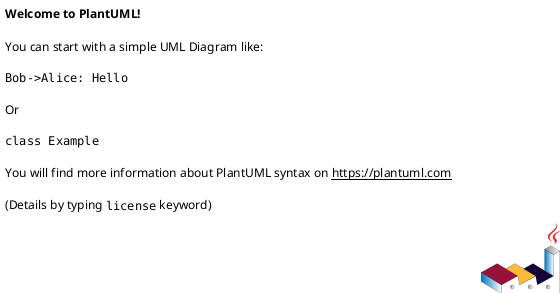
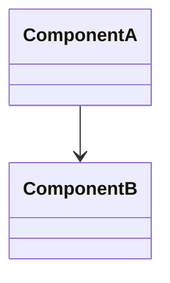

# Implementation Plan: [FEATURE] (Refactor)

**Branch**: `[###-feature-name]` | **Date**: [DATE] | **Spec**: [link]
**Input**: Feature specification from `/specs/[###-feature-name]/spec.md`

**Note**: This template is filled in by the `/speckit.plan.refactor` command.

## Summary

[Extract from feature spec: refactor goals + approach]

## Technical Context

**Language/Version**: [e.g., Python 3.11 or NEEDS CLARIFICATION]  
**Primary Dependencies**: [e.g., framework or NEEDS CLARIFICATION]  
**Storage**: [if applicable]  
**Testing**: [e.g., pytest or NEEDS CLARIFICATION]  
**Target Platform**: [e.g., Linux server or NEEDS CLARIFICATION]

## Target Architecture

Provide diagrams using PlantUML or Mermaid (sequence, class, component where relevant).





## Scope Impact Analysis

- **Interfaces**: [APIs, contracts, UI flows impacted]
- **Sequences**: [critical sequences to preserve]
- **Classes/Modules**: [key components and dependencies]

## Refactor Strategy

- **Invariants**: [interfaces/sequence/tables unchanged]
- **Incremental Steps**: [phase boundaries]
- **Compatibility**: [backward compatibility or migration]

## Migration & Rollout Plan

- **Phases**: [order of changes]
- **Rollback**: [how to revert]
- **Risk Mitigation**: [tests, feature flags, canaries]

## Performance Plan

- **Targets**: [latency/throughput/memory]
- **Measurement**: [benchmarks, baselines]

## Constitution Check

*GATE: Must pass before Phase 0 research. Re-check after Phase 1 design.*

[Gates determined based on constitution file]

## Project Structure

### Documentation (this feature)

```text
specs/[###-feature]/
├── plan.md
├── research.md
├── data-model.md
├── quickstart.md
├── contracts/
└── tasks.md
```

### Source Code (repository root)

```text
# [REPLACE WITH ACTUAL STRUCTURE]
```

**Structure Decision**: [Document the selected structure and reference the real directories]

## Complexity Tracking

> **Fill ONLY if Constitution Check has violations that must be justified**

| Violation | Why Needed | Simpler Alternative Rejected Because |
|-----------|------------|-------------------------------------|
| [e.g., 4th project] | [current need] | [why 3 projects insufficient] |
