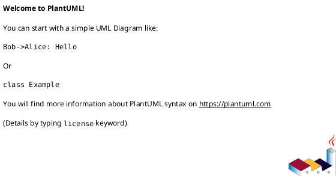
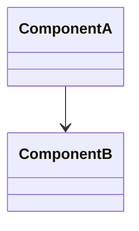

# Implementation Plan: [FEATURE] (Refactor)

**Branch**: `[###-feature-name]` | **Date**: [DATE] | **Spec**: [link]
**Input**: Feature specification from `/specs/[###-feature-name]/spec.md`

**Note**: This template is filled in by the `/speckit.plan.refactor` command.

## Summary

[1–2 paragraphs: why refactor, what changes, and what stays the same]

> **Spec → Plan handoff**: Do not re-litigate scope or success criteria here. Reference and operationalize them.

### Non-Negotiables (Invariants)

- **Interface/Protocol**: [carry over from spec.md → Current Behavior Baseline → Invariants]
- **Sequence/Timing**: [carry over from spec.md → Current Behavior Baseline → Invariants]
- **Data**: [carry over from spec.md → Current Behavior Baseline → Invariants]
- **Operational**: [carry over from spec.md → Current Behavior Baseline → Invariants]

### Deliverables

- [e.g., modules split, component extracted, orchestration introduced, legacy code retired]
- [docs updated: baseline + architecture diagrams + migration + rollback]

## Technical Context

**Language/Version**: [e.g., Python 3.11 or NEEDS CLARIFICATION]  
**Primary Dependencies**: [e.g., framework or NEEDS CLARIFICATION]  
**Storage**: [if applicable]  
**Testing**: [e.g., pytest or NEEDS CLARIFICATION]  
**Target Platform**: [e.g., Linux server or NEEDS CLARIFICATION]

## Baseline & Parity Plan (Must do before risky changes)

### Baseline Artifacts

- **Behavior baseline**: [golden inputs/outputs, fixtures, example requests]
- **Performance baseline**: [latency/throughput/error rate, sample window, tooling]
- **Operational baseline**: [key dashboards, logs, alerts, runbooks]

### Parity Validation

- **Parity definition**: [exact match vs tolerated differences]
- **Validation method**: [A/B comparison, shadow traffic, contract tests]
- **Exit criteria**: [what “equivalent” means]

## Impact Map (Index/Projection-driven)

> Prefer deterministic evidence from IDE symbol index / usages / call hierarchy.
> If you cannot produce evidence, stop and add a “NEEDS CLARIFICATION” item.

| Area | What changes | What must not change | Evidence (index/usages/tests) |
|------|--------------|----------------------|------------------------------|
| Interfaces | [API/contract] | [compat] | [link/notes] |
| Sequences | [flow] | [ordering] | [diagram/tests] |
| Modules | [boundaries] | [public surface] | [usages] |

### Interface Inventory (for interface-granularity tasks)

> **Source of truth for tasks.md**: tasks are generated from this inventory. Keep it complete and stable.
> In this repository, “Interface” means an end-to-end external entrypoint (HTTP/WebSocket/socket), not internal RPC/MQ/cron.

**Hard consistency rules**:

- **ID format**: `I01`, `I02`, ... (zero-padded)
- **ID stability**: IDs MUST match spec.md “In-Scope Interface List” and MUST NOT be renumbered.
- **Completeness**: Every in-scope interface from spec.md MUST appear here exactly once.
- **Downstream contract**: tasks.md MUST contain exactly one delivery task per `Ixx` from this table.

| Interface ID | Type | Method/Path (or name) | Contract | Owner module | Invariant(s) | Verification |
|-------------|------|------------------------|----------|--------------|--------------|--------------|
| I01 | HTTP | [GET /v1/foo] | [contracts/foo.yaml] | [module] | [protocol/sequence/data] | [curl + golden] |
| I02 | WebSocket | [WS msg: FooUpdated] | [contracts/ws.yaml] | [module] | [protocol/sequence/data] | [ws client + golden] |

## Target Architecture

Provide diagrams using PlantUML or Mermaid (sequence, class, component where relevant).





### Target Boundary Rules

- **Ownership**: [which module owns which responsibility]
- **Dependency direction**: [allowed arrows only]
- **Integration contracts**: [sync/async boundaries]

## Scope Impact Analysis

- **Interfaces**: [APIs, contracts, UI flows impacted]
- **Sequences**: [critical sequences to preserve]
- **Classes/Modules**: [key components and dependencies]

## Refactor Strategy

### Strategy Pattern

- **Step 0 (Minimum-change migration)**: Copy/move logic with minimal edits first to reduce risk.
- **Step 1 (Stabilize surface)**: Lock down invariants with regression/contract tests.
- **Step 2 (Extract boundaries)**: Introduce clear module/component seams.
- **Step 3 (Orchestrate / simplify)**: Move complex branching into explicit orchestration (workflow/strategy) where applicable.
- **Step 4 (Cleanup)**: Remove deprecated paths only after parity + rollout.

### Rules

- **Invariants**: [interfaces/sequence/tables unchanged]
- **Incremental & reversible**: Every phase must be shippable and rollbackable.
- **Compatibility**: [backward compatibility or migration]
- **Scope control**: No changes outside Impact Map unless explicitly added and approved.

## Migration & Rollout Plan

> Reference spec.md → Risks & Rollback → Lossless Release Risk for MTTR targets.

- **Phases**: [order of changes]
- **Rollback MTTR target**: [e.g., < 5 min, from spec.md]
- **Risk Mitigation**: [tests, feature flags, canaries]

### Rollout Checklist (maps to spec.md Acceptance Gate)

- [ ] **AC-1 ready**: Parity tests defined and passing
- [ ] **AC-2 ready**: Performance baseline captured, load tests prepared
- [ ] **AC-3 ready**: SLA dashboards configured
- [ ] **AC-4 ready**: Rollback MTTR rehearsed, method documented
- [ ] Observability dashboards updated

## Performance Plan

> Reference spec.md → Performance Targets for baseline metrics.
> Reference spec.md → Acceptance Criteria → AC-2 for acceptance thresholds.

- **Baseline source**: [APM / load test results / monitoring window]
- **Verification method**: [shadow traffic / A-B comparison / load test]
- **Measurement cadence**: [per-phase / pre-rollout / post-rollout]

## Constitution Check

*GATE: Must pass before Phase 0 research. Re-check after Phase 1 design.*

[Gates determined based on constitution file]

## Project Structure

### Documentation (this feature)

```text
specs/[###-feature]/
├── plan.md
├── research.md
├── baseline.md
├── impact-map.md
├── data-model.md
├── quickstart.md
├── contracts/
└── tasks.md
```

### Source Code (repository root)

```text
# [REPLACE WITH ACTUAL STRUCTURE]
```

**Structure Decision**: [Document the selected structure and reference the real directories]

## Complexity Tracking

> **Fill ONLY if Constitution Check has violations that must be justified**

| Violation | Why Needed | Simpler Alternative Rejected Because |
|-----------|------------|-------------------------------------|
| [e.g., 4th project] | [current need] | [why 3 projects insufficient] |
