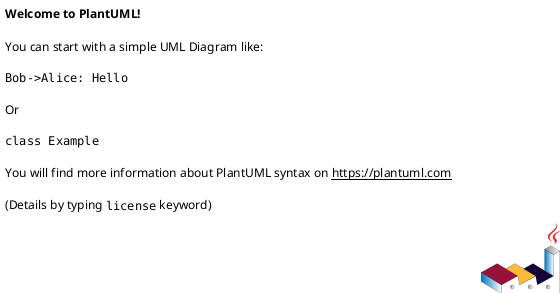

# Feature Specification: [FEATURE NAME] (Data)

**Feature Branch**: `[###-feature-name]`  
**Created**: [DATE]  
**Status**: Draft  
**Input**: User description: "$ARGUMENTS"

## User Scenarios & Testing *(mandatory)*

<!--
  IMPORTANT: User stories should be PRIORITIZED as user journeys ordered by importance.
  Each user story/journey must be INDEPENDENTLY TESTABLE - meaning if you implement just ONE of them,
  you should still have a viable MVP (Minimum Viable Product) that delivers value.
-->

### User Story 1 - [Brief Title] (Priority: P1)

[Describe this user journey in plain language]

**Why this priority**: [Explain the value and why it has this priority level]

**Independent Test**: [Describe how this can be tested independently]

**Acceptance Scenarios**:

1. **Given** [initial state], **When** [action], **Then** [expected outcome]
2. **Given** [initial state], **When** [action], **Then** [expected outcome]

---

[Add more user stories as needed]

### Edge Cases

- What happens when [source data missing or late]?
- How does system handle [schema change or invalid records]?

## Data Scenario Overview *(mandatory)*

**Mode**: [real-time, batch, or hybrid]  
**Inputs**: [data sources, frequency, ownership]  
**Outputs**: [data products, consumers, SLAs]  
**Interfaces**: [APIs, files, streams, contracts]

## Data Definitions & Metrics *(mandatory)*

- **Business Definitions**: [critical metrics and their exact definitions]
- **Grain**: [row-level grain and uniqueness expectations]
- **Time Semantics**: [event time vs processing time]

## Data Flow Diagram *(mandatory)*

Provide a diagram using PlantUML or Mermaid.

## Requirements *(mandatory)*

### Functional Requirements

- **FR-001**: System MUST support [real-time/batch] ingestion for [source].
- **FR-002**: System MUST define and enforce data contracts for [interfaces].
- **FR-003**: System MUST validate data quality rules for [critical fields].
- **FR-004**: System MUST track lineage from [source] to [target].
- **FR-005**: System MUST support backfill/replay for [time window].

### Data Quality Requirements

- **DQ-001**: [Completeness/accuracy/uniqueness thresholds].
- **DQ-002**: [Validation timing and failure handling].

### Lineage & Dependencies

- **LN-001**: [Upstream dependencies and ownership].
- **LN-002**: [Downstream consumers and contracts].

### Backfill & Replay Strategy

- **BF-001**: [Trigger conditions, scope, and retention].
- **BF-002**: [Idempotency and reconciliation expectations].

### Key Entities *(include if feature involves data)*

- **[Entity 1]**: [What it represents, key attributes without implementation]
- **[Entity 2]**: [What it represents, relationships to other entities]

## Success Criteria *(mandatory)*

### Measurable Outcomes

- **SC-001**: [Latency or freshness target, e.g., "data available within 5 minutes"]
- **SC-002**: [Accuracy/quality target, e.g., "<1% invalid records"]
- **SC-003**: [Coverage target, e.g., "100% of required fields populated"]
- **SC-004**: [Backfill completion target, e.g., "reprocess 90 days within 4 hours"]
