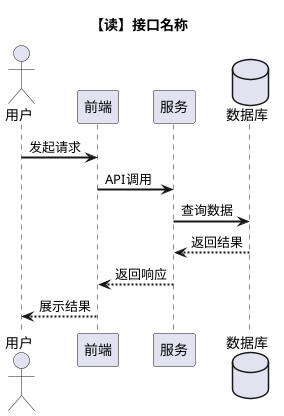
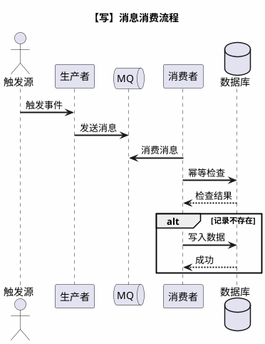
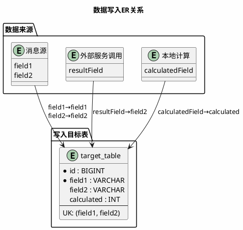
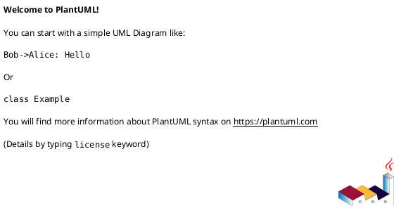

# Feature Specification: [FEATURE NAME] (Data)

**Feature Branch**: `[###-feature-name]`  
**Created**: [DATE]  
**Status**: Draft  
**Input**: User description: "$ARGUMENTS"

## User Scenarios & Testing *(mandatory)*

<!--
  IMPORTANT: User stories should be PRIORITIZED as user journeys ordered by importance.
  Each user story/journey must be INDEPENDENTLY TESTABLE - meaning if you implement just ONE of them,
  you should still have a viable MVP (Minimum Viable Product) that delivers value.
-->

### User Story 1 - [Brief Title] (Priority: P1)

[Describe this user journey in plain language]

**Why this priority**: [Explain the value and why it has this priority level]

**Independent Test**: [Describe how this can be tested independently]

**Acceptance Scenarios**:

1. **Given** [initial state], **When** [action], **Then** [expected outcome]
2. **Given** [initial state], **When** [action], **Then** [expected outcome]

---

[Add more user stories as needed]

### Edge Cases

- What happens when [source data missing or late]?
- How does system handle [schema change or invalid records]?

## Data Scenario Overview *(mandatory)*

**Mode**: [real-time, batch, or hybrid]  
**Inputs**: [data sources, frequency, ownership]  
**Outputs**: [data products, consumers, SLAs]  
**Interfaces**: [APIs, files, streams, contracts]

## Data Definitions & Metrics *(mandatory)*

- **Business Definitions**: [critical metrics and their exact definitions]
- **Grain**: [row-level grain and uniqueness expectations]
- **Time Semantics**: [event time vs processing time]

## Interface Definitions *(optional - for API/message-driven scenarios)*

### 交付接口总览

| 接口名称 | 接口类型 | 非功能性指标 |
| --- | --- | --- |
| [接口1名称] | [查询/同步/异步] | [RT/时效性要求] |
| [接口2名称] | [查询/同步/异步] | [RT/时效性要求] |

### 【读】接口定义示例

#### 接口1 - [接口名称]

| 项 | 说明 |
| --- | --- |
| **路径** | `GET/POST /api/path` |
| **入参** | [参数说明] |
| **变化点** | [本次新增/修改内容] |

**出参字段与来源**：

| 出参字段 | 类型 | 描述 | 来源 |
| --- | --- | --- | --- |
| `field1` | String | [字段说明] | [表名.字段名或计算逻辑] |
| `field2` | Integer | [字段说明] | [表名.字段名或计算逻辑] |

**时序图**：



### 【写】消息/事件定义示例

#### 消息1 - [消息名称]

**Topic**: `message-topic-name`

**Payload字段定义**：

| 字段 | 类型 | 必填 | 说明 | 新增 |
| --- | --- | --- | --- | --- |
| `field1` | Long | 是 | [字段说明] | |
| `field2` | String | 否（默认值） | [字段说明] | ✅ |

**时序图**：



**写入ER图**：



## Data Flow Diagram *(mandatory)*

Provide a diagram using PlantUML or Mermaid.




## Requirements *(mandatory)*

### Functional Requirements

- **FR-001**: System MUST support [real-time/batch] ingestion for [source].
- **FR-002**: System MUST define and enforce data contracts for [interfaces].
- **FR-003**: System MUST validate data quality rules for [critical fields].
- **FR-004**: System MUST track lineage from [source] to [target].
- **FR-005**: System MUST support backfill/replay for [time window].

### Data Quality Requirements

- **DQ-001**: [Completeness/accuracy/uniqueness thresholds].
- **DQ-002**: [Validation timing and failure handling].

### Lineage & Dependencies

- **LN-001**: [Upstream dependencies and ownership].
- **LN-002**: [Downstream consumers and contracts].

### Backfill & Replay Strategy

- **BF-001**: [Trigger conditions, scope, and retention].
- **BF-002**: [Idempotency and reconciliation expectations].

### Key Entities *(include if feature involves data)*

- **[Entity 1]**: [What it represents, key attributes without implementation]
- **[Entity 2]**: [What it represents, relationships to other entities]

## Database Schema *(optional - for database-heavy scenarios)*

### 变更总览

| 表名 | 变更 | 说明 |
| --- | --- | --- |
| `table1` | 新增表 | [用途说明] |
| `table2` | 新增字段 | [字段说明] |
| `table3` | 新增索引 | [索引说明] |

### 表字段说明

**table1**（表用途说明）：

| 字段 | 类型 | 说明 | 来源 |
| --- | --- | --- | --- |
| `id` | BIGINT | 主键 | 自增 |
| `field1` | VARCHAR | [字段说明] | [来源说明] |
| `field2` | INTEGER | [字段说明] | [计算逻辑] |
| `created_at` | DATETIME | 创建时间 | CURRENT_TIMESTAMP |

**Indexes**:
- PRIMARY KEY: `id`
- UNIQUE KEY: `uk_field1_field2(field1, field2)`
- INDEX: `idx_created(created_at)`

### DDL变更脚本

```sql
-- 新建表示例
CREATE TABLE `table1` (
  `id` BIGINT NOT NULL AUTO_INCREMENT,
  `field1` VARCHAR(255) NOT NULL COMMENT '字段说明',
  `field2` INTEGER DEFAULT 0 COMMENT '字段说明',
  `created_at` DATETIME DEFAULT CURRENT_TIMESTAMP,
  PRIMARY KEY (`id`),
  UNIQUE KEY `uk_field1_field2` (`field1`, `field2`),
  KEY `idx_created` (`created_at`)
) ENGINE=InnoDB DEFAULT CHARSET=utf8mb4 COMMENT='表用途说明';

-- 修改表示例
ALTER TABLE `table2`
  ADD COLUMN `new_field` SMALLINT NOT NULL DEFAULT 100 COMMENT '新字段说明' AFTER `existing_field`,
  ADD UNIQUE INDEX `uk_new_constraint` (`field1`, `new_field`);
```

**历史数据处理**：[说明是否需要数据迁移，默认值策略等]

## Success Criteria *(mandatory)*

### Measurable Outcomes

- **SC-001**: [Latency or freshness target, e.g., "data available within 5 minutes"]
- **SC-002**: [Accuracy/quality target, e.g., "<1% invalid records"]
- **SC-003**: [Coverage target, e.g., "100% of required fields populated"]
- **SC-004**: [Backfill completion target, e.g., "reprocess 90 days within 4 hours"]
