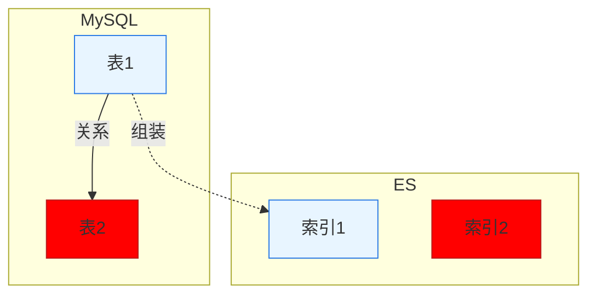
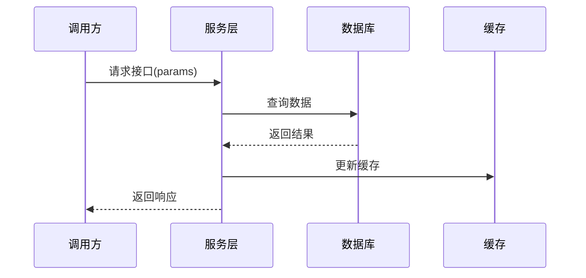
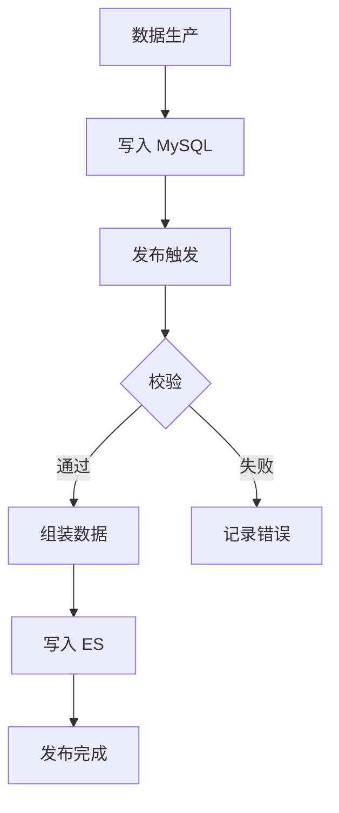
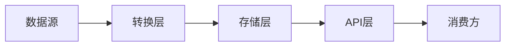

# Feature Specification: [FEATURE NAME] (教研知识发布)

**Feature Branch**: `[###-feature-name]`  
**Created**: [DATE]  
**Status**: Draft  
**Input**: User description: "$ARGUMENTS"

## User Scenarios & Testing *(mandatory)*

<!--
  IMPORTANT: 用户故事应该按重要性排列优先级。
  每个用户故事必须是独立可测试的 - 即使只实现其中一个，也应该有可交付的MVP。
  为每个故事分配优先级（P1, P2, P3等），其中P1是最关键的。
-->

### User Story 1 - [Brief Title] (Priority: P1)

[用自然语言描述此用户旅程]

**Why this priority**: [解释价值以及为什么是这个优先级]

**Independent Test**: [描述如何独立测试]

**Acceptance Scenarios**:

1. **Given** [初始状态], **When** [操作], **Then** [预期结果]
2. **Given** [初始状态], **When** [操作], **Then** [预期结果]

---

[根据需要添加更多用户故事]

### Edge Cases

- 当 [数据源缺失或延迟] 时会发生什么？
- 系统如何处理 [数据格式变化或无效记录]？
- 发布失败时的回滚策略是什么？

## 需求输入（来自业务方） *(mandatory)*

**日期**：[DATE]  
**范围**：[影响的系统/服务]  
**来源**：[需求文档名称或业务方]

### 核心需求要点

*   题目类型：
    *   [类型1]：`type=XXX`
    *   [类型2]：`type=YYY`

*   关键业务规则：
    *   [规则1描述]
    *   [规则2描述]

**需求描述**：

1.  [需求1]
2.  [需求2]
3.  [需求3]

## 技术方案 *(mandatory)*

### 变更总览

*   **变更**，[系统名]-[功能模块]，[变更内容]，[接口类型]；
*   **新增**，[系统名]-[功能模块]，[变更内容]，[接口类型]；
*   **删除**，[系统名]-[功能模块]，[变更内容]，[接口类型]；

### 架构设计



**颜色说明**：蓝色为现有模型，红色为新增/变更模型。

### 数据模型设计 *(mandatory)*

#### 新增/变更表字段说明

**表名**：`[table_name]`  
**责任人**：$\color{#0089FF}{@负责人}$

| **字段** | **类型** | **含义** | **备注** |
| --- | --- | --- | --- |
| id | bigint | 主键 | 自增 |
| [字段1] | [类型] | [含义] | [备注] |
| [字段2] | [类型] | [含义] | [备注] |
| is_delete | tinyint | 软删 | 0/1 |
| create_time | bigint | 创建时间 | 毫秒 |
| update_time | bigint | 更新时间 | 毫秒 |
| create_user | varchar(64) | 创建人 | 可选 |
| modify_user | varchar(64) | 修改人 | 可选 |

#### 表关系说明

*   [表A] 与 [表B] 通过 [字段] 关联
*   [表C] 为 [业务概念] 的主表
*   示例：1对多关系描述

#### 索引设计说明

**索引名**：`[index_name]`

```json
{
  "id": "主键ID",
  "field1": "字段1",
  "field2": ["数组字段"],
  "nested_field": {
    "sub_field1": "值1",
    "sub_field2": "值2"
  }
}
```

## 接口设计 *(mandatory)*

### 接口总览

| **接口名称** | **接口类型** | **系统** | **非功能性指标** | **责任人** |
| --- | --- | --- | --- | --- |
| [接口1] | [Dubbo/HTTP] | [系统名] | [RT/时效性要求] | @负责人 |
| [接口2] | [Dubbo/HTTP] | [系统名] | [RT/时效性要求] | @负责人 |

### 2.1 [接口1名称]（系统名，接口类型）

**接口**：`[InterfaceName.methodName(params)]` 或 `/api/path`

**入参 Schema**：

```java
// Java 示例
String param1
List<String> param2
```

或

```json
// JSON 示例
{
  "param1": "string",
  "param2": ["string"]
}
```

**出参 Schema**：

```java
// Java 示例
ResponseDTO {
  String field1;
  List<Object> field2;
}
```

**字段说明**（核心字段）：

*   `field1`：[字段含义]
*   `field2`：[字段含义]
*   **`newField`**：**[新增字段说明]（本次新增）**

**变更**：

*   **新增字段**：`newField`
*   **修改逻辑**：[具体修改说明]

#### 2.1.1 接口时序



#### 2.1.2 改动分析

**责任人**：$\color{#0089FF}{@负责人}$

1.  对 [业务场景A] **有影响**  
    **原因**：[具体影响说明]
    
2.  对 [业务场景B] **无影响**  
    **原因**：[具体说明]

**调用方清单**：

| **仓库** | **业务/场景** | **影响评估** |
| --- | --- | --- |
| [repo-1] | [业务场景] | [有/无影响] |
| [repo-2] | [业务场景] | [有/无影响] |

#### 2.1.3 性能设计

1.  **总体影响**：[性能影响评估]
2.  **读性能**：[读操作性能分析，目标RT]
3.  **写性能**：[写操作性能分析，目标RT]
4.  **兼容性**：[向后兼容性说明]

#### 2.1.4 改动清单

**目标**：[改动目标描述]

**拟改动点**：

1.  **文件1**：`path/to/file1.java`
    *   新增：`private String newField;`
    *   修改：`methodName()` 逻辑

2.  **文件2**：`path/to/file2.java`
    *   新增：[具体新增内容]

#### 2.1.5 验证路径

**验证步骤**：

1.  [步骤1描述]
2.  [步骤2描述]
3.  确认 [预期结果]

---

[根据需要添加更多接口]

## 发布规则 *(optional)*

### 发布校验规则

**责任人**：$\color{#0089FF}{@负责人}$

*   **必填项校验**：
    *   [字段1] 必须存在
    *   [字段2] 不可为空
    
*   **格式校验**：
    *   [字段3] 必须符合 [格式要求]
    *   禁止引用外部资源（如 `http://example.com/...`）
    
*   **业务规则校验**：
    *   [规则1描述]
    *   [规则2描述]

### 发布链路



**关键数据落点**：

*   **MySQL → 组装 → ES**
*   读取表：[table1, table2, ...]
*   组装逻辑：[组装说明]
*   目标索引：[index_name]

## 数据流转 *(optional)*

### 数据链路图



### 关键数据结构

**来源**：[数据来源系统/表]  
**格式**：[JSON/XML/CSV/等]  
**频率**：[实时/批量/定时]

**示例**：

```json
{
  "field1": "value1",
  "field2": {
    "nested": "value2"
  }
}
```

## 风险评估 *(mandatory)*

### 技术风险

| **风险项** | **影响程度** | **应对措施** | **责任人** |
| --- | --- | --- | --- |
| [风险1] | [高/中/低] | [应对方案] | @负责人 |
| [风险2] | [高/中/低] | [应对方案] | @负责人 |

### 兼容性风险

*   **向后兼容**：[说明]
*   **数据迁移**：[是否需要，如何执行]
*   **回滚方案**：[回滚策略]

## 上线计划 *(mandatory)*

### 上线检查清单

- [ ] 代码开发完成
- [ ] 单元测试通过
- [ ] 集成测试通过
- [ ] 性能测试通过（RT < [目标值]ms）
- [ ] 数据库变更脚本准备
- [ ] 配置项更新
- [ ] 监控告警配置
- [ ] 文档更新
- [ ] 相关方评审通过

### 上线步骤

1.  **预发布环境验证**
    *   部署时间：[时间]
    *   验证内容：[验证项]
    
2.  **生产环境发布**
    *   发布时间：[时间]
    *   发布方式：[灰度/全量]
    *   回滚条件：[触发条件]

3.  **发布后验证**
    *   监控指标：[RT/QPS/错误率]
    *   验证时长：[时长]
    *   负责人：@[负责人]

## 依赖方沟通 *(mandatory)*

### 上游依赖

| **系统/团队** | **依赖内容** | **负责人** | **沟通状态** |
| --- | --- | --- | --- |
| [系统A] | [依赖说明] | @负责人 | [已沟通/待沟通] |

### 下游影响

| **系统/团队** | **影响内容** | **负责人** | **沟通状态** |
| --- | --- | --- | --- |
| [系统B] | [影响说明] | @负责人 | [已通知/待通知] |

## 监控与告警 *(mandatory)*

### 关键指标

*   **接口性能**：RT < [目标值]ms，P99 < [目标值]ms
*   **成功率**：> 99.9%
*   **数据时效**：[时效性要求]

### 告警配置

*   **触发条件**：[条件描述]
*   **告警级别**：[P0/P1/P2]
*   **通知方式**：[钉钉/邮件/短信]
*   **责任人**：@[负责人]

## 附录 *(optional)*

### 相关文档

*   [业务需求文档链接]
*   [技术设计文档链接]
*   [API文档链接]

### 术语表

| **术语** | **含义** |
| --- | --- |
| [术语1] | [解释] |
| [术语2] | [解释] |

---

## Notes

*(Include any other requirements, constraints, goals or considerations that didn't fit neatly above.)*
