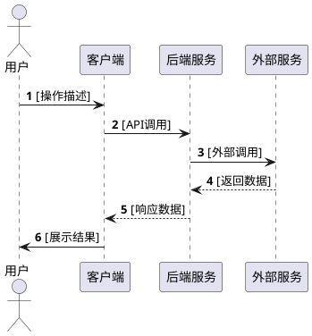
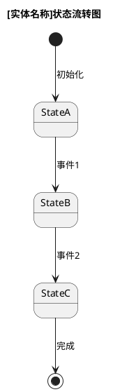
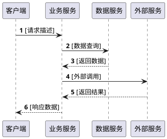
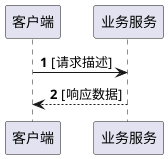
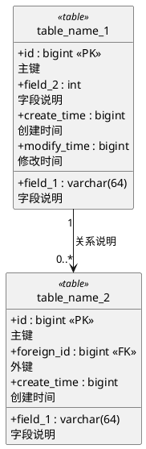

# [项目/功能名称] 技术评审文档

**Feature Branch**: `[###-feature-name]`  
**Created**: [DATE]  
**Status**: Draft  
**Input**: User description: "$ARGUMENTS"

## 0. 范围与边界

### 0.1 本期范围

<!--
  描述本期需要实现的功能范围，明确交付边界
-->

- [功能点1]：[详细描述]
- [功能点2]：[详细描述]
- [功能点3]：[详细描述]

### 0.2 关键口径

<!--
  定义核心业务规则和计算口径，确保理解一致
-->

- **[口径名称1]**：[计算公式或业务规则]
- **[口径名称2]**：[计算公式或业务规则]
- **[口径名称3]**：[计算公式或业务规则]

### 0.3 产品流程图

<!--
  使用PlantUML绘制完整的用户流程时序图
-->



### 0.4 状态流转图

<!--
  描述核心实体的状态机
-->



## 1. 功能点完备性覆盖（功能识别、接口、新/老接口）

### 1.1 功能点 → 接口/实现映射表

<!--
  完整列举所有功能点，明确是否需要接口、新老接口状态
-->

| 功能点 | 是否需要接口 | 新/老 | 对外接口/产出 | 备注 |
| --- | --- | --- | --- | --- |
| [功能点1] | 是/否 | 新/老 | `[HTTP方法] /api/path` | [说明] |
| [功能点2] | 是/否 | 新/老 | `[HTTP方法] /api/path` | [说明] |
| [功能点3] | 是/否 | 新/老 | `[HTTP方法] /api/path` | [说明] |

## 2. 主要接口时序图

<!--
  为关键接口绘制详细的时序图，包含所有系统间交互
-->

### 2.1 [接口场景1]



### 2.2 [接口场景2]



### 2.3 变量/状态逻辑

<!--
  描述关键的业务逻辑和状态处理
-->

- **[逻辑点1]**：[描述]
- **[逻辑点2]**：[描述]
- **幂等性**：[描述幂等处理策略]

## 3. 接口定义评审（字段完备性、冗余）

### 3.1 接口清单

<!--
  列出所有接口及其文档链接
-->

| 接口 | 文档链接 | 备注 |
| --- | --- | --- |
| `[HTTP方法] /api/path1` | [文档链接] | [说明] |
| `[HTTP方法] /api/path2` | [文档链接] | [说明] |

### 3.2 接口规范

<!--
  描述统一的接口约定和规范
-->

- **响应包装**：[描述统一的响应格式]
- **Header约定**：[列举必需的Header]
- **鉴权方式**：[描述鉴权机制]
- **错误码规范**：[描述错误码体系]

### 3.3 关键字段说明

<!--
  对重要的、易混淆的字段进行详细说明
-->

| 字段名 | 类型 | 说明 | 示例 |
| --- | --- | --- | --- |
| [fieldName1] | [type] | [description] | [example] |
| [fieldName2] | [type] | [description] | [example] |

## 4. 对外部写接口调用与影响评估

### 4.1 外部依赖清单

<!--
  列出所有外部服务依赖及其用途
-->

| 外部服务 | 调用类型 | 用途 | 是否写操作 | 影响评估 |
| --- | --- | --- | --- | --- |
| [服务名1] | RPC/HTTP/MQ | [用途] | 是/否 | [影响说明] |
| [服务名2] | RPC/HTTP/MQ | [用途] | 是/否 | [影响说明] |

### 4.2 影响评估

<!--
  评估本次改动对外部系统的影响
-->

- **数据一致性**：[说明]
- **性能影响**：[说明]
- **故障隔离**：[说明]
- **回滚方案**：[说明]

## 5. 核心问题与算法定义（理解一致性）

### 5.1 关键算法口径

<!--
  详细定义核心算法和计算逻辑，确保理解一致
-->

#### (A) [算法名称1]

**算法描述**：[详细描述算法逻辑]

**输入**：[输入参数]

**输出**：[输出结果]

**评审点**：
- [评审点1：需要明确的细节]
- [评审点2：边界条件处理]
- [评审点3：异常场景处理]

**示例**：
```
输入：[示例输入]
输出：[示例输出]
```

#### (B) [算法名称2]

**算法描述**：[详细描述算法逻辑]

**计算公式**：`[公式]`

**特殊情况处理**：
- 当[条件]时，返回[结果]
- 当[条件]时，返回[结果]

## 6. 技术选型

### 6.1 技术栈

<!--
  列出使用的技术栈和中间件
-->

| 组件 | 技术选型 | 版本 | 用途 | 是否新增 |
| --- | --- | --- | --- | --- |
| [组件1] | [技术] | [版本] | [用途] | 是/否 |
| [组件2] | [技术] | [版本] | [用途] | 是/否 |

### 6.2 并发与幂等

<!--
  描述并发控制和幂等性保证
-->

- **并发控制**：[描述并发场景及处理策略]
- **幂等性保证**：[描述幂等实现方式]
- **分布式锁**：[如需要，描述使用场景]
- **数据库约束**：[描述唯一索引等约束]

### 6.3 数据模型（ER图）

<!--
  使用PlantUML绘制ER图
-->



#### 6.3.1 关键约束/索引

<!--
  列出所有表的主键、索引、唯一约束
-->

**table_name_1**
- PK：`id`
- 索引：`idx_field_1(field_1)`、`idx_field_2_time(field_2, create_time)`
- 唯一约束：`uk_field_1_field_2(field_1, field_2)`

**table_name_2**
- PK：`id`
- 索引：`idx_foreign_id(foreign_id)`
- 外键：`fk_foreign_id` REFERENCES `table_name_1(id)`

### 6.4 枚举类定义

<!--
  定义所有枚举类型及其取值
-->

#### (A) [枚举名称1]

| 枚举值 | Code | 说明 |
| --- | --- | --- |
| [NAME_1] | [code1] | [说明] |
| [NAME_2] | [code2] | [说明] |

#### (B) [枚举名称2]

| 枚举值 | Code | 说明 |
| --- | --- | --- |
| [STATE_1] | 1 | [说明] |
| [STATE_2] | 2 | [说明] |

## 7. 用户场景与测试 *(mandatory)*

<!--
  描述用户使用场景和验收测试
-->

### User Story 1 - [场景名称] (Priority: P1)

[描述用户使用场景]

**验收标准**：

1. **Given** [初始状态], **When** [用户操作], **Then** [预期结果]
2. **Given** [初始状态], **When** [用户操作], **Then** [预期结果]

### Edge Cases

- 当[边界条件]时，系统应该[行为]
- 如何处理[异常场景]？

## 8. 成功标准 *(mandatory)*

### 8.1 可测量的成果

- **SC-001**: [性能指标，如"接口响应时间 < 200ms"]
- **SC-002**: [容量指标，如"支持10000并发用户"]
- **SC-003**: [正确性指标，如"计算准确率 > 99.9%"]
- **SC-004**: [业务指标，如"用户完成率 > 80%"]

### 8.2 质量标准

- **代码覆盖率**：[目标，如"单元测试覆盖率 > 80%"]
- **接口稳定性**：[目标，如"可用性 > 99.9%"]
- **数据一致性**：[验证方法]
