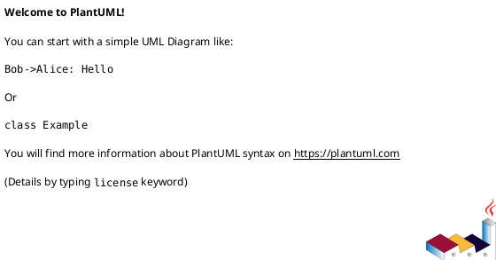
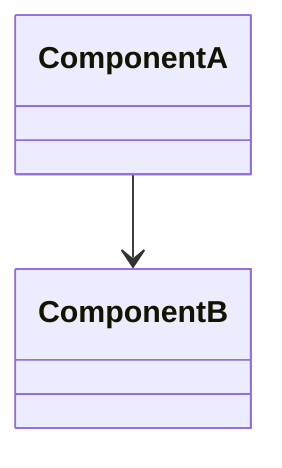

# Feature Specification: [FEATURE NAME] (Refactor)

**Feature Branch**: `[###-feature-name]`  
**Created**: [DATE]  
**Status**: Draft  
**Input**: User description: "$ARGUMENTS"

## Refactor Overview *(mandatory)*

### Background (Problem → Impact)

| Problem | Description | Impact |
|--------|-------------|--------|
| [e.g., high coupling] | [what you see today] | [why it matters] |
| [e.g., hard to test] | [what blocks tests] | [risk/cost] |

**Goals**: [what should improve and why]  
**Non-Goals**: [explicitly out of scope]  
**Primary Drivers**: [maintainability, testability, performance, stability, cost]

### Deliverables

- [e.g., module split, component extracted, orchestration simplified]
- [docs: baseline + diagrams + migration + rollback]

## User Scenarios & Testing *(mandatory)*

<!--
  Keep user-facing behaviors and journeys intact unless explicitly changed.
  Each story should be independently testable as a regression safety net.
-->

### User Story 1 - [Brief Title] (Priority: P1)

[Describe the behavior that must remain correct after refactor]

**Why this priority**: [Explain the value and why it has this priority level]

**Independent Test**: [Describe how this can be tested independently]

**Acceptance Scenarios**:

1. **Given** [initial state], **When** [action], **Then** [expected outcome]
2. **Given** [initial state], **When** [action], **Then** [expected outcome]

---

[Add more user stories as needed]

### Edge Cases

- What happens when [boundary condition]?
- How does system handle [error scenario]?

## Current Behavior Baseline *(mandatory)*

- **Observed Behavior**: [what exists today]
- **Known Issues**: [pain points, defects, risks]
- **Invariants** *(must not change)*:
  - **Interface/Protocol**: [request/response/contracts]
  - **Sequence/Timing**: [ordering/side effects]
  - **Data**: [schema/event/serialization]
  - **Operational**: [auth/audit/observability]

### Baseline Artifacts

- **Golden examples**: [sample inputs/outputs]
- **Baseline measurements**: [latency/error rate/throughput, time window]
- **Regression safety net**: [tests or manual checks]

## Scope & Impact *(mandatory)*

> **Spec → Plan handoff rule**: Spec defines **WHAT/WHY** (scope + invariants + success). Plan defines **HOW** (target architecture + interface inventory + migration).

### Interface Definition (end-to-end only)

- **Interface** = externally observable entrypoint: HTTP API, WebSocket (connect/auth + message types), raw socket protocol.
- **Not an interface**: internal RPC, MQ consumer/producer, scheduled jobs/cron.

- **Interfaces**: [APIs, contracts, UI flows impacted]
- **Sequences**: [critical sequence flows to preserve]
- **Classes/Modules**: [key components and dependencies]

### In-Scope Interface List (high-level)

**Hard consistency rule**:

- Assign stable Interface IDs in this list using the format `I01`, `I02`, ...
- These IDs MUST be reused unchanged in plan.md (Interface Inventory) and tasks.md (interface delivery tasks).
- Do not renumber IDs after plan/tasks exist; only append new IDs.

- [I01] [HTTP] [GET /v1/foo]
- [I02] [WebSocket] [WS msg: FooUpdated]

> Detailed **Interface Inventory** (owner module, verification, invariants) belongs in plan.md.

### Scope Rules

- Refactor MUST NOT expand product scope.
- Any planned behavior change must be explicitly listed under “Allowed Differences”.

### Allowed Differences (If any)

- [e.g., log wording changes, non-functional internal re-organization]

## Target Architecture *(mandatory)*

Provide diagrams using PlantUML or Mermaid. Include sequence, class, and component views when relevant.

### Boundary Rules *(mandatory)*

- **Module ownership**: [who owns what]
- **Dependency direction**: [allowed arrows only]
- **Integration contracts**: [sync/async boundaries]

## Refactor Constraints *(mandatory)*

- **Interface Stability**: [e.g., interfaces unchanged]
- **Data Stability**: [e.g., schema/table unchanged]
- **Timing/Sequence**: [e.g., sequence unchanged]
- **Compatibility**: [e.g., backward compatibility requirements]

## Refactor Strategy *(mandatory)*

### Phased Approach

1. **Minimum-change migration**: move/copy logic first with minimal edits.
2. **Lock invariants**: add parity/contract regression checks.
3. **Extract boundaries**: introduce seam(s) between modules/components.
4. **Simplify orchestration**: make flows explicit (strategy/workflow) where needed.
5. **Cleanup**: remove deprecated paths after rollout validation.

### Validation Checkpoints

- **Checkpoint A (Baseline)**: baseline artifacts complete.
- **Checkpoint B (Parity)**: behavior equivalence verified.
- **Checkpoint C (Rollout-ready)**: rollback plan tested/rehearsed.

## Requirements *(mandatory)*

### Functional Requirements

- **FR-001**: System MUST preserve [critical behavior].
- **FR-002**: System MUST maintain compatibility for [interface/contract].
- **FR-003**: System MUST keep [performance metric] within target.

### Refactor Requirements

- **RR-001**: Refactor MUST be incremental and reversible.
- **RR-002**: Each step MUST include validation against baseline behaviors.
- **RR-003**: Scope MUST exclude [explicit non-goals].

### Key Entities *(include if data involved)*

- **[Entity 1]**: [What it represents, key attributes without implementation]
- **[Entity 2]**: [What it represents, relationships to other entities]

## Performance Targets *(mandatory)*

> **Refactor principle**: No regression. All targets are relative to baseline.

| Metric | Baseline (pre-refactor) | Target (post-refactor) | Tolerance |
|--------|------------------------|------------------------|----------|
| P95 Latency | [e.g., 180ms] | ≤ baseline | 0% regression |
| P99 Latency | [e.g., 350ms] | ≤ baseline | 0% regression |
| Throughput (QPS) | [e.g., 500 QPS] | ≥ baseline | 0% regression |
| Error Rate | [e.g., 0.1%] | ≤ baseline | 0% regression |
| Memory/CPU | [e.g., 2GB / 50%] | ≤ baseline + 20% | 20% headroom |

## Risks & Rollback *(mandatory)*

### Risk Inventory

| Risk ID | Description | Probability | Impact | Mitigation |
|---------|-------------|-------------|--------|------------|
| R01 | [e.g., parity failure] | [H/M/L] | [H/M/L] | [mitigation] |
| R02 | [e.g., performance regression] | [H/M/L] | [H/M/L] | [mitigation] |

### Lossless Release Risk (MTTR-based)

> **Lossless release** = rollback can restore service within acceptable MTTR, causing zero or near-zero user-visible impact.

| Dimension | Requirement | Verification |
|-----------|-------------|-------------|
| **Rollback MTTR** | ≤ [e.g., 5 min] | [rehearsal / runbook] |
| **Data Loss Window** | 0 (no data loss) | [replication / idempotency] |
| **User-visible Downtime** | ≤ [e.g., 0 sec / graceful degradation] | [feature flag / traffic shift] |
| **Blast Radius** | ≤ [e.g., 10% of traffic during canary] | [staged rollout config] |

### Rollback Plan

- **Trigger**: [when to rollback — e.g., error rate > 1%, latency > 2× baseline]
- **Method**: [how — e.g., feature flag off, traffic shift, redeploy old version]
- **Estimated MTTR**: [e.g., < 5 min]
- **Rehearsal**: [yes/no, last rehearsal date]

### Rollout Plan

- **Rollout type**: [feature flag / canary / shadow / blue-green]
- **Stages**: [e.g., 1% → 10% → 50% → 100%]
- **Bake time per stage**: [e.g., 24h]
- **Monitoring**: [dashboards / alerts to watch]
- **Stop conditions**: [when to halt and rollback]

## Acceptance Criteria *(mandatory)*

> **Refactor Acceptance Principle: CONSISTENCY**
>
> Refactor projects are accepted if and only if:
> 1. User-visible behavior is **identical** (or explicitly allowed difference)
> 2. Performance is **no worse** than baseline
> 3. SLA is **no worse** than baseline
> 4. Release is **lossless** (MTTR-verified rollback)

### AC-1: User Behavior Consistency (E2E Parity)

| Scenario | Baseline Behavior | Post-Refactor Behavior | Verification |
|----------|------------------|------------------------|-------------|
| [e.g., Apply lecture] | [expected output] | Identical | [E2E test / shadow comparison] |
| [e.g., Student speak] | [expected output] | Identical | [E2E test / shadow comparison] |
| [Edge case 1] | [expected output] | Identical | [regression test] |

**Allowed Differences** (if any): [list explicitly, e.g., log format changes]

### AC-2: Performance Consistency (No Regression)

| Metric | Baseline | Acceptance Threshold | Verification |
|--------|----------|---------------------|-------------|
| P95 Latency | [e.g., 180ms] | ≤ baseline | [load test / APM comparison] |
| P99 Latency | [e.g., 350ms] | ≤ baseline | [load test / APM comparison] |
| Throughput | [e.g., 500 QPS] | ≥ baseline | [load test] |
| Error Rate | [e.g., 0.1%] | ≤ baseline | [monitoring] |

### AC-3: SLA Consistency (No Degradation)

| SLA Metric | Baseline | Acceptance Threshold | Verification |
|------------|----------|---------------------|-------------|
| Availability | [e.g., 99.9%] | ≥ baseline | [SLA dashboard / incident count] |
| Success Rate | [e.g., 99.95%] | ≥ baseline | [monitoring] |
| Incident Rate | [e.g., < 1/week] | ≤ baseline | [incident tracking] |

### AC-4: Lossless Release (MTTR Risk)

| Dimension | Requirement | Status |
|-----------|-------------|--------|
| Rollback MTTR | ≤ [e.g., 5 min] | [verified / not verified] |
| User-visible Downtime | [e.g., 0 sec] | [verified / not verified] |
| Data Loss | 0 | [verified / not verified] |
| Rollback Rehearsal | Completed | [date / not done] |

### Acceptance Gate

- [ ] AC-1 (User Behavior Consistency): All parity tests PASSED
- [ ] AC-2 (Performance Consistency): All metrics ≤ baseline
- [ ] AC-3 (SLA Consistency): All SLA metrics ≥ baseline
- [ ] AC-4 (Lossless Release): Rollback MTTR verified, rehearsal completed
