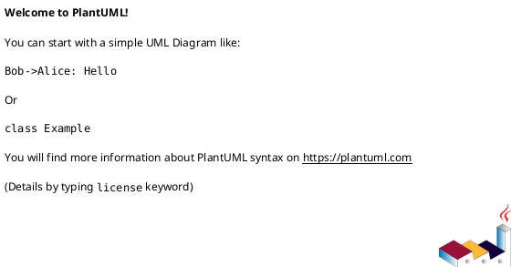
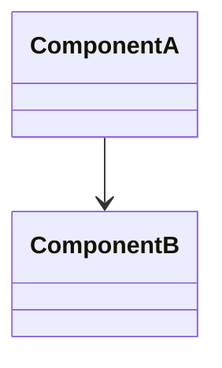

# Feature Specification: [FEATURE NAME] (Refactor)

**Feature Branch**: `[###-feature-name]`  
**Created**: [DATE]  
**Status**: Draft  
**Input**: User description: "$ARGUMENTS"

## Refactor Overview *(mandatory)*

**Goals**: [what should improve and why]  
**Non-Goals**: [explicitly out of scope]  
**Primary Drivers**: [maintainability, performance, stability, cost]

## User Scenarios & Testing *(mandatory)*

<!--
  Keep user-facing behaviors and journeys intact unless explicitly changed.
  Each story should be independently testable as a regression safety net.
-->

### User Story 1 - [Brief Title] (Priority: P1)

[Describe the behavior that must remain correct after refactor]

**Why this priority**: [Explain the value and why it has this priority level]

**Independent Test**: [Describe how this can be tested independently]

**Acceptance Scenarios**:

1. **Given** [initial state], **When** [action], **Then** [expected outcome]
2. **Given** [initial state], **When** [action], **Then** [expected outcome]

---

[Add more user stories as needed]

### Edge Cases

- What happens when [boundary condition]?
- How does system handle [error scenario]?

## Current Behavior Baseline *(mandatory)*

- **Observed Behavior**: [what exists today]
- **Known Issues**: [pain points, defects, risks]
- **Invariants**: [behavior that must not change]

## Scope & Impact *(mandatory)*

- **Interfaces**: [APIs, contracts, UI flows impacted]
- **Sequences**: [critical sequence flows to preserve]
- **Classes/Modules**: [key components and dependencies]

## Target Architecture *(mandatory)*

Provide diagrams using PlantUML or Mermaid. Include sequence, class, and component views when relevant.

## Refactor Constraints *(mandatory)*

- **Interface Stability**: [e.g., interfaces unchanged]
- **Data Stability**: [e.g., schema/table unchanged]
- **Timing/Sequence**: [e.g., sequence unchanged]
- **Compatibility**: [e.g., backward compatibility requirements]

## Requirements *(mandatory)*

### Functional Requirements

- **FR-001**: System MUST preserve [critical behavior].
- **FR-002**: System MUST maintain compatibility for [interface/contract].
- **FR-003**: System MUST keep [performance metric] within target.

### Refactor Requirements

- **RR-001**: Refactor MUST be incremental and reversible.
- **RR-002**: Each step MUST include validation against baseline behaviors.
- **RR-003**: Scope MUST exclude [explicit non-goals].

### Key Entities *(include if data involved)*

- **[Entity 1]**: [What it represents, key attributes without implementation]
- **[Entity 2]**: [What it represents, relationships to other entities]

## Performance Targets *(mandatory)*

- **PT-001**: [response time, throughput, memory, or resource targets]
- **PT-002**: [regression tolerance, e.g., no worse than X%]

## Risks & Rollback *(mandatory)*

- **Risk**: [risk] | **Mitigation**: [mitigation]
- **Rollback Plan**: [how to revert safely]

## Success Criteria *(mandatory)*

### Measurable Outcomes

- **SC-001**: [Behavior parity confirmed by tests]
- **SC-002**: [Performance target met]
- **SC-003**: [Operational stability or error rate target]
